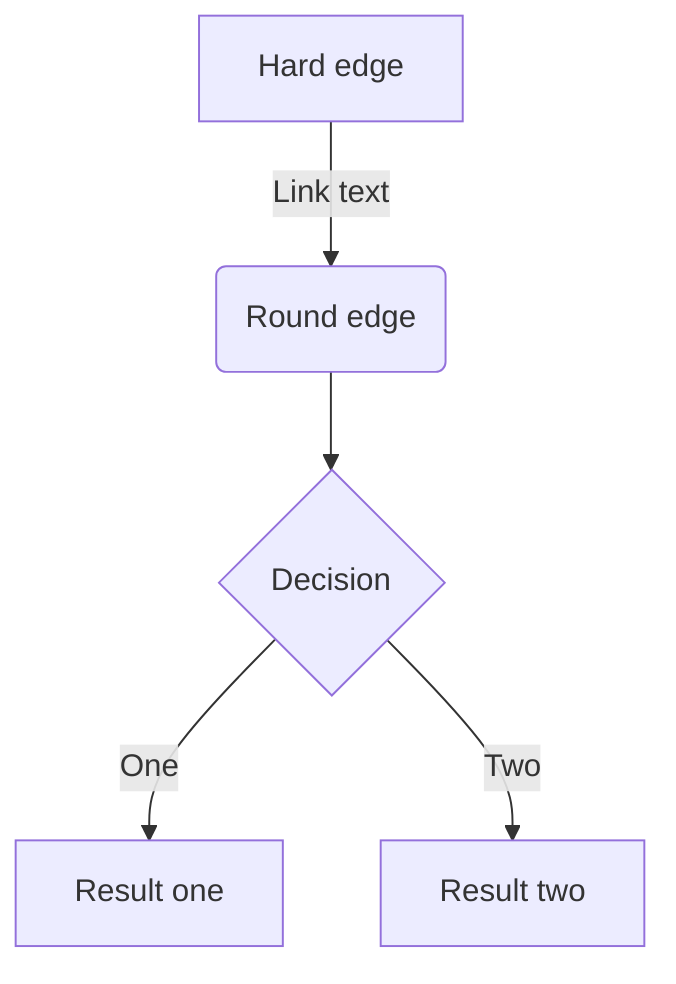
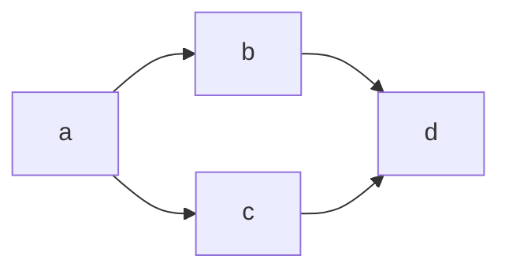

# Zenn CLI

* [📘 How to use](https://zenn.dev/zenn/articles/zenn-cli-guide)

## よく使いそうなcommand

### 記事作成
npx zenn new:article --slug <記事の名前>
npx zenn new:book --slug <記事の名前>

### プレビュー
npx zenn preview

### 記事を公開する
記事を zenn.dev 上で公開するにはpublishedオプションがtrueになっていることを確認したうえで、ファイルをコミットし、Zenn と連携されている GitHub リポジトリにプッシュします。
Zenn と連携したリポジトリの登録ブランチにプッシュされると、同期（デプロイ）が開始されます。

## 見出し
見出しは見出し2から使うこと

## リスト

- あいうえお
  - タブでスペースを作る
    - タブでスペースを作る


## 番号付きリスト

1. これ
2. あれ
3. それ

## リンク

[リンクの名前](https://zenn.dev/zenn/articles/markdown-guide)

## 画像


*キャプションはここ*

[](https://zenn.dev/zenn/articles/markdown-guide)
*画像にリンクをつけることもできる*

## コードブロック
```csharp
var tech = "tech";
```

## 数式

$$
e^{i\theta} = \cos\theta + i\sin\theta
$$

## 引用文

> これとかどう
> 2回書いてもちゃんと引用文になるのいいね

## 脚注

脚注[^1]のテスト

[^1]: 脚注の内容 この内容は末尾につけてくれる

## 区切り線

---

## インラインスタイル

*イタリック*

**太字**

~~打ち消し~~

インラインで`code`を書くこともできる

## Zenn 独自の違法

:::message
ここに注意すべき事項を
:::

:::message alert
メッセージをここに
:::

::::detairls クリックして詳細を表示
:::message
詳細な情報をここに
:::
::::

<!-- TODO: 追記する -->

## ダイアグラム






X（Twitter）のポスト（ツイート）
# ポストのURLだけの行（前後に改行が必要です）
https://twitter.com/jack/status/20

# x.comドメインの場合
https://x.com/jack/status/20

以前は@[tweet](ポストのURL)の記法を採用していましたが、現在はポストのURLを貼り付けるだけで埋め込みが表示されます。

アンダースコア _ を含む URL が正しく認識されない場合
リプライ元のポストを非表示にする
リプライを埋め込んだ場合、デフォルトでリプライ元のポスト含まれて表示されます。ポストのURL?conversation=noneのようにクエリパラメータにconversation=noneを指定すると、リプライ元のポストが含まれなくなります。

YouTube
# YouTubeのURLだけの行（前後に改行が必要です）
https://www.youtube.com/watch?v=WRVsOCh907o

以前は@[youtube](YouTubeの動画ID)という記法を採用していましたが、現在は動画URLを貼り付けるだけで動画を埋め込むことができます。

GitHub
GitHub上のファイルへのURLまたはパーマリンクだけの行を作成すると、その部分にGitHubの埋め込みが表示されます。

# GitHubのファイルURLまたはパーマリンクだけの行（前後に改行が必要です）
https://github.com/octocat/Hello-World/blob/master/README

上記のリンクは、以下のように表示されます。


行の指定
GitHubと同じように、リンクの末尾に#L00-L00のような形で表示するファイルの開始行と終了行を指定することができます。

# コードの開始行と終了行を指定
https://github.com/octocat/Spoon-Knife/blob/main/README.md#L1-L3

上記のリンクは以下のように表示されます。


また、開始行のみ指定することもできます。

# コードの開始行のみ指定
https://github.com/octocat/Spoon-Knife/blob/main/README.md#L3

上記のリンクは、以下のように開始行のみ埋め込まれて表示されます。


テキストファイル以外は埋め込めません
埋め込めるファイルは、ソースコードなどのテキストファイルのみとなっています。
もし画像などのファイルを指定した場合は、以下のような表示になります。


GitHub Gist
@[gist](GistのページURL)

GistのページURLを指定します。

特定のファイルだけ埋め込みたい場合は@[gist](https://gist.github.com/foo/bar?file=example.json)のようにクエリ文字列で?file=ファイル名という形で指定します。

CodePen
@[codepen](ページのURL)

デフォルトの表示タブはページのURL?default-tab=html,cssのようにクエリを指定することで変更できます。

SlideShare
@[slideshare](スライドのkey)

SlideShare の埋め込み iframe に含まれる...embed_code/key/○○...の◯◯の部分を入力します。

SpeakerDeck
@[speakerdeck](スライドのID)

SpeakerDeck で取得した埋め込みコードに含まれるdata-idの値を入力します。

Docswell
@[docswell](スライドのURL)
# もしくは
@[docswell](埋め込み用のURL)

スライドのURL（ https://www.docswell.com/s/{UserId}/{SlideId}-xxx-xxx ）、もしくは埋め込み用のURL( https://www.docswell.com/slide/{SlideId}/embed )を入力します。

JSFiddle
@[jsfiddle](ページのURL)

埋め込みオプションを指定する場合、iframe用の埋め込みURL（ ページのURL + /embedded/{Tabs}/{Visual}/ ）を入力します。

CodeSandbox
@[codesandbox](embed用のURL)

CodeSandbox では、各ページから埋め込み用の<iframe>を取得できます。この<iframe>に含まれるsrcの URL を括弧の中に入力します。

StackBlitz
@[stackblitz](embed用のURL)

StackBlitz では、各ページから「Embed URL」を取得できます。取得した URL をそのまま括弧の中に入力します。

Figma
@[figma](ファイルまたはプロトタイプのURL)

Figma では、ファイルまたはプロトタイプのページで共有リンクを取得できます。取得したURLをそのまま括弧の中に入力します。