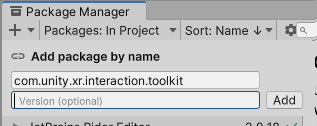

　この記事は、ARFoundationの最新ドキュメントをGoogle翻訳した内容を読み解くためのものです。和訳と、自分が引っかかったところを追記したり解説しています。

目次

- [Introduction](#introduction)
  - [必要なパッケージ](#必要なパッケージ)
  - [機能](#機能)
  - [プラットフォームサポート](#プラットフォームサポート)
- [プロジェクトのセットアップ](#プロジェクトのセットアップ)
  - [ARFoundationをインストールする](#arfoundationをインストールする)
    - [必要なパッケージ](#必要なパッケージ-1)
  - [ユニバーサルレンダーパイプライン](#ユニバーサルレンダーパイプライン)
  - [シーン設定](#シーン設定)
- [Architecture](#architecture)
  - [Subsystem](#subsystem)
    - [Subsystemのライフサイクル](#subsystemのライフサイクル)
    - [SubsystemDescriptors](#subsystemdescriptors)
    - [TrackingSubsystem](#trackingsubsystem)
  - [Manager](#manager)
    - [シーンにManagerを追加する](#シーンにmanagerを追加する)
    - [Managerの有効化と無効化](#managerの有効化と無効化)
    - [TrackableとTrackable Manager](#trackableとtrackable-manager)
    - [Tracking可能なものの列挙](#tracking可能なものの列挙)
    - [Trackableなライフサイクル](#trackableなライフサイクル)
      - [Tracking可能なものを追加する](#tracking可能なものを追加する)
      - [Tracking可能なものを削除する](#tracking可能なものを削除する)
      - [Tracking状態の監視](#tracking状態の監視)
      - [Tracking可能なものを非アクティブ化する](#tracking可能なものを非アクティブ化する)
      - [Tracking可能なものを視覚化する](#tracking可能なものを視覚化する)
    - [Tracking可能なゲームObjectの設定](#tracking可能なゲームobjectの設定)
  - [拡張](#拡張)
- [Features](#features)
  - [Session](#session)
    - [AR Session Component](#ar-session-component)
    - [デバイスのサポートを確認する](#デバイスのサポートを確認する)
    - [Sessionの状態](#sessionの状態)
    - [AR Input Manager](#ar-input-manager)
  - [Devicetracking](#devicetracking)
    - [XR Origin コンポーネント](#xr-origin-コンポーネント)
    - [Session空間とワールド空間](#session空間とワールド空間)
    - [Device Target](#device-target)
  - [Camera](#camera)
    - [カメラプラットフォームのサポート](#カメラプラットフォームのサポート)
    - [Camera Components](#camera-components)
    - [Image Capture](#image-capture)
      - [Image Capture](#image-capture-1)
      - [GPUとCPUの違いを理解する](#gpuとcpuの違いを理解する)
      - [GPU経由でImageにアクセスする](#gpu経由でimageにアクセスする)
      - [CPU経由でImageにアクセス](#cpu経由でimageにアクセス)
      - [同期変換](#同期変換)
      - [非同期変換](#非同期変換)
      - [RawImagePlane](#rawimageplane)
    - [EXIFデータ](#exifデータ)
    - [表示マトリックスの形式と導出](#表示マトリックスの形式と導出)
    - [カスタム背景シェーダー](#カスタム背景シェーダー)
      - [カスタム背景シェーダー](#カスタム背景シェーダー-1)
      - [XR 頂点シェーダー操作](#xr-頂点シェーダー操作)
      - [GLSLサンプルコード](#glslサンプルコード)
      - [HLSL サンプルコード](#hlsl-サンプルコード)
  - [Plane Detection](#plane-detection)
    - [プラットフォームサポート](#プラットフォームサポート-1)
      - [平面検出のサポートを確認する](#平面検出のサポートを確認する)
      - [オプション機能](#オプション機能)
        - [オプション機能のサポートを確認する](#オプション機能のサポートを確認する)
    - [AR Plane Manager Component](#ar-plane-manager-component)
      - [はじめる](#はじめる)
      - [検出されたPlaneに応答する](#検出されたplaneに応答する)
      - [シーン内の平面を視覚化する](#シーン内の平面を視覚化する)
      - [AR Plane Debug Visualizer](#ar-plane-debug-visualizer)
      - [Custom Plane Visualizer](#custom-plane-visualizer)
    - [AR Plane Component](#ar-plane-component)
      - [AR 平面コンポーネント](#ar-平面コンポーネント)
      - [追加した](#追加した)
      - [更新](#更新)
        - [Tracking状態](#tracking状態)
      - [削除されました](#削除されました)
  - [Bounding Box Detection](#bounding-box-detection)
    - [プラットフォームサポート](#プラットフォームサポート-2)
    - [オプション機能](#オプション機能-1)
      - [オプション機能のサポートを確認する](#オプション機能のサポートを確認する-1)
    - [AR Bounding Box Manager Component](#ar-bounding-box-manager-component)
    - [AR Bounding Box Component](#ar-bounding-box-component)
      - [Add](#add)
      - [Update](#update)
      - [TrackingState](#trackingstate)
      - [Delete](#delete)
    - [Image Tracking](#image-tracking)
      - [AR Image Manager Component](#ar-image-manager-component)
      - [用語](#用語)
      - [参照Imageライブラリを作成する](#参照imageライブラリを作成する)
      - [参照Imageライブラリの編集](#参照imageライブラリの編集)
      - [参照Imageライブラリ](#参照imageライブラリ)
      - [AssetBundlesで参照Imageライブラリを使用する](#assetbundlesで参照imageライブラリを使用する)
      - [AssetBundles のビルドウィンドウ](#assetbundles-のビルドウィンドウ)
      - [検出されたImageに応答する](#検出されたimageに応答する)
      - [TrackingImageプレハブ](#trackingimageプレハブ)
      - [実行時に新しい参照Imageを追加する](#実行時に新しい参照imageを追加する)
        - [参照Imageとテクスチャのインポート設定](#参照imageとテクスチャのインポート設定)
      - [実行時にManagerを作成する](#実行時にmanagerを作成する)
      - [動画の最大数](#動画の最大数)
      - [TrackingImagePrefab](#trackingimageprefab)
      - [TrackingState](#trackingstate-1)
    - [Object Tracking](#object-tracking)
      - [AR Tracking Manager Component](#ar-tracking-manager-component)
  - [Face Tracking](#face-tracking)
    - [プラットフォームのサポート](#プラットフォームのサポート)
      - [FaceTrackingのサポートを確認する](#facetrackingのサポートを確認する)
      - [オプション機能](#オプション機能-2)
        - [オプション機能プラットフォームサポート](#オプション機能プラットフォームサポート)
        - [オプション機能のサポートを確認する](#オプション機能のサポートを確認する-2)
    - [AR Face Manager Component](#ar-face-manager-component)
    - [AR Face Component](#ar-face-component)
  - [BodyTracking](#bodytracking)
  - [Point clouds](#point-clouds)
    - [AR Point Cloud manager](#ar-point-cloud-manager)
      - [特徴点のプロパティ](#特徴点のプロパティ)
        - [位置](#位置)
        - [識別子](#識別子)
        - [信頼値](#信頼値)
  - [Raycast](#raycast)
    - [プラットフォームサポート](#プラットフォームサポート-3)
      - [レイキャスティングのサポートを確認する](#レイキャスティングのサポートを確認する)
      - [オプション機能](#オプション機能-3)
      - [サポートされているTracking可能項目](#サポートされているtracking可能項目)
      - [オプション機能のサポートを確認する](#オプション機能のサポートを確認する-3)
    - [AR Raycast Manager Component](#ar-raycast-manager-component)
      - [始める](#始める)
      - [Raycast法の種類](#raycast法の種類)
      - [Raycastのサンプルシーン](#raycastのサンプルシーン)
  - [単一光線の投射](#単一光線の投射)
    - [光線が何に当たったかを判断する](#光線が何に当たったかを判断する)
    - [TrackingされたRaycast](#trackingされたraycast)
      - [TrackingRaycastを追加する](#trackingraycastを追加する)
      - [Raycastライフサイクルイベント](#raycastライフサイクルイベント)
      - [Raycastを削除する](#raycastを削除する)
      - [Raycastを視覚化する](#raycastを視覚化する)
    - [AR Raycast Component](#ar-raycast-component)
  - [Anchor](#anchor)
    - [Introduction](#introduction-1)
    - [プラットフォームのサポート](#プラットフォームのサポート-1)
    - [AR Anchor Manager Component](#ar-anchor-manager-component)
    - [AR Anchor Component](#ar-anchor-component)
    - [永続的なAnchor](#永続的なanchor)
  - [Meshing](#meshing)
    - [AR Mesh Manager Component](#ar-mesh-manager-component)
    - [要件](#要件)
    - [シーン内でMeshを使用する](#シーン内でmeshを使用する)
    - [Meshプレハブ](#meshプレハブ)
    - [密度](#密度)
    - [法線](#法線)
    - [接線](#接線)
    - [テクスチャ座標](#テクスチャ座標)
    - [色](#色)
    - [同時キューサイズ](#同時キューサイズ)
  - [EnvironmentProbe](#environmentprobe)
  - [Occulusion](#occulusion)
    - [プラットフォームのサポート](#プラットフォームのサポート-2)
    - [AR Occlusion Manager Component](#ar-occlusion-manager-component)
  - [Participant](#participant)
    - [AR Participant Manager Component](#ar-participant-manager-component)
- [XR Simulation](#xr-simulation)
  - [Introduction](#introduction-2)
  - [Arcitecture](#arcitecture)
  - [制限事項](#制限事項)
  - [はじめる](#はじめる-1)
  - [Features](#features-1)
  - [Dummy Anchor](#dummy-anchor)
  - [XR Environment View](#xr-environment-view)
  - [XR Simulation Project Settings](#xr-simulation-project-settings)
  - [XR Simulation Environment](#xr-simulation-environment)
- [ARシーンのデバック](#arシーンのデバック)
  - [AR Foundaiton DebugMenu](#ar-foundaiton-debugmenu)
- [プロバイダーを実装する](#プロバイダーを実装する)


# Introduction

　AR Foundation を使用すると、Unity でマルチプラットフォームの拡張現実 (AR) アプリを作成できます。AR Foundation プロジェクトでは、対応するManager コンポーネントをシーンに追加することで、有効にする AR 機能を選択します。AR デバイスでアプリをビルドして実行すると、AR Foundation はプラットフォームのネイティブ AR SDK を使用してこれらの機能を有効にするため、一度作成すれば、世界の主要な AR プラットフォームにデプロイできます。

（メモ）
- Managerコンポーネントが大事ってこと...？

## 必要なパッケージ

　AR Foundation パッケージには AR 機能のインターフェースが含まれていますが、それ自体は機能を実装していません。ターゲット プラットフォームで AR Foundation を使用するには、そのプラットフォーム用の別のプロバイダー プラグインパッケージも必要です。
　Unity は、次のプロバイダー プラグインを公式にサポートしています。
- Android 上のGoogle ARCore XR プラグイン
- iOS 上のApple ARKit XR プラグイン
- Apple visionOS XR プラグイン(visionOS 用)
- HoloLens 2 のOpenXR プラグイン
- Unity Open XR: Metaの Meta Quest

重要
AR Foundation は、そのプラットフォームのプロバイダー プラグイン パッケージもインストールしない限り、ターゲット プラットフォームでは動作しません。詳細なセットアップ手順については、「AR Foundation のインストール」を参照してください。

## 機能

- Session 
ターゲット プラットフォームで AR を有効化、無効化、および構成します。
- Device tracking	
物理空間におけるデバイスの位置と回転をTrackingします。
- Camera
デバイスのカメラからのImageをレンダリングし、光の推定を実行します。
- Plane detection	
平らな表面を検出してTrackingします。
- Bounding Box detection	
3D ObjectのBounding Box を検出してTrackingします。
- Image tracking
2D Imageを検出してTrackingします。
- Object tracking	
3D Objectを検出してTrackingします。
- Face tracking
人間のFaceを検出してTrackingします。
- Body tracking	
人体を検出しTrackingします。
- Point clouds
特徴点を検出してTrackingします。
- Ray casts
Tracking対象アイテムに対して光線を照射します。
- Anchors
空間内の任意の点をTrackingします。
- Meshing
EnvironmentのMeshを生成します。
- Environment probes
Environmentのキューブマップを生成します。
- Occlusion
AR コンテンツを物理Objectで遮蔽し、人間のセグメンテーションを実行します。
- Participants
Shared AR Sessionで他のデバイスをTrackingします。

## プラットフォームサポート

（和訳）
　AR Foundation プロバイダー プラグインは、Android 上の Google の ARCore や iOS 上の Apple の ARKit など、AR 機能のプラットフォーム実装に依存します。すべての機能がすべてのプラットフォームで利用できるわけではありません。
　XR シミュレーションでは、Unity エディターで AR アプリをテストするためのAR Foundation の一部機能が利用できます。

| Feature | ARCore | ARKit　| ARKit| OpenXR  | OpenXR | XR Simulation |
|---|----|----|-----|---|---| -- |
|                         | Android | iOS | visionOS | Microsoft HoloLens | Meta Quest | Unity Editor |
| **Session**            | Yes      | Yes | Yes      | Yes               | Yes        | Yes          |
| **Device tracking**    | Yes      | Yes | Yes      | Yes               | Yes        | Yes          |
| **Camera**             | Yes      |     |          |                   |            | Yes          |
| **Plane detection**    | Yes      | Yes | Yes      | Yes               | Yes        | Yes          |
| **Bounding Box detection** |       |     |          | Yes               |            |              |
| **Image tracking**     | Yes      | Yes | Yes      |                   |            | Yes          |
| **Object tracking**    |          | Yes |          |                   |            |              |
| **Face tracking**      |          | Yes | Yes      |                   |            |              |
| **Body tracking**      |          | Yes |          |                   |            |              |
| **Point clouds**       | Yes      | Yes |          |                   |            |              |
| **Ray casts**          | Yes      | Yes | Yes      | Yes               | Yes        | Yes          |
| **Anchors**            | Yes      | Yes | Yes      | Yes               | Yes        | Yes          |
| **Meshing**            | Yes      | Yes | Yes      | Yes               | Yes        | Yes          |
| **Environment probes** |          | Yes | Yes      |                   |            | Yes          |
| **Occlusion**          |          | Yes | Yes      |                   |            | Yes          |
| **Participants**       |          | Yes |          |                   |            |              |

ヒント
AR アプリを開発するときは、AR Foundation のドキュメントと、サポートする各プラットフォームに必要なパッケージの両方を参照してください。

# プロジェクトのセットアップ

## ARFoundationをインストールする

　AR Foundation は、パッケージ Managerから入手できる公式 Unity パッケージです。

エディターの互換性
　AR Foundation 6.0 は Unity 6 (6000.0) と互換性があります。

注記
　Unity 6 の新しい命名規則の詳細については、Unity フォーラムをご覧ください。

古いエディターのバージョン
　プロジェクトで古いバージョンのエディターが必要な場合は、サポートされている次のバージョンの AR Foundation を使用できます。

### 必要なパッケージ
　
　AR Foundation パッケージには AR 機能のインターフェースが含まれていますが、AR 機能自体は実装されていません。ターゲット プラットフォームで AR Foundation を使用するには、そのプラットフォーム用の別のプロバイダー プラグインパッケージも必要です。プロバイダー プラグインは、特定のプラットフォーム用の AR Foundation 機能の実装を含む別のパッケージです。

　Unity は、このバージョンの AR Foundation で次のプロバイダー プラグインを公式にサポートしています。

- Android	Google ARCore XR プラグイン	6.0
- iOS	Apple ARKit XR プラグイン	6.0
- HoloLens2	OpenXR プラグイン	1.8

　デバイスで AR Foundation を使用するには、パッケージ Managerから、または以下に示すように[プロジェクト設定] > [ XR プラグイン管理]に移動して、少なくとも 1 つのプロバイダー プラグインをインストールする必要があります。

　プロジェクト設定ウィンドウのXRプラグイン管理カテゴリには、サポートされているプラ​​ットフォーム用のAR Foundationプロバイダープラグインをダウンロードするためのインターフェイスが表示されます。

注記
　Cloud Anchors などの追加の ARCore 機能を使用するには、Google のARCore Extensions for AR Foundationをインストールします。

プロバイダープロジェクト設定
一部のプロバイダー プラグインでは、AR が正しく機能するために特定のプロジェクト設定を行う必要があります。具体的な手順については、それぞれのドキュメントを参照してください。

プロバイダープラグイン	セットアップ手順
Google ARCore XR プラグイン	プロジェクト構成
Apple ARKit XR プラグイン	プロジェクト構成
サードパーティのプラグイン
AR Foundation 用のカスタム プロバイダー プラグインを開発することができます。サードパーティのプロバイダー プラグインを使用している場合は、インストールと使用に関する詳細な手順については、プラグインのドキュメントを参照してください。

## ユニバーサルレンダーパイプライン

AR Foundation は、Universal Render Pipeline (URP) バージョン 7.0.0 以降をサポートしています。URPへの切り替えの詳細については、 URP の開始ページを参照してください。

注記
AR Foundation では URP または組み込みレンダリング パイプラインのいずれかを使用できますが、開発を開始する前にプロジェクトで使用するレンダリング パイプラインを決定する必要があります。

AR Foundation 用に URP を構成する
ユニバーサルレンダーパイプラインアセットを作成する
注記
URP セットアップの手順は AR Foundation に固有のものではなく、組み込みのレンダリング パイプラインを備えた AR Foundation プロジェクトを URP AR Foundation プロジェクトに変換する方法を示すために含まれています。URPプロジェクト テンプレートからプロジェクトを作成した場合、またはプロジェクトにUniversalRenderPipelineAssetと が既にある場合は、 「ユニバーサル レンダリング パイプライン アセットを構成する」に進んでください。Universal Renderer

UniversalRenderPipelineAssetおよびそれに対応する を作成するにはUniversal Renderer:

プロジェクトのAssetsフォルダーに、 という名前の新しいフォルダーを作成しますRendering。
フォルダー内にRendering、URP 用のユニバーサル レンダラー アセットを作成します。フォルダー内の任意の場所を右クリックし、コンテキスト メニューから[作成] > [レンダリング] > [ユニバーサル レンダー パイプライン] > [URP アセット (ユニバーサル レンダラーを使用)]を選択します。これにより、次の 2 つのアセットが作成されます。
ユニバーサルレンダーパイプラインアセット
ユニバーサルレンダリング
ユニバーサルレンダーパイプラインアセットを構成する
注記
URP は、組み込みのレンダリング パイプラインを模倣する一連のアセットとパイプラインを構築するパイプライン変換ツールを提供します。このツールを使用する場合は、ARBackgroundRenderFeatureレンダラーに割り当てる前に実行するか、戻ってプロジェクトのレンダリング パイプライン アセットとして適切なものを設定する必要がありますUniversalRenderPipelineAsset。

UniversalRenderPipelineAssetAR Foundation で動作するように設定するには:

アセットを見つけます。URPプロジェクト テンプレートUniversal Rendererからプロジェクトを作成した場合、またはパイプライン変換ツールを使用した場合は、プロジェクトのフォルダー内のフォルダーに複数の URP/Renderer アセットが作成されます。Renderer アセットごとに次の手順に従います。SettingsAssets

アセットを選択しますUniversal Renderer。そのインスペクターARBackgroundRendererFeatureで、レンダラー機能のリストにを追加します。XRシミュレーションを使用してアプリケーションをテストするには、レンダラーの深度プライミング モード(レンダリングヘッダーの下) を に設定しますDisabled。 ARBackgroundRendererFeature の追加

注記
URP プロジェクト テンプレートからプロジェクトを作成した場合、またはパイプライン変換ツールを使用した場合、プロジェクトの品質設定を構成することで、パイプライン アセットを切り替えるようにプロジェクトがすでに設定されています。これらのツールを使用した場合、次の手順はオプションです。

グラフィック設定にアクセスし(メニュー:編集>プロジェクト設定、次にグラフィックを選択)、デフォルトのレンダリング パイプラインUniversalRenderPipelineAssetフィールドでを選択します。この URP アセットは、プロジェクトのアクティブな品質レベルにパイプライン アセットがまだ割り当てられていない場合に使用されます。

## シーン設定

シーン設定
アプリ内の各 AR シーンには、 AR SessionとXR Origin という2 つの GameObject が必要です。

AR Session GameObject はターゲット プラットフォームで AR を有効にし、XR Origin GameObject はデバイスのTrackingを有効にしてTracking可能なものを Unity の座標系に変換します。これらの GameObject のいずれかがシーンに存在しない場合、AR は正しく機能しません。

AR Sessionまたは XR Origin を作成するには、階層ウィンドウを右クリックし、コンテキスト メニューから次のいずれかのオプションを選択します。

XR > ARSession
XR > XR Origin (モバイル AR)

AR Sessionと XR Origin の両方をシーンに追加すると、階層ウィンドウは次のように表示され、「AR Session」と「XR Origin」という名前のゲームObjectが表示されます。XR Origin には「Camera Offset」という名前の子ゲームObjectがあり、Camera Offset には「Main Camera」という名前の子ゲームObjectがあります。

ARSessionとXR Originを含むシーングラフ

これはデフォルトのシーン設定ですが、プロジェクトのニーズに応じてゲームObjectの名前を変更したり、親を変更したりできます。

AR Sessionと XR Origin ゲームObjectとそのコンポーネントは、AR Foundation プロジェクトで重要な役割を果たします。これらについて詳しくは、それぞれ「Session」と「デバイス Tracking」を参照してください。

# Architecture

## Subsystem

Subsystem( Subsystem With Providerの略) は、Unity エンジン機能のライフサイクルとスクリプト インターフェースを定義します。すべてのSubsystemは共通のSubsystem ライフサイクルを共有しますが、機能の実装はプラットフォームによって異なる場合があり、アプリケーション コードと Google ARCore や Apple ARKit などのプラットフォーム固有の SDK の間に抽象化レイヤーを提供します。

AR Foundation はSubsystemを使用して AR 機能を定義します。たとえば、XRPlaneSubsystemは平面検出用のインターフェースを定義します。iOS と Android、または平面Subsystemの実装を備えたその他のプラットフォームで検出された平面を操作するには同じアプリケーション コードを使用しますが、AR Foundation 自体にはこれらのプラットフォーム用のSubsystem実装は含まれていません。

Subsystemの実装はプロバイダと呼ばれ、通常はプロバイダ プラグインと呼ばれる別のパッケージで提供されます。たとえば、Google ARCore XR プラグインはAndroid プラットフォーム用のSubsystemの実装を提供し、Apple ARKit XR プラグインはiOS 用の実装を提供します。

デバイス Trackingを除いて、以下の表に AR Foundation の AR 機能とそれに対応するSubsystemを示します。(デバイス Trackingは入力システムを使用し、Subsystem ベースではありません。)

| 特徴               | Subsystem                        |
|--------------------|----------------------------------|
| Session            | XRSessionSubsystem               |
| カメラ             | XRCameraSubsystem                |
| 平面検出           | XRPlaneSubsystem                 |
| 境界ボックス検出   | XRBoundingBoxSubsystem |
| ImageTracking       | XRImageTrackingSubsystem         |
| ObjectTracking | XRObjectTrackingSubsystem |
| FaceTracking         | XRFaceSubsystem                  |
| BodyTracking     | XR人体Subsystem                  |
| Point clouds       | XRPointCloudSubsystem         |
| Raycast       | XRRaycastSubsystem               |
| Anchor           | XRAnchorSubsystem                |
| Mesh           | XRMeshSubsystem                  |
| EnvironmentProbe | XREnvironmentProbe Subsystem  |
| Oculusion               | XROcclusionSubsystem             |
| Participant             | XRParticipantSubsystem           |

### Subsystemのライフサイクル
すべてのSubsystemのライフサイクルは同じです。つまり、作成、開始、停止、破棄が可能です。通常、Subsystemのインスタンスを自分で作成または破棄する必要はありません。これは Unity のアクティブな が行うためですXRLoader。各プロバイダープラグインにはXRLoader実装 (または単にローダー) が含まれています。最も一般的には、ローダーはアプリケーションの初期化時にすべての適用可能なSubsystemのインスタンスを作成し、アプリケーションの終了時にそれらを破棄しますが、この動作は構成可能です。Tracking可能なManagerがStartSubsystemにアクセスすると、プロジェクト設定> XR プラグイン管理 にある設定に基づいて、プロジェクトのアクティブなローダーからSubsystemインスタンスを取得します。ローダーとその構成の詳細については、XR プラグイン管理のエンドユーザードキュメントを参照してください。

一般的な AR Foundation シーンでは、シーン内に存在するすべてのManagerはStart、StopManagerが有効または無効になっているときに、それぞれ とそのSubsystemを起動します。Startとの正確な動作はStopSubsystemによって異なりますが、通常はそれぞれ「作業の開始」と「作業の停止」に対応します。アプリケーションのニーズに基づいて、いつでもSubsystemを起動または停止できます。

### SubsystemDescriptors

各Subsystemには対応するSubsystem記述子があり、そのプロパティはSubsystemの機能の範囲を記述します。プロバイダーは、さまざまなプラットフォームまたはデバイスの制限に基づいて、実行時にこれらのプロパティに異なる値を割り当てる場合があります。

Subsystem記述子に記述された機能を使用する場合は、まず実行時にそのプロパティ値をチェックして、その機能がターゲット デバイスでサポートされているかどうかを確認する必要があります。以下に例を示します。

```csharp

var trackedImageManager = FindObjectOfType(typeof(ARTrackedImageManager));
var imageTrackingSubystem = trackedImageManager.subsystem;

// Query whether the image tracking provider supports runtime modification
// of reference image libraries
if (imageTrackingSubsystem.subsystemDescriptor.supportsMutableLibrary)
{
    // take some action
}

// Equivalently:
if (trackedImageManager.descriptor.supportsMutableLibrary)
{
    // take some action
}

```

### TrackingSubsystem
TrackingSubsystemは、物理Environment内でTracking可能Objectと呼ばれる 1 つ以上のObjectを検出してTrackingするSubsystemです。

Tracking可能Objectは、TrackingSubsystemが検出してTrackingできるものを表します。たとえば、XRPlaneSubsystemは、境界平面のTracking可能Objectを検出してTrackingします。各Tracking可能Objectには、TrackingTrackableId可能Objectが追加、更新、または削除されたときに複数のフレームにわたってTracking可能Objectを一意に識別するために使用できる 128 ビットの GUID (グローバル一意識別子) があります。

コードでは、Tracking可能ObjectはITrackable を実装する任意のクラスとして定義されます。UnityEngine.XR.ARSubsystems名前空間では、Tracking可能なすべての実装 ( Bounded Planeなど) は構造体です。UnityEngine.XR.ARFoundation名前空間では、Tracking可能なすべての実装 ( ARPlaneなど) は、これらの構造体をラップするコンポーネントです。

## Manager

AR Foundation では、Managerはシーン内の AR 機能のスクリプト インターフェイスを提供するコンポーネントです。たとえば、平面Managerは平面検出機能を有効にし、検出された平面にアプリケーション コードで応答できるようにします。

AR Foundation は、Subsystemを使用して AR 機能を定義します。Managerは、シーン内でSubsystem データをゲームObjectおよびコンポーネントとしてアクセス可能にし、Subsystemのライフ サイクルも管理します (Managerは の省略形ですSubsystemLifecycleManager)。たとえば、XRPlaneSubsystemがEnvironment内で平面を検出すると、平面Managerはその平面を表すゲームObjectを作成します。平面Managerを有効または無効にすると、アプリでの平面検出もそれぞれ有効または無効になります。

すべての AR 関連Subsystemには対応するManagerがあります。このパッケージ内のSubsystemは命名規則XR<Feature>Subsystemに従い、そのManagerはARSessionコンポーネントを除いてAR<Feature>Manager という名前が付けられます。

### シーンにManagerを追加する

シーンにManagerを追加するには、コンポーネントを追加する場合と同じ手順に従います。

注記
特別なケースであるAR Session コンポーネントとMesh Managerを除き、シーン内のすべてのManagerを XR Origin と同じ GameObject に追加する必要があります。

まず、階層ウィンドウで、追加するManager コンポーネントの適切な GameObject を選択します。
インスペクターの「コンポーネントの追加」ボタンをクリックします。
最後に、追加するManager コンポーネントを検索して選択します。

Managerは、新しいTracking可能Objectを XR Origin の子としてシーンに追加し、Tracking可能Objectの位置、回転、スケールを XR Origin の位置、回転、スケールに相対的に定義します。

### Managerの有効化と無効化
関連するManagerを有効または無効にすることで、AR 機能を有効または無効にすることができます。たとえば、AR PlaneManager コンポーネントを有効または無効にすることで、Planeの検出のオン/オフを切り替えることができます。

シーン内で一度に有効にできるのは同じタイプのManager 1 つだけです。Managerのインスタンスを複数有効にすると、各Manager インスタンスが同じ基礎Subsystemと対話するため、望ましくない動作が発生する可能性があります。

アクティブな AR 機能によりデバイスの電力消費量が増える可能性があるため、アプリで AR 機能を使用していないときはManagerを無効にすることをお勧めします。

Managerは、対応するSubsystemのライフサイクルメソッドを呼び出して、有効化または無効化に応答します。

OnEnable: Subsystemを呼び出すStart
OnDisable: Subsystemを呼び出すStop
プロバイダ プラグインが特定のSubsystemを実装していない場合、対応するマネージャは自動的に無効になります。たとえば、 Google ARCore XR プラグインは現在XRObject Tracking Subsystemを実装していないため、ARTracked Object ManagerはAndroid プラットフォームでは常に無効になります。ターゲット プラットフォームでどのSubsystemが使用可能かを確認するには、プラットフォーム サポートまたはプロバイダのドキュメントを参照してください。

### TrackableとTrackable Manager
多くの AR Foundation Subsystemは、物理Environment内のObjectを検出してTrackingします。これらのSubsystemはTrackingSubsystemと呼ばれ、そのManagerはTracking可能Managerと呼ばれます。Tracking可能Managerは、TrackingSubsystemからのデータを使用して、Tracking可能なコンポーネントとその GameObject を作成および管理します。

Tracking可能Objectは、現実世界で検出およびTrackingできるあらゆるものを表す特別なコンポーネントです。平面、Point Cloud、Anchor、EnvironmentProbe、Face、Body、Image、3D Objectはすべて、対応するTracking可能コンポーネントを持つObjectの例です。

各タイプのTracking可能Objectは、対応するタイプのTracking可能Object Managerによって作成および管理されます。Tracking可能Object ManagerはTracking Subsystemをラップし、そのデータを使用してTracking可能Objectとそのゲーム Objectを管理します。たとえば、ARPlaneManagerは、XRPlaneSubsystemのデータを使用してARPlaneTracking可能Objectを生成します。

この表は、Tracking可能なManagerとそのTracking可能なタイプをまとめたものです。

Tracking可能なManager	Tracking可能	目的
ARPlaneManager	ARPlane	表面を検出してTrackingします。
ARBoundingBoxManager	ARBoundingBox	3D Objectの境界ボックスを検出してTrackingします。
ARTrackedImageManager	ARTrackedImage	2D Imageを検出してTrackingします。
ARTrackedObjectManager	ARTrackedObject	3D Objectを検出してTrackingします。
ARFaceManager	ARフェイス	人間のFaceを検出してTrackingします。
ARヒューマンBodyManager	AR人体	人体を検出しTrackingします。
ARPointCloudManager	ARPointCloud	特徴点を検出してTrackingします。
ARRaycastManager	ARRaycast	フレームごとにRaycastを繰り返します。
ARAnchorManager	ARAnchor	空間内の任意の点をTrackingします。
AREnvironmentProbeManager	AREnvironmentProbe	Environmentのキューブマップを生成します。
ARParticipantManager	ARParticipant	共有 AR Sessionで他のデバイスをTrackingします。

### Tracking可能なものの列挙
Trackables は、Managerのtrackablesプロパティを介して列挙できます。

```csharp
var planeManager = GetComponent<ARPlaneManager>();
foreach (ARPlane plane in planeManager.trackables)
{
    // Do something with the ARPlane
}
```

プロパティtrackablesは を返しますTrackableCollection。これは、上記の例のようにステートメントで列挙できますforeach。 メソッドを使用して、特定のTracking可能Objectを照会することもできますTryGetTrackable。

### Trackableなライフサイクル
TrackableObjectのライフ サイクルはTrackingSubsystemによって管理され、追加、更新、削除の 3 つのフェーズがあります。Tracking可能Objectは最初に追加され、その後のフレームで更新、削除、または変更なしになります。各フレームで、ManagerはSubsystemを照会して、前のフレーム以降にTracking可能Objectに変更があったかどうかを判断します。これらの変更について通知を受けるには、ManagerのTracking可能Objectの変更イベントをサブスクライブします。

#### Tracking可能なものを追加する
AnchorやEnvironmentProbeなどの一部のTracking可能Objectは、手動で追加および削除できます。平面、Image、Object、Point Cloudなどのその他のTracking可能Objectは、マネージャによって自動的に追加および削除されます。一部のTracking可能Objectは、手動または自動で追加できます。サポートされている場合、Tracking可能Objectのマネージャは、手動で追加および削除する方法を提供します。

手動でTracking可能Objectを追加した場合、基になるSubsystemはすぐにTrackingしない可能性があります。addedSubsystemが追加されたことを報告 (通常は次のフレーム) するまで、そのTracking可能Objectのイベントは受信されません。手動で追加してからイベントが発生するまでの間added、Tracking可能Objectは保留状態になります。これは、すべてのTracking可能Objectの プロパティで確認できますpending。

たとえば、Anchorを追加すると、次のフレームまで保留になる可能性があります。

```csharp

var anchor = AnchorManager.AddAnchor(new Pose(position, rotation));
Debug.Log(anchor.pending); // "true"

// -- next frame --
void OnAnchorsChanged(ARAnchorsChangedEventArgs eventArgs)
{
    foreach (var anchor in eventArgs.added)
    {
        // anchor added above now appears in this list.
    }
}

```


Tracking可能Objectが保留状態にある正確な時間は、基礎となる実装によって異なります。

#### Tracking可能なものを削除する

Anchorを除いて、DestroyTracking可能なコンポーネントまたはその GameObject を決して削除しないでください。Tracking可能Objectは、Tracking可能なSubsystemによって表面化されたデータの表現であり、そのシーン表現を破棄してもSubsystemの実装には影響しません。Tracking可能Objectが手動による削除をサポートしている場合、そのManagerは通常、Tracking可能Objectを削除するメソッドを提供します。たとえば、 を呼び出すことで永続的なRaycastを削除できますARRaycastManager.RemoveRaycast(ARRaycast)。

Anchorはこのルールの例外です。Anchorは、その GameObject を破棄することで安全に削除できます。Anchorの追加と削除の詳細については、「Anchor」を参照してください。

平面、Image、Object、Point Cloudなどの多くのTracking可能Objectは、いかなる形式の手動削除もサポートしていません。これらのTracking可能Objectは、Managerによってのみ削除できます。Managerは、基礎となるSubsystemから削除通知を受信すると、自動的にTracking可能Objectを削除します。ManagerがこのようにTracking可能Objectを削除すると、 でない限り、Tracking可能Objectの GameObject が削除されDestroyます。destroyOnRemovalfalse

削除時に破棄フィールドを持つ AR プレーン コンポーネント
削除時に破棄フィールドを持つ AR プレーン コンポーネント

アプリケーションは、Tracking可能なもののManagerのTracking可能なものの変更イベントをサブスクライブすることで、Tracking可能なものの削除に応答できます。たとえば、ARPlaneが削除されると、AR Plane Manager コンポーネントは、そのプレーンのコレクションにそのプレーンを含むARTrackables Changed Event Args<ARPlane>trackablesChanged構造体を使用してイベントを呼び出します。removed

#### Tracking状態の監視
Tracking可能ObjectのManagerが無効になっている場合や、Tracking対象Objectが AR デバイスのカメラのフレーム外に移動した場合など、Tracking品質が変化する場合は、関連するSubsystemがTracking可能Objectを削除しないことがあります。代わりに、それらのTracking可能ObjectのTracking状態の値を変更することがあります。アプリケーションは、Tracking可能Objectが追加または更新されたときにそのプロパティを読み取ることで、Tracking状態の変化に対応できますtrackingState。

#### Tracking可能なものを非アクティブ化する
場合によっては、Managerを無効にせずに、Tracking可能Objectに関連付けられた動作の実行を停止したい場合があります。たとえば、平面の検出を停止せずに、検出された平面のレンダリングを停止したい場合があります。

これを行うには、各Tracking可能な GameObject を非アクティブ化します。

```csharp
var planeManager = GetComponent<ARPlaneManager>();
foreach (var plane in planeManager.trackables)
{
    plane.gameObject.SetActive(false);
}
```

#### Tracking可能なものを視覚化する
Tracking可能なコンポーネントは、それ自体では何も行いません。Tracking可能な各コンポーネントに関連付けられたデータが含まれています。Tracking可能なコンポーネントを視覚化する方法はたくさんあります。そのため、AR Foundation には、デバッグに使用したり、アプリケーションに適したビジュアライザーを作成するための出発点として使用できるビジュアライザーがいくつか含まれています。

### Tracking可能なゲームObjectの設定
新しいTracking可能Objectが検出されると、そのManagerは、インスペクターで指定されたプレハブのコピーをインスタンス化するか、プレハブが空のゲームObjectである場合はそれをインスタンス化しますnull。

TrackingImageプレハブフィールドを備えた AR TrackingImageManager
TrackingImageプレハブフィールドを備えた AR TrackingImageマネージャコンポーネント

インスタンス化された GameObject にARTrackableは、そのタイプのTracking可能Objectのコンポーネントが必要です。したがって、Prefab が の場合null、Managerは空の GameObject を作成し、関連するARTrackableコンポーネントのみを追加します。同様に、null 以外の Prefab に関連コンポーネントがない場合ARTrackable、Managerはそれを追加します。

## 拡張

プロバイダー プラグイン間のプラットフォーム固有の実装の違いにより、AR Foundation は C# 経由でプラットフォーム SDK のコンテンツ全体を公開しない場合があります。代わりに、AR Foundation は、該当する場合にプラットフォーム固有の機能とデータにアクセスするためのネイティブ ポインターを提供します。たとえば、XRSessionSubsystemにはネイティブPtrプロパティがあります。

各プロバイダー プラグインは、各ネイティブ ポインターが指すものを定義します。一般に、ポインターは、最初のメンバーがintバージョン番号とそれに続く生のポインターを含む構造体を指します。

C では、XRSessionSubsystem.nativePtr次のような構造体を指す場合があります。

```csharp
typedef struct UnityXRNativeSessionPtr
{
    int version;
    void* session;
} UnityXRNativeSessionPtr;
```

構造体のパッキングとアラインメントのルールはプラットフォームによって異なるため、void* sessionポインターは必ずしも 4 バイトのオフセットにあるとは限りません。たとえば、64 ビット プラットフォームでは、ポインターが 8 バイト境界にあることを保証するために、ポインターは 8 バイトオフセットされることがあります。

すべてのTracking可能Object (平面、TrackingされたImage、Faceなど) にはネイティブ ポインターが用意されています。これらのポインターを使用して、ネイティブ フレーム、Session、平面、Anchorなどのネイティブ データ構造にアクセスできます。

# Features

## Session

### AR Session Component

ARSessionコンポーネントは、ターゲット プラットフォームで AR を有効または無効にすることで、AR エクスペリエンスのライフサイクルを制御します。



Sessionとは、 AR のインスタンスを指します。平面検出などの他の機能は個別に有効または無効にできますが、Sessionはすべての AR 機能のライフサイクルを制御します。AR Session コンポーネントを無効にすると、システムはEnvironment内の機能をTrackingしなくなります。その後、後で有効にすると、システムは以前に検出された機能を回復して維持しようとします。

注記
同じシーン内の複数の AR Session コンポーネントは互いに競合する可能性があるため、Unity ではシーンに最大 1 つの AR Session コンポーネントを追加することをお勧めします。

### デバイスのサポートを確認する
一部のプラットフォームでは、デバイスのオペレーティング システムに AR 機能が組み込まれています。他のプラットフォームでは、AR ソフトウェアをオンデマンドでインストールできる場合もあれば、AR がまったくサポートされていない場合もあります。アプリケーションは、AR がサポートされていない場合に代替エクスペリエンスを提供できるように、AR Foundation のサポートを検出できる必要があります。

「このデバイスで AR は利用できますか?」という質問では、リモート サーバーでソフトウェアの可用性を確認する必要がある可能性があるため、Check Availabilityを呼び出してAR が利用可能かどうかを確認する必要があります。

```csharp
public class MyComponent {
    [SerializeField] ARSession m_Session;

    IEnumerator Start() {
        if ((ARSession.state == ARSessionState.None) ||
            (ARSession.state == ARSessionState.CheckingAvailability))
        {
            yield return ARSession.CheckAvailability();
        }

        if (ARSession.state == ARSessionState.Unsupported)
        {
            // Start some fallback experience for unsupported devices
        }
        else
        {
            // Start the AR session
            m_Session.enabled = true;
        }
    }
}
```

「更新の試行」をtrueに設定すると、デバイスは可能な場合は AR ソフトウェアをインストールしようとします。この機能のサポートはプラットフォームによって異なります。

### Sessionの状態
現在のSession状態を取得するには、ARSession. stateを使用します。また、 ARSession. state Changedイベントをサブスクライブして、状態が変更されたときにコールバックを受信することもできます。すべての可能な状態のリストについては、次の表を参照してください。

| Session状態              | 説明   |
|--------|---|
| なし                     | ARは初期化されておらず、利用可能かどうかは不明です。空き状況を確認するデバイス上で AR が利用可能かどうかを確認します。|
| サポートされていません     | デバイスは AR をサポートしていません。 |
| 空き状況の確認            | SessionSubsystemは現在、デバイス上でARが利用可能かどうかを確認しています。空き状況を確認するコルーチンはまだ完了していません。 |
| インストールが必要         | デバイスはARをサポートしていますが、追加のソフトウェアをインストールする必要があります。プロバイダーがランタイムインストールをサポート、電話をかけることができますインストールデバイスに AR ソフトウェアをインストールしようとします。  |
| インストール              | ARソフトウェアは現在インストール中です。インストールコルーチンはまだ完了していません。  |
| 準備ができて               | デバイスは AR をサポートしており、必要なソフトウェアがインストールされています。この状態は自動的にSessionInitializingまたはに変わりますSessionTracking。  |
| Sessionの初期化            | AR Sessionは現在初期化中です。これは通常、AR は実行されているが、まだ正常にTrackingされていないことを意味します。  |
| SessionTracking          | AR Sessionは実行中で、Trackingは正常に行われています。デバイスは、世界における位置と方向を判断できます。Session中にTrackingが失われた場合、この状態は に変わる可能性がありますSessionInitializing。|
| AR 入力Manager          | ARInput Managerコンポーネントは、ワールド Trackingを有効にします。デフォルトでは、ARInput Managerコンポーネントは AR Session ゲームObjectに含まれています。    |


注記
AR 入力Manager コンポーネントがないと、XROrigin はデバイスのワールド空間ポーズを取得できません。AR が正しく機能するには、AR 入力Manager コンポーネントが必要です。

### AR Input Manager

ARInput Managerコンポーネントは、ワールド トラッキングを有効にします。デフォルトでは、ARInput Managerコンポーネントは AR セッション ゲームObjectに含まれています。

注記
AR 入力マネージャー コンポーネントがないと、XROrigin はデバイスのワールド空間ポーズを取得できません。AR が正しく機能するには、AR 入力マネージャー コンポーネントが必要です。

AR 入力Manager コンポーネントはシーン階層内の任意の場所に移動できますが、シーンごとに 1 つしか配置できません。

## Devicetracking

AR Foundationシーンのセットアップ手順に従うと、シーンには「XR Origin」という名前の事前設定された GameObject が含まれます。XR Origin GameObject は、以下に詳述するように、 XROriginコンポーネントと、Camera and Tracked Pose Driverを備えた GameObject 階層を介して、デバイスのTrackingとTracking可能Objectの Unity 座標系への変換を自動的に処理します。


### XR Origin コンポーネント
XROriginコンポーネントは、平面や特徴点などのTracking可能な特徴を、シーン内の最終的な位置、回転、スケールに変換します。


### Session空間とワールド空間
XROriginコンポーネントは、AR Sessionの開始を基準としたスケールされていない空間である AR デバイスの「Session空間」からTracking可能Objectを Unity ワールド空間に変換します。たとえば、Session空間 (0, 0, 0) は AR Sessionが作成された位置を指し、Unity ワールド空間における XR Origin の位置に対応します。

この概念は、Unity で他のアセットを操作するときの「モデル」または「ローカル」空間とワールド空間の違いに似ています。たとえば、DCC ツールから家のアセットをインポートすると、ドアの位置はモデラーの原点に相対的になります。これは一般に「モデル空間」または「ローカル空間」と呼ばれます。Unity がこれをインスタンス化すると、Unity の原点に相対的なワールド空間も存在します。

ゲームObject階層
XR Origin は、「Camera Offset」と「Main Camera」という名前の 2 つの子ゲームObjectで作成されることに注意してください。これらのゲームObjectとその変換はそれぞれ重要です。

アプリケーションがデバイス上で実行されると、XR Origin の位置と回転は、アプリケーション起動時のユーザーのデバイスの初期位置と回転を反映します。XR Origin は AR Session中は移動しませんが、メイン カメラ ゲームObjectのTracked Pose Driverコンポーネントは、物理Environment内を移動する AR デバイスの位置と回転に合わせてメイン カメラの位置と回転を自動的に更新します。

XROriginコンポーネントは、Tracking Origin ModeがDeviceに設定されている場合に、 Camera Offset GameObject を使用してCamera Y Offset値を適用します。XR Origin と Camera Offset の間に別の GameObject を挿入することで、追加のカメラ オフセットを適用できます。

注記
アプリに特別な理由がない限り、カメラとTracking対象に高さのオフセットが追加されないように、XROrigin.CameraYOffset値を に設定する必要があります。0

実行時に、XROriginコンポーネントは「Trackables」という名前の別の子ゲームObjectを作成します。Managerが新しいTracking可能Objectを検出してシーンに追加すると、それらを Trackables ゲームObjectの子としてインスタンス化します。子ゲームObjectとして、インスタンス化されたTracking可能Objectとその位置、回転、スケールは、XR Origin を基準として定義されます。

規模
XROrigin では、仮想コンテンツの拡大縮小も可能です。XR Origin にスケールを適用するには、インスペクターまたはtransformプロパティを使用して、Transform コンポーネントのスケールを設定します。これにより、メインカメラの位置や検出されたTracking可能Objectなど、デバイスからのすべてのデータが拡大縮小されます。値が大きいほど AR コンテンツは小さく表示され、その逆も同様です。たとえば、スケールが 10 の場合、コンテンツは 10 倍小さく表示され、0.1 の場合、コンテンツは 10 倍大きく表示されます。

### Device Target
XROrigin は、AR Foundation とXR Interaction Toolkitパッケージ間で共有されるクラスです。XR Interaction Toolkit は、Unity で AR エクスペリエンスを構築するために使用できるオプションの追加パッケージです。

AR Foundation のデフォルトのXROrigin は、モバイル AR エクスペリエンス用に事前構成されています。ただし、ハンドヘルド コントローラー入力を備えた AR HMD をターゲットにする場合は、追加のXROrigin構成用にXR Interaction Toolkit をインストールできます。XROrigin構成の詳細については、完全なXR Origin コンポーネント ドキュメントを参照してください。

## Camera

### カメラプラットフォームのサポート

AR Foundation XRCameraSubsystemは、次の表に示すように、ARCore、ARKit、Meta OpenXR、XR Simulation プラットフォームでサポートされています。

プロバイダープラグイン	カメラ対応	プロバイダーのドキュメント
Google ARCore XR プラグイン	はい	カメラ（ARCore）
Apple ARKit XR プラグイン	はい	カメラ（ARキット）
Apple visionOS XR プラグイン		
マイクロソフト ホロレンズ		
Unity OpenXR: メタ	はい	カメラ(メタOpenXR)
XRシミュレーション	はい	カメラ（XRシミュレーション）
カメラのサポートを確認する
アプリは実行時に、プロバイダー プラグインがユーザーのデバイス上のカメラ コンポーネントをサポートしているかどうかを確認できます。デバイスがカメラ コンポーネントをサポートしているかどうかを確認するには、次のサンプル コードを使用します。

```csharp
void Start()
{
    if (LoaderUtility
            .GetActiveLoader()?
            .GetLoadedSubsystem<XRCameraSubsystem>() != null)
    {
        // XRCameraSubsystem was loaded. The platform supports the camera subsystem.
    }
}
```

注記
このサンプルコードでは、アプリがすでに XR を初期化していることを前提としています。

デフォルトでは、アプリの起動時に XR が自動的に初期化されますが、これはプロジェクト設定> XR プラグイン管理>起動時に XR を初期化 で構成できます。XRプラグインのライフサイクル管理の詳細については、XR プラグイン管理のエンドユーザー ドキュメントを参照してください。

注記
このコード例は、trueプロバイダー プラグインがカメラ Subsystemを実装しているかどうかを返します。特定のデバイスでカメラが使用できないのは、ユーザー権限などの他の理由による場合があります。

オプション機能
次の表は、カメラ Subsystemのオプション機能の一覧です。各オプション機能は、XRCameraSubsystem記述子の記述子プロパティによって定義され、実行時に確認することで機能がサポートされているかどうかを判断できます。説明列には、各プラットフォームで実装されているかどうかわからないオプションの API が一覧表示されます。機能がサポートされているかどうかを確認するコード例については、「オプション機能のサポートを確認する」を参照してください。

ヒント
プロバイダーが機能をサポートしていない場合の各 API の動作を理解するには、API ドキュメントを確認してください。たとえば、機能がサポートされていない場合に値を設定しようとすると、一部のプロパティで例外がスローされます。

特徴	記述子プロパティ	説明
輝度	平均輝度をサポート	プロバイダ実装が値を提供できるかどうかを示しますXRCameraフレーム。平均輝度。
色温度	平均色温度をサポート	プロバイダ実装が値を提供できるかどうかを示しますXRCameraフレーム。平均色温度。
色補正	色補正をサポート	プロバイダ実装が値を提供できるかどうかを示しますXRCameraフレーム。色補正。
表示マトリックス	ディスプレイマトリックスをサポート	プロバイダ実装が値を提供できるかどうかを示しますXRCameraフレーム。マトリックスを表示。
投影行列	投影マトリックスをサポート	プロバイダ実装が値を提供できるかどうかを示しますXRCameraフレーム。投影マトリックス。
タイムスタンプ	タイムスタンプをサポート	プロバイダ実装が値を提供できるかどうかを示しますXRCameraフレーム。タイムスタンプNs。
カメラの設定	カメラ構成をサポート	プロバイダ実装がサポートしているかどうかを示しますカメラ構成。
カメラImage	カメラImageをサポート	プロバイダー実装がカメラImageを提供できるかどうかを示します。
平均輝度（ルーメン）	平均輝度（ルーメン）をサポート	プロバイダ実装が値を提供できるかどうかを示しますXRCameraフレーム。平均輝度（ルーメン）。
フォーカスモード	フォーカスモードをサポート	プロバイダ実装がカメラのフォーカスモード。
FaceTracking 周囲光強度推定	FaceTracking、周囲光強度推定をサポート	FaceTrackingが有効な場合に、プロバイダー実装が周囲の光の強度推定をサポートするかどうかを示します。
FaceTrackingHDR光推定	FaceTrackingHDR光推定をサポート	FaceTrackingが有効な場合にプロバイダー実装が HDR ライト推定をサポートするかどうかを示します。
世界TrackingEnvironment光強度推定	ワールドTrackingEnvironment光強度推定をサポート	プロバイダー実装が、ワールド Tracking中に周囲の強度の光の推定をサポートするかどうかを示します。
ワールドTrackingHDR光推定	ワールドTrackingHDRライト推定をサポート	プロバイダー実装がワールド Tracking中の HDR ライト推定をサポートするかどうかを示します。
カメラの粒子	カメラグレインをサポート	プロバイダ実装が値を提供できるかどうかを示しますXRCameraフレーム。カメラのグレイン。
Image安定化	Image安定化をサポート	プロバイダ実装がカメラのImage安定化モード。
Exifデータ	Exifデータに対応	プロバイダ実装がサポートしているかどうかを示しますEXIFデータ。
オプション機能プラットフォームサポート
サポートされている各 XR プラグイン プロバイダーに実装されているオプション機能を理解するには、次の表を参照してください。

特徴	ARCore	ARキット	メタOpenXR	XRシミュレーション
輝度	はい			はい
色温度		はい		はい
色補正	はい			はい
表示マトリックス	はい	はい		
投影行列	はい	はい		
タイムスタンプ	はい	はい		
カメラ構成	はい	はい		はい
カメラImage	はい	はい		はい
平均輝度（ルーメン）		はい		はい
フォーカスモード	はい	はい		
FaceTracking 周囲光強度推定	はい	はい		
FaceTrackingHDR光推定		はい		
世界TrackingEnvironment光強度推定	はい	はい		
ワールドTrackingHDR光推定	はい			
カメラの粒子		iOS 13以降		
Image安定化				
EXIFデータ	はい	iOS 16以降		

オプション機能のサポートを確認する
アプリは、実行時にカメラプロバイダーがユーザーのデバイスのオプション機能をサポートしているかどうかを確認できます。XRCameraSubsystem記述子には、オプション機能ごとに、サポートされているかどうかを示すブール プロパティが含まれています。

オプション機能のサポートを確認する方法については、次のサンプル コードを参照してください。

```csharp
void CheckForOptionalFeatureSupport()
{
    // This is inefficient. You should re-use a saved reference instead.
    var manager = Object.FindAnyObjectByType<ARCameraManager>();

    // Use manager.descriptor to determine which optional features
    // are supported on the device. For example:

    if (manager.descriptor.supportsCameraImage)
    {
        // Camera image is supported.
    }
}
```

### Camera Components

カメラ部品
AR Foundation は、AR シーンのデバイス カメラ機能を制御すべく、ARCamera ManagerとARCamera Background という2 つの主要コンポーネントを使用します。シーンには、一度に有効にできるこれらのコンポーネントがそれぞれ最大 1 つずつ含まれている必要があります。シーンの初期設定後、XR Origin GameObject 階層のXR Origin > Camera Offset > Main Cameraに AR Camera Manager と AR Camera Background コンポーネントが見つかります。

AR カメラ Manager コンポーネント
ARCamera Managerコンポーネントは、コンポーネントが有効または無効になっているときにデバイスのカメラをそれぞれ有効または無効にするManagerであり、カメラ関連機能のスクリプト インターフェイスを提供します。

AR カメラ Manager コンポーネント
AR カメラ Manager コンポーネント

財産	説明
オートフォーカス	カメラの自動フォーカス モードを使用する要求を有効または無効にします。無効にすると、固定フォーカス モードが使用されます。自動フォーカスの可用性は、カメラのハードウェアによって異なります。
Image安定化	カメラの揺れを補正します。XRCameraSubsystem記述子。Image安定化をサポートプロバイダーがImage安定化をサポートしているかどうかを確認します。
光推定	Environmentの照明特性を推定します。次の 5 つのオプションがあります。
周囲の明るさ:全体の平均明るさを推定します
周囲の色:全体の平均色を推定します
周囲の球面調和関数:球面調和関数シーンを描写します。球面調和関数は、よりリアルな照明計算を行うために使用されます。
メイン ライトの方向:主な光源の方向を推定します。方向はライトから離れる方向を指します (ライトの方向と一致するように)。
主な光の強度:主な光源の明るさを推定します。
これらはいずれも同時にリクエストできますが、それぞれのサポートはデバイスによって異なります。一部のプラットフォームでは、すべてのオプションを同時に提供できない場合や、他の機能 (カメラの向きなど) に依存する場合があります。
向いている方向	使用するカメラを制御します。この値はWorldまたはUser のいずれかになります。携帯電話やタブレットなどの携帯型モバイル デバイスでは、World は背面カメラを指し、User は前面 ("自撮り") カメラを指します。
レンダリングモード	ARCameraManager'sを設定します要求されたバックグラウンドレンダリングモードは、AR カメラの背景がレンダリングされる Unity のレンダリング パイプラインのステージを指定します。次の 3 つのオプションがあります。
任意:カメラプロバイダーが背景をレンダリングするタイミングを決定します。
不透明化前:不透明ジオメトリの前にカメラの背景全体をレンダリングします。これは Android と iOS でのデフォルトの動作です。
不透明の後:不透明ジオメトリの後にカメラの背景を選択的にレンダリングし、シーン内の不透明ジオメトリによって遮蔽されていないピクセルのみをレンダリングします。シーンの背景の大部分が不透明ジオメトリで遮蔽されている場合、このレンダリング モードはオーバードローを削減するための最適化になります。
注記
After Opaques は、レンダリング順序以外にも、レンダリング動作が若干異なります。After Opaques では、深度テストで不透明ジオメトリの背後にあるフラグメントが適切にカリングされるように、ARCameraBackgroundカメラの遠いクリッププレーンでフルスクリーンの四角形もレンダリングされます。

AR カメラ背景コンポーネント
ARCamera Backgroundコンポーネントは、デバイス カメラからのビデオをシーンの背景としてレンダリングします。このコンポーネントを有効にすると AR 背景がレンダリングされ、無効にすると背景のレンダリングが無効になります。

AR カメラ背景コンポーネント
AR カメラ背景コンポーネント

財産	説明
カスタムマテリアルを使用する	「カスタム マテリアルの使用」をtrueに設定すると、指定したカスタム マテリアルをARCameraBackground使用して背景がレンダリングされます。
カスタム素材	Use Custom Materialがtrueの場合にのみ表示されます。独自のシェーダーを使用して背景をレンダリングするには、このプロパティを設定します。AR Foundation は、デフォルトでアクティブなプロバイダー プラグインのマテリアルを使用しますが、独自のマテリアルでデフォルトを上書きできます。

### Image Capture

#### Image Capture
次の条件が満たされている場合、アプリはデバイスのカメラで撮影されたImageにアクセスできます。

- デバイスプラットフォームがカメラ機能をサポート
- ユーザーが必要なカメラの許可を与えている
- カメラ機能が有効になっている（例：ARCamera Managerがアクティブで有効になっている）
  
デバイスのカメラImageにアクセスするために選択する方法は、Imageをどのように処理するかによって異なります。GPU ベースまたは CPU ベースのアプローチにはトレードオフがあります。

#### GPUとCPUの違いを理解する
デバイスのカメラImageにアクセスするには、次の 2 つの方法があります。

- GPU:単純にImageをレンダリングしたり、シェーダーで処理したりする場合には、GPU が最高のパフォーマンスを発揮します。
- CPU: C# スクリプトでImageのピクセル データにアクセスする場合は、CPU を使用します。これはリソースを大量に消費しますが、Imageをファイルに保存したり、コンピューター ビジョン システムに渡したりするなどの操作を実行できます。
 
#### GPU経由でImageにアクセスする
カメラ テクスチャは通常、フレーム境界を超えて持続しない外部テクスチャです。カメラ イメージをレンダリング テクスチャにコピーして、それを保持したり、さらに処理したりすることができます。

次のコードは、選択したレンダリング テクスチャへのGPU コピーまたは「ブリット」を直ちに実行するコマンド バッファーを設定します。コードは、 ClearRenderTarget を呼び出して、コピーの前にレンダリング テクスチャをクリアします。

```csharp
// Create a new command buffer
var commandBuffer = new CommandBuffer();
commandBuffer.name = "AR Camera Background Blit Pass";

// Get a reference to the AR Camera Background's main texture
// We will copy this texture into our chosen render texture
var texture = !m_ARCameraBackground.material.HasProperty("_MainTex") ?
    null : m_ARCameraBackground.material.GetTexture("_MainTex");

// Save references to the active render target before we overwrite it
var colorBuffer = Graphics.activeColorBuffer;
var depthBuffer = Graphics.activeDepthBuffer;

// Set Unity's render target to our render texture
Graphics.SetRenderTarget(m_RenderTexture);

// Clear the render target before we render new pixels into it
commandBuffer.ClearRenderTarget(true, false, Color.clear);

// Blit the AR Camera Background into the render target
commandBuffer.Blit(
    texture,
    BuiltinRenderTextureType.CurrentActive,
    m_ARCameraBackground.material);

// Execute the command buffer
Graphics.ExecuteCommandBuffer(commandBuffer);

// Set Unity's render target back to its previous value
Graphics.SetRenderTarget(colorBuffer, depthBuffer);
```

#### CPU経由でImageにアクセス
CPU 上のデバイス カメラ イメージにアクセスするには、まずARCamera Manager を呼び出します。最新のCpuイメージを取得して取得してくださいXRCpuImage。

注記
iOS 16 以降では、ARKitCameraSubsystem.TryAcquireHighResolutionCpuImageも使用できます。詳細については、「高解像度の CPU イメージ」を参照してください。

XRCpu Image は、ネイティブ ピクセル配列を表す構造体です。アプリでこのリソースが不要になった場合は、XRCpu Image. Disposeを呼び出して、関連付けられているメモリを AR プラットフォームに解放する必要があります。インスタンスの失敗が多すぎると、 AR プラットフォームのメモリが不足し、新しいカメラImageをキャプチャできなくなる可能性があるため、Disposeできるだけ早く呼び出す必要があります。DisposeXRCpuImage

を取得したら、それをTexture2DXRCpuImageに変換するか、生のImageデータに直接アクセスすることができます。

グレースケールまたはカラーのテクスチャフォーマットへの同期変換
グレースケールまたはカラーへの非同期変換
生のImageプレーン

#### 同期変換
をXRCpuImageグレースケールまたはカラー形式に同期的に変換するには、XRCpu Image を呼び出します。Convert :

```csharp
public void Convert(
    XRCpuImage.ConversionParams conversionParams,
    IntPtr destinationBuffer,
    int bufferLength)
```
このメソッドは、 をConversion Paramsで指定されたテクスチャ形式XRCpuImageに変換し、そのデータを に書き込みます。destinationBuffer

TextureFormat.Alpha8やなどのグレースケールImage変換はTextureFormat.R8通常非常に高速ですが、カラー変換には CPU を集中的に使用する計算が必要になります。

XRCpuイメージを使用します。必要なサイズを取得するには、必要に応じて変換されたデータサイズを取得しますdestinationBuffer。

例
以下のサンプル コードは、次の手順を実行します。

取得するXRCpuImage
RGBA32カラー形式に同期して変換する
変換したピクセルデータをテクスチャに適用する

```csharp
// Acquire an XRCpuImage
if (!m_CameraManager.TryAcquireLatestCpuImage(out XRCpuImage image))
    return;

// Set up our conversion params
var conversionParams = new XRCpuImage.ConversionParams
{
    // Convert the entire image
    inputRect = new RectInt(0, 0, image.width, image.height),

    // Output at full resolution
    outputDimensions = new Vector2Int(image.width, image.height),

    // Convert to RGBA format
    outputFormat = TextureFormat.RGBA32,

    // Flip across the vertical axis (mirror image)
    transformation = XRCpuImage.Transformation.MirrorY
};

// Create a Texture2D to store the converted image
var texture = new Texture2D(image.width, image.height, TextureFormat.RGBA32, false);

// Texture2D allows us write directly to the raw texture data as an optimization
var rawTextureData = texture.GetRawTextureData<byte>();
try
{
    unsafe
    {
        // Synchronously convert to the desired TextureFormat
        image.Convert(
            conversionParams,
            new IntPtr(rawTextureData.GetUnsafePtr()),
            rawTextureData.Length);
    }
}
finally
{
    // Dispose the XRCpuImage after we're finished to prevent any memory leaks
    image.Dispose();
}

// Apply the converted pixel data to our texture
texture.Apply();
```

AR Foundation サンプルGitHub リポジトリには、デバイスで実行できる同様の例が含まれています。

#### 非同期変換
変換されたImageにすぐにアクセスする必要がない場合は、非同期に変換できます。

非同期変換には 3 つのステップがあります。

XRCpu Image. Convert Async(XRCpu Image. Conversion Params)を呼び出します。変換ステータスをTrackingするためのXRCpu Image. Async ConversionConvertAsyncObjectを返します。

注記
非同期変換が完了する前に破棄することができますXRCpuImage。 に含まれるデータはXRCpuImage.AsyncConversionにバインドされませんXRCpuImage。

AsyncConversion変換が完了するまでステータスを待ちます:
```csharp
while (!conversion.status.IsDone())
    yield return null;
 ```
変換が完了したら、ステータス値を読み取って、変換が成功したかどうかを判断します。AsyncConversionStatus.Readyは、変換が成功したことを示します。

成功した場合は、Async Conversion を呼び出します。Get Data<T> を呼び出して、変換されたデータを取得します。

GetData<T>NativeArray<T>ネイティブ ピクセル配列のビューである を返します。 がこれを破棄するNativeArrayので、AsyncConversion.Disposeこれを破棄する必要はありません。

重要
を明示的に破棄する必要がありますXRCpuImage.AsyncConversion。 を破棄しないと、AsyncConversionが破棄されるまでメモリがリークされますXRCameraSubsystem。

非同期リクエストは通常​​ 1 フレーム内で完了しますが、複数のリクエストを一度にキューに入れると、さらに時間がかかることがあります。リクエストは受信順に処理され、リクエストの数に制限はありません。

例
```csharp
void AsynchronousConversion()
{
    // Acquire an XRCpuImage
    if (m_CameraManager.TryAcquireLatestCpuImage(out XRCpuImage image))
    {
        // If successful, launch an asynchronous conversion coroutine
        StartCoroutine(ConvertImageAsync(image));

        // It is safe to dispose the image before the async operation completes
        image.Dispose();
    }
}

IEnumerator ConvertImageAsync(XRCpuImage image)
{
    // Create the async conversion request
    var request = image.ConvertAsync(new XRCpuImage.ConversionParams
    {
        // Use the full image
        inputRect = new RectInt(0, 0, image.width, image.height),

        // Optionally downsample by 2
        outputDimensions = new Vector2Int(image.width / 2, image.height / 2),

        // Output an RGB color image format
        outputFormat = TextureFormat.RGB24,

        // Flip across the Y axis
        transformation = XRCpuImage.Transformation.MirrorY
    });

    // Wait for the conversion to complete
    while (!request.status.IsDone())
        yield return null;

    // Check status to see if the conversion completed successfully
    if (request.status != XRCpuImage.AsyncConversionStatus.Ready)
    {
        // Something went wrong
        Debug.LogErrorFormat("Request failed with status {0}", request.status);

        // Dispose even if there is an error
        request.Dispose();
        yield break;
    }

    // Image data is ready. Let's apply it to a Texture2D
    var rawData = request.GetData<byte>();

    // Create a texture
    var texture = new Texture2D(
        request.conversionParams.outputDimensions.x,
        request.conversionParams.outputDimensions.y,
        request.conversionParams.outputFormat,
        false);

    // Copy the image data into the texture
    texture.LoadRawTextureData(rawData);
    texture.Apply();

    // Dispose the request including raw data
    request.Dispose();
}
```
以下の例に示すように、ConvertAsyncデリゲートを受け入れて を返さないのオーバーロードもあります。XRCpuImage.AsyncConversion

```csharp
public void GetImageAsync()
{
    // Acquire an XRCpuImage
    if (m_CameraManager.TryAcquireLatestCpuImage(out XRCpuImage image))
    {
        // Perform async conversion
        image.ConvertAsync(new XRCpuImage.ConversionParams
        {
            // Get the full image
            inputRect = new RectInt(0, 0, image.width, image.height),

            // Downsample by 2
            outputDimensions = new Vector2Int(image.width / 2, image.height / 2),

            // Color image format
            outputFormat = TextureFormat.RGB24,

            // Flip across the Y axis
            transformation = XRCpuImage.Transformation.MirrorY

            // Call ProcessImage when the async operation completes
        }, ProcessImage);

        // It is safe to dispose the image before the async operation completes
        image.Dispose();
    }
}
void ProcessImage(
    XRCpuImage.AsyncConversionStatus status,
    XRCpuImage.ConversionParams conversionParams,
    NativeArray<byte> data)
{
    if (status != XRCpuImage.AsyncConversionStatus.Ready)
    {
        Debug.LogErrorFormat("Async request failed with status {0}", status);
        return;
    }

    // Copy to a Texture2D, pass to a computer vision algorithm, etc
    DoSomethingWithImageData(data);

    // Data is destroyed upon return. No need to dispose
}
```

デリゲートの有効期間を超えてデータを保持する必要がある場合は、コピーを作成します。NativeArray<T>.CopyFromを参照してください。

#### RawImagePlane
注記
ここで言うImage「Plane」とは、ビデオ形式で使用されるチャネルを指します。Planeではなく、ARPlaneとは関係ありません。

ほとんどのビデオ形式では、Y が輝度平面で、UV 平面に色度情報が含まれる YUV エンコード バリアントを使用します。U と V はインターリーブまたは別々の平面にすることができ、ピクセルごとまたは行ごとに追加のパディングが存在する場合があります。

プラットフォーム固有の生の YUV データにアクセスする必要がある場合は、XRCpuImage.GetPlane次の例に示すメソッドを使用して各イメージの「Plane」を取得できます。

```csharp
if (!cameraManager.TryAcquireLatestCpuImage(out XRCpuImage image))
    return;

// Consider each image plane
for (int planeIndex = 0; planeIndex < image.planeCount; ++planeIndex)
{
    // Log information about the image plane
    var plane = image.GetPlane(planeIndex);
    Debug.LogFormat("Plane {0}:\n\tsize: {1}\n\trowStride: {2}\n\tpixelStride: {3}",
        planeIndex, plane.data.Length, plane.rowStride, plane.pixelStride);

    // Do something with the data
    MyComputerVisionAlgorithm(plane.data);
}

// Dispose the XRCpuImage to avoid resource leaks
image.Dispose();
```
XRCpuImage.Planeは、 NativeArray<byte>を介してNative Memory Bufferに直接アクセスできるようにします。これはネイティブ メモリへのビューを表します。 NativeArrayを破棄する必要はありません。このメモリは読み取り専用であり、 XRCpuImageが破棄されるまでそのデータが有効であると見なす必要があります。

### EXIFデータ

サポートされている EXIF タグを確認するには、次の表を確認してください。EXIF仕様の詳細については、このリンクを参照してください。

| サポートされている EXIF タグ名 | EXIF 2.32 仕様                                                                                                                                                                                                                                                                                                                                                                                                                                                                                                                            |
|--------------------------------|---------------------------------------------------------------------------------------------|
| 絞り値                         | レンズの絞り。単位は APEX (Additive System of Photographic Exposure) 値です。                       |
| 明るさ値                       | 明るさの値。単位は APEX 値です。通常は -99.99 ～ 99.99 の範囲で指定します。   |
| カラースペース                 | 色空間情報タグ (ColorSpace) は、常に色空間指定子として記録されます。通常は、PC モニターの状態やEnvironmentに基づいて色空間を定義するために sRGB (=1) が使用されます。sRGB 以外の色空間を使用する場合は、Uncalibrated (=FFFF.H) が設定されます。Uncalibrated として記録されたImageデータは、Flashpix に変換されるときに sRGB として扱われる場合があります。                                           |
| 露出バイアス値                 | 露出補正。単位は APEX 値です。通常は -99.99 ～ 99.99 の範囲で指定します。   |
| 曝露時間                       | 露出時間（秒単位）。   |
| F番号                          | F値（F値とも呼ばれる）は、レンズの焦点距離と絞り径の比率です。AdobeのカメラのF値とは何ですか?詳細については、こちらをご覧ください。                                          |
| フラッシュ                     | このタグは、Imageが撮影されたときのフラッシュの状態を示します。ビット 0 はフラッシュの発光状態、ビット 1 と 2 はフラッシュの復帰状態、ビット 3 と 4 はフラッシュ モード、ビット 5 はフラッシュ機能の有無、ビット 6 は「赤目」モードを示します。                     |
| 焦点距離                       | レンズの実際の焦点距離（mm）。35 mm フィルム カメラの焦点距離への変換は行われません。    |
| 写真感度                       | このタグは、Imageを撮影した際のカメラまたは入力デバイスの感度を示します。ISO 12232 で規定されているパラメータである標準出力感度 (SOS)、推奨露出指数 (REI)、ISO 感度のいずれかの値を示します。このタグを記録する場合は、SensitivityType タグも記録してください。また、Count = Any の場合、このタグを記録する場合は 1 カウントのみを使用してください。このタグは、バージョン 2.21 までは「ISOSpeedRatings」と呼ばれていました。 |
| 測光モード                     | 測光モード。デフォルト = 0。0 = 不明。1 = 平均。2 = 中央加重平均。3 = スポット。4 = マルチスポット。5 = パターン。6 = 部分的。255 = その他。その他 = 予約済み。    |
| シャッタースピード値           | シャッタースピード。単位はAPEX値です。       |


### 表示マトリックスの形式と導出

表示マトリックス形式と導出
表示マトリックスは、デバイスの画面にレンダリングされる CPU 側のImageをマップします。つまり、CPU 側のImageテクスチャ座標をデバイスの画面座標にマップします。これは行優先であり、CPU 側のImageテクスチャ座標の y 軸反転が含まれます (y 軸反転なしでレンダリングすると、Imageが上下逆になるため)。表示マトリックスは次のように定義されます。

図 1. 4 x 4 の行優先表示マトリックスで、y 軸を反転します。名前は「D 行 y 反転」です。行 1 のエントリは、「r ドット x」マイナス「t ドット x」、「r ドット y」マイナス「t ドット y」、0、0 です。行 2 のエントリは、「t ドット x」マイナス「u ドット x」、「t ドット y」マイナス「u ドット y」、0、0 です。行 3 のエントリは、「u ドット x」、「u ドット y」、1、0 です。行 4 のエントリは、0、0、0、1 です。
図1 - y軸を反転する行優先表示マトリックス

2Dベクトル「r」はCPU側Image座標の右基底ベクトル、つまりImageのテクスチャ座標の水平軸を表すベクトルに対応します。

図 2. 「r」という名前の 2 行 1 列のベクトル。最初の要素は「r dot x」です。2 番目の要素は「r dot y」です。
図2 - Imageのテクスチャ座標の右基底ベクトル

2Dベクトル「u」はCPU側Image座標の上基底ベクトル、つまりImageのテクスチャ座標の垂直軸を表すベクトルに対応します。

図 3. 「u」という名前の 2 行 1 列のベクトル。最初の要素は「u ドット x」です。2 番目の要素は「u ドット y」です。
図3 - Imageのテクスチャ座標の上方向基底ベクトル

2Dベクトル「t」は、上記の基底ベクトルのオフセットまたは変換、つまりImageのテクスチャ座標の原点の位置に対応します。

図 4. 「t」という名前の 2 行 1 列のベクトル。最初の要素は「t ドット x」です。2 番目の要素は「t ドット y」です。
図4 - Imageのテクスチャ座標の原点の位置

表示マトリックスが何であるか、またそれがどのようにフォーマットされるかは必ずしも明らかではないため、より明確な説明が必要な場合は、その導出を以下で説明します。

表示マトリックスを導出する
Y 軸を反転しない列優先の表示マトリックスは、次のように定義できます。

図 5. 4 x 4 の列優先表示マトリックス、「D col」。列 1 のエントリは、「r dot x」マイナス「t dot x」、「r dot y」マイナス「t dot y」、0、0 です。列 2 のエントリは、「u dot x」マイナス「t dot x」、「u dot y」マイナス「t dot y」、0、0 です。列 3 のエントリは、「t dot x」、「t dot y」、1、0 です。列 4 のエントリは、0、0、0、1 です。
図5 - 列を主とした表示マトリックス

ここで、「r」、「u」、および「t」は、上記の図 2、3、および 4 で定義されています。これは、標準的な回転、スケール、変換行列です。

1. 列優先表示マトリックスを使用する
次の 2D ベクトルを、対応する頂点シェーダの入力テクスチャ座標、つまり CPU 側イメージのテクスチャ座標とします。

図 6. 「v in」という名前の 2 行 1 列のベクトル。最初の要素は「v in dot x」です。2 番目の要素は「v in dot y」です。
図6 - CPU側Imageのテクスチャ座標

次の 2D ベクトルを、対応する頂点シェーダの出力テクスチャ座標、つまりデバイス画面座標とします。

図 7. 「v out」という名前の 2 行 1 列のベクトル。最初のコンポーネントは「v out dot x」です。2 番目のコンポーネントは「v out dot y」です。
図7 - 出力デバイスの画面座標

y 軸を反転し、列優先の表示マトリックス D col を使用して出力テクスチャ座標を見つけるには、対応する頂点シェーダーで次の操作を実行する必要があります。

図 8. 行列とベクトルの乗算式。これは 4 x 4 行列と 4 x 1 ベクトルを掛け合わせたもので、別の 4 x 1 ベクトルになります。4 x 4 行列は、図 5 で定義されている「D col」です。最初の 4 x 1 ベクトルの成分は、「v in dot x」、「1」から「v in dot y」、「1、0」を引いたものです。2 番目の 4 x 1 ベクトルの成分は、「v out dot x」、「v out dot y」、「1、0」です。
図8 - 列優先表示マトリックスを使用して、Y反転されたImageテクスチャ座標を画面座標に変換する

2. Y軸反転を表示マトリックスに移動する
図 8 の式を掛け合わせて項を並べ替え、次のような新しい表示行列を見つけます。

図 9. 行列とベクトルの乗算式。これは 4 x 4 行列と 4 x 1 ベクトルを掛け合わせたもので、別の 4 x 1 ベクトルに相当します。4 x 4 行列は、列を主とする表示行列で、y 軸を反転します。これは「D col y-flip」と呼ばれます。最初の 4 x 1 ベクトルのコンポーネントは、「v in dot x」、「v in dot y」、1、0 です。2 番目の 4 x 1 ベクトルのコンポーネントは、「v out dot x」、「v out dot y」、1、0 です。
図9 - y軸を反転する列主表示マトリックスを使用して、Imageテクスチャ座標を画面座標に変換します。

この新しい行列は次のように定義されます。

図 10. 図 9 で言及した「D col y-flip」という 4 x 4 の列主要表示マトリックスの定義。列 1 のエントリは、「r dot x」マイナス「t dot x」、「r dot y」マイナス「t dot y」、0、0 です。列 2 のエントリは、「t dot x」マイナス「u dot x」、「t dot y」マイナス「u dot y」、0、0 です。列 3 のエントリは、「u dot x」、「u dot y」、1、0 です。列 4 のエントリは、0、0、0、1 です。
図10 - y軸を反転する列主表示マトリックス

3. 表示マトリックスの行をメジャーにする
図 9 の式の両辺の転置を取り、上記の手順 2 の表示行列の転置を使用して式を書き直します。

図 11. ベクトルと行列の乗算式。これは 1 x 4 行ベクトルと 4 x 4 行列を掛け合わせたもので、別の 1 x 4 行ベクトルに相当します。最初の 1 x 4 行ベクトルの成分は、「v in dot x」、「v in dot y」、1、0 です。4 x 4 行列は、図 10 で定義されている「D col y-flip」と呼ばれる行列の転置です。2 番目の 1 x 4 行ベクトルの成分は、「v out dot x」、「v out dot y」、1、0 です。
図11 - 図9の式を書き直して、y軸を反転する行優先表示行列を使用する

したがって、図 1 に示すように、y 軸を反転する正しい行優先の表示マトリックスは次のように定義されます。

図 12. 図 10 で定義される「D 列 y 反転」と呼ばれる行列の転置は、y 軸を反転する行優先表示行列で、「D 行 y 反転」と呼ばれます。これは、図 1 で説明した行列と同じです。
図12 - 結果、y軸を反転する行優先表示マトリックス

### カスタム背景シェーダー

#### カスタム背景シェーダー
XR デバイスの画面にレンダリングするカスタム背景シェーダーは、ディスプレイ マトリックスを使用して CPU 側のイメージ テクスチャ座標を変換します。ディスプレイ マトリックスの形式と導出については、このマニュアル ページを参照してください。

#### XR 頂点シェーダー操作
頂点シェーダーは次の数学演算を実行します。ここで、「t i」は CPU 側Imageのテクスチャ座標、「D」は表示マトリックス、「t d」は XR デバイスの画面のテクスチャ座標です。

ベクトルと行列の乗算式。1 x 4 行ベクトルと 4 x 4 行列を掛け合わせると、別の 1 x 4 行ベクトルになります。最初の 1 x 4 行ベクトルの要素は、「ti dot x」、「ti dot y」、1、0 です。「t i」はImageのテクスチャ座標です。4 x 4 行列は、「D」と呼ばれる表示行列です。2 番目の 1 x 4 行ベクトルの要素は、「td dot x」、「td dot y」、1、0 です。「t_d」はデバイス画面のテクスチャ座標です。
ディスプレイマトリックスとImageテクスチャ座標を使用して出力デバイス座標を見つける

#### GLSLサンプルコード
GLSL 頂点シェーダの場合、次の行はイメージ テクスチャ座標をデバイス画面座標に変換します。

出力テクスチャ座標 = (vec4(gl_MultiTexCoord0.x, gl_MultiTexCoord0.y, 1.0f, 0.0f) * _UnityDisplayTransform).xy;
ここで、_UnityDisplayTransformは表示行列であり、はgl_MultiTexCoord0Imageの 2D テクスチャ座標です。

GLSL*演算子は、行列がベクトルで事前乗算されるときに行ベクトルを使用するようにオーバーロードされていることに注意してください。詳細については、このドキュメントを参照してください: https://en.wikibooks.org/wiki/GLSL_Programming/Vector_and_Matrix_Operations#Operators

#### HLSL サンプルコード
HLSL 頂点シェーダーの場合、次の行はイメージ テクスチャ座標をデバイス画面座標に変換します。

出力テクスチャ座標 = mul(float3(v.texcoord, 1.0f), _UnityDisplayTransform).xy;
ここで、_UnityDisplayTransformは表示行列であり、はvImageの 2D テクスチャ座標です。

HLSL 関数は、mul()行列がベクトルで事前乗算されるときに行ベクトルを使用するようにオーバーロードされ、0行ベクトルの最後のインデックスなしで操作を実行します。これは、最終的な出力テクスチャ座標には必要ないためです。詳細については、次のドキュメントを参照してください: https://learn.microsoft.com/en-us/windows/win32/direct3dhlsl/dx-graphics-hlsl-mul

## Plane Detection

Plane Detectionとは、物理環境内の平面を検出してTrackingすることを指します。AR Plane Manager コンポーネントは、アプリ内の平面検出機能を制御し、ARPlane検出された平面ごとにTracking可能なものを作成します。

### プラットフォームサポート

平面検出は、次の表に示すように、ARCore、ARKit、Meta OpenXR、XR Simulation プラットフォームでサポートされています。

|プロバイダープラグイン	|平面検出をサポート	|プロバイダーのドキュメント|
|---|---|---|
|Google ARCore XR プラグイン |はい	|平面検出（ARCore）|
|Apple ARKit XR プラグイン	|はい	|平面検出（ARKit）|
|Apple visionOS XR プラグイン	|はい	|該当なし|
|マイクロソフト ホロレンズ|
|Unity OpenXR: メタ	|はい	|平面検出(Meta OpenXR)|
|XRシミュレーション	|はい	|該当なし|

#### 平面検出のサポートを確認する
アプリは、実行時にプロバイダー プラグインがユーザーのデバイスで平面検出をサポートしているかどうかを確認できます。これは主に、デバイスが平面検出をサポートしているかどうか不明な状況で役立ちます。これは、サードパーティのプロバイダー プラグインで AR Foundation を使用している場合に当てはまる可能性があります。

以下のサンプル コードを使用して、デバイスが平面検出をサポートしているかどうかを確認します。

```csharp
void Start()
{
    if (LoaderUtility
            .GetActiveLoader()?
            .GetLoadedSubsystem<XRPlaneSubsystem>() != null)
    {
        // XRPlaneSubsystem was loaded. The platform supports plane detection.
    }
}
```
注記
このサンプルコードでは、アプリがすでに XR を初期化していることを前提としています。

デフォルトでは、アプリの起動時に XR が自動的に初期化されますが、これはプロジェクト設定> XR プラグイン管理>起動時に XR を初期化 で構成できます。XRプラグインのライフサイクル管理の詳細については、XR プラグイン管理のエンドユーザー ドキュメントを参照してください。

#### オプション機能
平面検出プロバイダーは、以下の表に示すように、 AR Foundation のXRPlaneSubsystemのオプション機能のいずれかを実装するかどうかを選択できます。

| 特徴               | 説明                                                                                 | ARCore | ARキット       | メタOpenXR | XRシミュレーション |
|------|----------|--------|---------------|------------|-------|
| 水平面検出         | 床などの水平面の検出をサポートしているかどうかを示します。         | はい   | はい          | はい       | はい               |
| 垂直面検出         | 壁などの垂直面の検出をサポートしているかどうかを示します。         | はい   | iOS 11.3以降 | はい       | はい               |
| 任意の平面検出     | 水平軸にも垂直軸にも配置されていない平面の検出をサポートしているかどうかを示します。 |        |               | はい       |                    |
| 境界頂点           | 平面の境界頂点をサポートしているかどうかを示します。               | はい   | はい          | はい       | はい               |
| 分類               | ARPlaneの分類結果を提供できるかどうかを示します               |        | iOS 12以降    | はい       |                    |
    

##### オプション機能のサポートを確認する
アプリは、実行時に、平面検出プロバイダーがユーザーのデバイス上のオプション機能をサポートしているかどうかを確認できます。XRPlaneSubsystem記述子には、オプション機能ごとに、サポートされているかどうかを示すブール型プロパティが含まれています。

オプション機能のサポートを確認する方法については、以下のサンプル コードを参照してください。

```csharp
void CheckForOptionalFeatureSupport()
{
    // This is inefficient. You should re-use a saved reference instead.
    var manager = Object.FindAnyObjectByType<ARPlaneManager>();

    // Use manager.descriptor to determine which optional features
    // are supported on the device. For example:

    if (manager.descriptor.supportsClassification)
    {
        // Classification is supported.
    }
}
```

### AR Plane Manager Component

物理Environment内の平面を検出してTrackingするTracking可能なManagerの一種です。Tracking可能なManagerとして、検出された平面ごとにシーン内に GameObject を作成します。

| 財産                   | 説明                                                                                                                                                       |
|------------------------|------------------------------------------------------------------------------------------------------------------------------------------------------------|
| Tracking可能項目変更     | Tracking可能項目が変更されたとき (追加、更新、または削除されたとき) に呼び出されます。                                                                      |
| PlanePrefab          | nullでない場合、このプレハブは検出された各平面に対してインスタンス化されます。プレハブにAR平面コンポーネント、ARPlaneManagerを1つ追加します。                    |
| 検出モード               | 検出するPlaneの種類。次の4つのオプションがあります：  - なし  |
|                        | - なし: Planeを検出できません。                                                                                                                         |
|                        | - すべて: あらゆる配置の平面を検出できます。                                                                                                             |
|                        | - 水平: 水平に揃った平面を検出できます。                                                                                                                 |
|                        | - 垂直: 垂直に並んだ平面を検出できます。                                                                                                                 |
|                        | - NotAxisAligned: 軸に沿っていない平面を検出できます。                                                                                                    |


#### はじめる
アプリで平面検出を有効にするには、XR Origin GameObject に AR Plane Manager コンポーネントを追加します。シーンに XR Origin GameObject が含まれていない場合は、まずシーンのセットアップ手順に従ってください。

アプリで平面検出機能が必要ない場合は、AR Plane Manager コンポーネントを無効にして平面検出を無効にすると、アプリのパフォーマンスが向上します。ユーザーのデバイスが平面検出をサポートしていない場合、AR Plane Manager コンポーネントは実行中に自動的に無効になりますOnEnable。

#### 検出されたPlaneに応答する
有効になっている場合、AR Plane Manager コンポーネントは、フレームごとにXRPlaneSubsystemによって報告される変更を取得します。プレーンが追加、更新、または削除された場合、関連する情報とともに、Tracking可能な変更イベントが呼び出されます。

購読するには、trackablesChanged次の 2 つの方法があります。

インスペクターを使用する

a.以下のサンプル コードに示すように、MonoBehaviorまたはに、 ARTrackables Changed Event Args<ARPlane>ScriptableObject型の単一のパラメータを持つパブリック メソッドを作成します。

```csharp
public void OnTrackablesChanged(ARTrackablesChangedEventArgs<ARPlane> changes)
{
    foreach (var plane in changes.added)
    {
        // handle added planes
    }

    foreach (var plane in changes.updated)
    {
        // handle updated planes
    }

    foreach (var plane in changes.removed)
    {
        // handle removed planes
    }
}
```
b. XR Origin GameObject を選択し、AR Plane Manger コンポーネントのtrackablesChangedプロパティの追加 (+)ボタンをクリックします。

c. Object ピッカー (⊙) を使用して、コンポーネントのインスタンスを含む GameObject または ScriptableObject のインスタンスのいずれか該当する方を選択します。

ARPlaneManagerのtrackablesChangedイベントは、サブスクライブされたMonoBehaviorとともにインスペクターに表示されます。
trackablesChangedイベントを購読する

d. ドロップダウンで、クラス名とメソッド名を選択します。メソッド名は、メソッド リストの[動的]セクションに表示されます。

C#スクリプトを使用する

a.上記の手順 1a に示すように、ARTrackables Changed Event Args<ARPlane>型の単一のパラメータを持つパブリック メソッドを作成します。

b. 以下のサンプル コードを使用してtrackablesChangedイベントをサブスクライブします。

```csharp
void SubscribeToPlanesChanged()
{
    // This is inefficient. You should re-use a saved reference instead.
    var manager = Object.FindAnyObjectByType<ARPlaneManager>();

    manager.trackablesChanged.AddListener(OnTrackablesChanged);
}
```
#### シーン内の平面を視覚化する
デフォルトでは、AR 平面Managerは、平面が検出されてもシーンにテクスチャ Meshをレンダリングしません。平面の視覚化を有効にするには、プレハブを AR 平面Managerの平面プレハブとして設定します。

#### AR Plane Debug Visualizer
AR Foundation サンプルGitHub リポジトリに含まれているPrefab．平面Meshを単色で視覚化し、オプションで平面のTracking可能なID、Tracking状態、分類、法線ベクトルなどを表示できる。視覚化オプションはPrefabのインスペクターから設定できる。

#### Custom Plane Visualizer
シーンでプレーンを視覚化する一般的な方法としては、MeshFilterとMeshRenderer、LineRenderer、またはMeshColliderを使用する方法があります。Custom Visualizerでこれらのコンポーネントを 1 つ以上使用している場合は、Plane PrefabにARPlane Mesh Visualizerコンポーネントを追加して、Plane Mesh Dataを自動的に設定できます。

Custom Plane Visualizerが他のコンポーネントを使用してシーン内のプレーンをレンダリングする場合は、ARPlane をサブスクライブする必要があります。プレーン境界が変更されたときに更新を受信するように境界が変更されました。

### AR Plane Component

#### AR 平面コンポーネント
ARPlaneコンポーネントは、平面に関連付けられたデータを含むTracking可能なタイプのコンポーネントです。

| 財産                   | 説明     |
|------------------------|-----|
| 除去時に破壊           | `true`の場合、このTracking可能Objectが削除されると、このコンポーネントの GameObject は破棄されます。     |
| 頂点しきい値の変更     | 平面の頂点位置が変化する最大値。境界が変更されたイベント。単位はメートルです。 |
| Planeのライフサイクル | Tracking可能な AR プレーンには、追加、更新、削除の 3 つのフェーズで構成されるライフサイクルがあります。アプリは、AR Plane Manager コンポーネントのイベントをサブスクライブすることで、AR Session 中に検出されたプレーンに応答できます。`trackablesChanged` |


#### 追加した
Planeが最初に検出されると、PlaneManagerは AR Planeコンポーネントがアタッチされた新しい GameObject を作成し、イベントを呼び出して、追加されたtrackablesChangedプロパティを介して新しい AR Planeコンポーネントへの参照を渡します。

#### 更新
平面が追加された後の各フレームで、平面Managerはその平面の情報を更新する場合があります。ARCore や ARKit などのEnvironmentを継続的にスキャンするプラットフォームでは、通常、表面の検出が増えるにつれて平面は時間の経過とともに大きくなります。

平面が更新されると、その境界頂点が変更されている可能性があります。これに対応するには、平面の境界変更イベントをサブスクライブします。は、境界頂点の位置が少なくとも 1 つ、頂点変更boundaryChangedしきい値以上変更された場合、または頂点の総数が変わった場合にのみ呼び出されます。

平面の境界頂点が変更されると、更新された表面領域をより適切に反映するために、Transform コンポーネントの位置と回転も変更される可能性があります。アプリが平面に対して一貫した位置と回転で AR コンテンツをレンダリングするように設計されている場合は、その位置にAnchorを作成し、コンテンツのゲームObjectをAnchor ゲームObjectの親にする必要があります。これにより、平面の境界が時間の経過とともに変化しても、コンテンツが正しい位置に維持されます。

##### Tracking状態
Planeがデバイスのカメラの視野から外れると、PlaneManagerはTracking状態を削除するのではなく、Tracking状態を制限に設定することがあります。制限の値は、PlaneManagerがPlaneを認識しているが、現在その位置をTrackingできないことを示します。

アプリがプレーンのライフサイクル イベントに応答する場合は、trackingStateプレーンが更新されるたびに各プレーンの値を確認する必要があります。

#### 削除されました
Planeが検出されなくなった場合、PlaneManagerはそれを削除することがあります。削除されたPlaneは更新できなくなります。削除されたPlaneのDestroy on Removalプロパティが true に設定されている場合、PlaneManagerはtrackablesChangedイベントを呼び出した後すぐにそれを破棄します。

平面が削除された場合、これはEnvironmentに表面が存在しなくなったことを示すのではなく、AR プラットフォームのEnvironmentの認識が変化し、その平面が無効になったことを示している可能性があります。

一部のプラットフォームでは、平面が互いに包含し合う、つまりマージするという概念がサポートされています。1 つの平面が別の平面を包含する場合、その境界は、その平面の検出された表面領域を含むように拡張され、もう一方の平面は削除されます。AR プラットフォームがサポートしている場合、削除された平面の包含されたByプロパティには、その平面を包含した平面への参照が含まれることがあります。

重要
AR Plane コンポーネントまたはその GameObject を呼び出さないでくださいDestroy。AR プレーンは AR Plane Manager コンポーネントによって管理されており、自分で破棄するとエラーが発生する可能性があります。GameObject を無効にするか、代わりにプレーン Meshをレンダリングしないことを検討してください。

## Bounding Box Detection

### プラットフォームサポート

境界ボックス検出プラットフォームのサポート
境界ボックスの検出は、次の表に示すように、Meta OpenXR プラットフォームでのみサポートされています。

プロバイダープラグイン	境界ボックス検出をサポート	プロバイダーのドキュメント
Google ARCore XR プラグイン		
Apple ARKit XR プラグイン		
Apple visionOS XR プラグイン		
マイクロソフト ホロレンズ		
Unity OpenXR: メタ	はい	該当なし
XRシミュレーション		
境界ボックス検出のサポートを確認する
アプリは実行時に、プロバイダー プラグインがユーザーのデバイス上で境界ボックスの検出をサポートしているかどうかを確認できます。これにより、境界ボックスがサポートされていない場合にユーザーに情報を表示するなどの分岐ロジックを実装できます。

以下のサンプル コードを使用して、デバイスが境界ボックスの検出をサポートしているかどうかを確認します。

```csharp
void Start()
{
    if (LoaderUtility
            .GetActiveLoader()?
            .GetLoadedSubsystem<XRBoundingBoxSubsystem>() != null)
    {
        // XRBoundingBoxSubsystem was loaded. The platform supports bounding box detection.
    }
}
```

### オプション機能

境界ボックス検出プロバイダーは、次の表に示すように、 AR Foundation のXRBounding Box Subsystemのオプション機能を実装するかどうかを選択できます。

特徴	説明	ARCore	ARキット	メタOpenXR	XRシミュレーション
分類	プロバイダ実装が値を提供できるかどうかを示しますARBounding Box。分類。				

#### オプション機能のサポートを確認する
アプリは、実行時に境界ボックス検出プロバイダーがユーザーのデバイス上のオプション機能をサポートしているかどうかを確認できます。XRBounding BoxSubsystem記述子には、オプション機能ごとに、サポートされているかどうかを示すブール型プロパティが含まれています。

オプション機能のサポートを確認する方法については、以下のサンプル コードを参照してください。

```csharp
void CheckForOptionalFeatureSupport()
{
    // This is inefficient. You should re-use a saved reference instead.
    var manager = Object.FindAnyObjectByType<ARBoundingBoxManager>();

    // Use manager.descriptor to determine which optional features
    // are supported on the device. For example:
    if (manager.descriptor.supportsClassifications)
    {
        // Classification is supported.
    }
}
```

### AR Bounding Box Manager Component

ARBounding Box Managerコンポーネントは、物理Environment内の 3D 境界ボックスを検出してTrackingするTracking可能なManagerの一種です。Tracking可能なManagerとして、検出された 3D 境界ボックスごとにシーン内に GameObject を作成します。

AR バウンディング ボックス Manager コンポーネント
AR バウンディング ボックス Manager コンポーネント

財産	説明
Tracking可能項目変更	Tracking可能項目が変更されたとき (追加、更新、または削除されたとき) に呼び出されます。
BoundingBoxプレハブ	そうでない場合null、このプレハブは検出された3D境界ボックスごとにインスタンス化されます。プレハブにAR バウンディング ボックス コンポーネント、ARBoundingBoxManager1つ追加します。
はじめる
アプリでバウンディング ボックスのTrackingを有効にするには、XR Origin GameObject に AR バウンディング ボックス Manager コンポーネントを追加します。シーンに XR Origin GameObject が含まれていない場合は、まずシーンのセットアップ手順に従ってください。

アプリで境界ボックス検出機能が必要ない場合は、AR 境界ボックス Manager コンポーネントを無効にして、アプリのパフォーマンスを向上させます。ユーザーのデバイスが境界ボックス検出をサポートしていない場合、AR 境界ボックス Manager コンポーネントは実行中に自動的に無効になりますOnEnable。

検出された境界ボックスに応答する
有効になっている場合、AR バウンディング ボックス Manager コンポーネントは、フレームごとにXRBounding BoxSubsystemによって報告される変更を取得します。バウンディング ボックスが追加、更新、または削除された場合、関連する情報とともにTracking可能な変更イベントが呼び出されます。

trackablesChangedインスペクター ウィンドウまたは C# スクリプトを使用してサブスクライブできます。

インスペクターを使用する
以下のサンプル コードに示すように、MonoBehaviourまたはに、 ARTrackables Changed Event Args<ARBounding Box>ScriptableObject型の単一パラメータを持つパブリック メソッドを作成します。

```csharp
public void OnTrackablesChanged(ARTrackablesChangedEventArgs<ARBoundingBox> changes)
{
    foreach (var boundingBox in changes.added)
    {
        // handle added bounding boxes
    }

    foreach (var boundingBox in changes.updated)
    {
        // handle updated bounding boxes
    }

    foreach (var boundingBox in changes.removed)
    {
        // handle removed bounding boxes
    }
}
```

XR Origin GameObject を選択し、AR Bounding Box Manager コンポーネントのtrackablesChangedプロパティの追加 (+)ボタンをクリックします。

Object ピッカー (⊙) を使用して、コンポーネントのインスタンスを含む GameObject または ScriptableObject のインスタンスのいずれか該当するものを選択します。

ARBoundingBoxManagerのtrackablesChangedイベントは、サブスクライブされたMonoBehaviourとともにインスペクターに表示されます。
trackablesChangedイベントを購読する

ドロップダウンで、クラス名とメソッド名を選択します。メソッド名は、メソッド リストの[動的]セクションに表示されます。
C#スクリプトを使用する
上記の手順 1a に示すように、ARTrackables Changed Event Args<ARBounding Box>型の単一のパラメータを持つパブリック メソッドを作成します。

イベントをサブスクライブするには、以下のサンプル コードを使用しますtrackablesChanged。

void SubscribeToBoundingBoxesChanged()
{
    // This is inefficient. You should re-use a saved reference instead.
    var manager = Object.FindAnyObjectByType<ARBoundingBoxManager>();

    manager.trackablesChanged.AddListener(OnTrackablesChanged);
}
シーン内の境界ボックスを視覚化する
デフォルトでは、AR バウンディング ボックス Managerは、3D バウンディング ボックスが検出されても、シーン内にテクスチャ Meshをレンダリングしません。バウンディング ボックスの視覚化を有効にするには、プレハブを AR バウンディング ボックス Managerのバウンディング ボックス プレハブとして設定します。

AR Foundation サンプルGitHub リポジトリには、開始時に使用できるプレハブが含まれています。

プレハブ	説明
AR バウンディング ボックス デバッグ ビジュアライザー	境界ボックスMeshを単色で視覚化し、オプションで境界ボックスのTracking可能なID、Tracking状態、分類、および方向を設定します。視覚化オプションは、インスペクタから設定できます。
カスタム境界ボックスビジュアライザー
また、バウンディング ボックス プレハブで使用するための独自のカスタム バウンディング ボックス ビジュアライザーを作成することもできます。シーン内でバウンディング ボックスを視覚化する一般的な方法としては、MeshFilterとMeshRenderer、またはMeshCollider を使用する方法があります。

### AR Bounding Box Component

ARBounding Boxコンポーネントは、 3D 境界ボックスに関連付けられたデータを含むTracking可能なタイプの 1 つです。

財産	説明
除去時に破壊	の場合true、このTracking可能Objectが削除されると、このコンポーネントの GameObject は破棄されます。
境界ボックスのライフサイクル
Tracking可能な AR 境界ボックスには、追加、更新、削除の 3 つのフェーズで構成されるライフサイクルがあります。アプリは、AR 境界ボックス Manager コンポーネントのイベントをサブスクライブすることで、AR Session中に検出された 3D 境界ボックスに応答trackablesChangedできます。

#### Add
3D バウンディング ボックスが最初に検出されると、バウンディング ボックス Managerは AR バウンディング ボックス コンポーネントがアタッチされた新しい GameObject を作成し、イベントを呼び出して、追加されたtrackablesChangedプロパティを介して新しい AR バウンディング ボックス コンポーネントへの参照を渡します。

#### Update
3D 境界ボックスが追加された後の各フレームで、境界ボックス Managerはその境界ボックスの情報を更新する場合があります。

#### TrackingState
境界ボックスがデバイス カメラの視野から外れると、境界ボックス Managerは境界ボックスを削除する代わりに、Tracking状態をLimitedに設定することがあります。Limited の値は、境界ボックス Managerが境界ボックスを認識しているが、現在その位置をTrackingできないことを示します。

アプリが境界ボックスのライフサイクル イベントに応答する場合は、trackingState境界ボックスが更新されるたびに各境界ボックスの値を確認する必要があります。

#### Delete
境界ボックスが削除された場合、これはEnvironment内にサーフェスが存在しなくなったことを示すのではなく、AR プラットフォームのEnvironmentの認識が変化し、その境界ボックスが無効になったことを示している可能性があります。

重要
AR バウンディング ボックス コンポーネントまたはその GameObject を呼び出さないでくださいDestroy。AR バウンディング ボックスは AR バウンディング ボックス Manager コンポーネントによって管理されており、自分で破棄するとエラーが発生する可能性があります。代わりに GameObject を無効にするか、バウンディング ボックス Meshをレンダリングしないことを検討してください。

### Image Tracking

#### AR Image Manager Component

TrackingImageManagerはTracking可能なManagerの一種であり、2D ImageTrackingを実行します。


TrackingImageManagerは、Environment内で検出されたImageごとにゲームObjectを作成します。Imageを検出する前に、参照Imageライブラリにコンパイルされた参照Imageのセットを検索するようにManagerに指示する必要があります。このライブラリ内のImageのみが検出されます。

#### 用語
学期	説明
参考Image	参照Imageとは、現実世界で見つけようとするImageですXRImageTrackingSubsystem。Subsystemは、検出されたImageと、その検出に使用された参照Imageを関連付けます。検出された各Imageには、現実世界でのポーズがあります。
参照Imageライブラリ	参照Imageのセット。ImageTrackingSubsystemを起動するときは、まず参照Imageのライブラリを提供して、何を検索するかを把握できるようにする必要があります。

#### 参照Imageライブラリを作成する

参照Imageライブラリは Unity エディターで作成します。Unity のメイン メニューから、Assets > Create > XR > Reference Image Libraryに移動します。

これにより、プロジェクトに新しい参照Imageライブラリ アセットが作成されます。Imageを追加するには、このアセットを選択し、[Imageの追加]をクリックして、表示されるフィールドに入力します。

#### 参照Imageライブラリの編集

以下の情報を指定できます。

分野	説明
テクスチャ2Dアセット	参照Imageファイルから作成されたTexture2Dアセット。参照テクスチャのインポートImageファイルから Texture2D アセットを作成する方法の詳細については、こちらをご覧ください。
名前	実行時に使用できる文字列名。この名前はSubsystemでは使用されませんが、検出された参照イメージを識別するのに役立ちます。重複する名前の競合はチェックされません。
サイズを指定	有効にすると、実際のImageのサイズを指定できます。このフィールドは、一部のプロバイダーでは必須ですが、その他のプロバイダーではオプションです。詳細については、プロバイダーのドキュメントを参照してください。このフィールドを指定する場合、寸法は 0 より大きくする必要があります。1 つの寸法 (幅など) を編集すると、Imageのアスペクト比に基づいて他の寸法 (高さ) が自動的に変更されます。
実行時にテクスチャを保持	有効にすると、XRReferenceImage.textureソース テクスチャへの参照が含まれます。これは、実行時にソース テクスチャにアクセスする必要がある場合に便利です。デフォルトでは、ビルドされたプレーヤーのサイズを小さくするために、これはオフになっています。オフにすると、XRReferenceImage.texturenull になります。
ヒント
AssetBundle にを含めXRReferenceImageLibrary、その参照イメージ ライブラリが存在しない状態でビルドされたアプリで使用することができます。

#### 参照Imageライブラリ
参照Imageライブラリは実行時に設定できますが、TrackingImageマネージャ コンポーネントが有効になっている限り、参照Imageライブラリは null 以外である必要があります。スクリプトを使用して設定できます。

ARTrackedImageManager manager = ...;
manager.referenceLibrary = myReferenceImageLibrary;
参照Imageライブラリは、XRReferenceImageライブラリまたはランタイム参照Imageライブラリのいずれかに設定できます。 はXRReferenceImageLibraryエディターでのみ作成でき、実行時に変更することはできません。RuntimeReferenceImageLibraryは のランタイム表現ですXRReferenceImageLibrary。ライブラリを に設定するとXRReferenceImageLibrary、ImageTrackingSubsystemはそれを に自動的に変換してRuntimeReferenceImageLibrary使用します。

実際のImageライブラリ データはプロバイダーによって異なります。詳細については、プロバイダーのドキュメントを参照してください。

メソッドを使用してRuntimeReferenceImageLibraryからを作成できます。XRReferenceImageLibraryARTrackedImageManager.CreateRuntimeLibrary

XRReferenceImageLibrary serializedLibrary = ...
RuntimeReferenceImageLibrary runtimeLibrary = trackedImageManager.CreateRuntimeLibrary(serializedLibrary);
注記
内のXRReference Imageの順序はRuntimeReferenceImageLibrary未定義です。つまり、ソース にImageが表示された順序と一致しない可能性があります。各参照Imageには、割り当てた文字列名と、ランダムに割り当てられたGuid がXRReferenceImageLibraryあります。ソースと対応する の間では、同じです。GuidXRReferenceImageLibraryRuntimeReferenceImageLibrary

#### AssetBundlesで参照Imageライブラリを使用する
AssetBundleXRReferenceImageLibraryにを含めるには、AR Foundation ではまずARBuildプロセッサを呼び出す必要があります。AssetBundleをビルドする前に、ビルドを前処理します。プラットフォーム固有のデータは、この前処理手順でアセットに添付されます。XRReferenceImageLibrary

参照Imageライブラリを含む AssetBundle を構築する方法については、以下のコード サンプルを参照してください。

```csharp
static void ExportAssetBundles(string directoryPath, BuildTarget buildTarget)
{
    UnityEditor.XR.ARSubsystems.ARBuildProcessor.PreprocessBuild(buildTarget);
    BuildPipeline.BuildAssetBundles(
        directoryPath,
        BuildAssetBundleOptions.ForceRebuildAssetBundle,
        buildTarget);
}
```
#### AssetBundles のビルドウィンドウ
または、メニュー オプションのAssets > AR Foundation > Build AssetBundles...を使用して、選択したディレクトリに AssetBundles をエクスポートすることもできます。

エディターに表示される AssetBundles ビルド ウィンドウ
AssetBundles のビルドウィンドウ

要素	説明
ターゲット向けに構築	AssetBundle のターゲット プラットフォームを指定します。
出力ディレクトリ	ビルドされた AssetBundle を保存するディレクトリ。テキスト フィールドに入力するか、フォルダー アイコンをクリックしてファイル ピッカーを開くことができます。
出力ディレクトリをクリーンアップする	有効にすると、AssetBundle がビルドされる前に出力ディレクトリ内のすべてのファイルが削除されます。
アセットバンドルを構築する	選択したディレクトリに AssetBundle をビルドします。

#### 検出されたImageに応答する

Imageが追加（つまり、最初に検出）、更新、または削除されるたびに通知を受け取るには、ARTrackedImageManager のtrackables Changedイベントをサブスクライブします。
  
  ```csharp
[SerializeField]
ARTrackedImageManager m_TrackedImageManager;

void OnEnable() => m_TrackedImageManager.trackablesChanged.AddListener(OnChanged);

void OnDisable() => m_TrackedImageManager.trackablesChanged.RemoveListener(OnChanged);

void OnChanged(ARTrackablesChangedEventArgs<ARTrackedImage> eventArgs)
{
    foreach (var newImage in eventArgs.added)
    {
        // Handle added event
    }

    foreach (var updatedImage in eventArgs.updated)
    {
        // Handle updated event
    }

    foreach (var removedImage in eventArgs.removed)
    {
        // Handle removed event
    }
}
```
ImageにはTracking状態もあり、Tracking品質に関する追加情報を提供できることに注意してください。たとえば、Imageが視界から外れた場合、そのImageは「削除」されないかもしれませんが、Tracking状態は変化する可能性があります。

ARTrackedImageManager のtrackablesプロパティを使用して、現在TrackingされているすべてのImageを取得することもできます。これはIEnumerableコレクションのように動作するため、ステートメントで使用できますforeach。
```csharp
void ListAllImages()
{
    Debug.Log(
        $"There are {m_TrackedImageManager.trackables.count} images being tracked.");

    foreach (var trackedImage in m_TrackedImageManager.trackables)
    {
        Debug.Log($"Image: {trackedImage.referenceImage.name} is at " +
                  $"{trackedImage.transform.position}");
    }
}
```
または、Tracking可能なIDで特定のImageにアクセスします。

```csharp
ARTrackedImage GetImageAt(TrackableId trackableId)
{
    return m_TrackedImageManager.trackables[trackableId];
}
```
#### TrackingImageプレハブ
ARTracked Image Manager には「Tracked Image Prefab」フィールドがありますが、これはコンテンツ用ではありません。Imageが検出されると、ARFoundation はそれを表す新しいゲームObjectを作成します。

「TrackingされたImageのプレハブ」が の場合null、AR Foundation はARTracked Imageコンポーネントを含む GameObject を作成します。ただし、TrackingされたすべてのImageに追加のコンポーネントも含める場合は、検出されたImageごとに AR Foundation がインスタンス化するためのプレハブを提供できます。つまり、プレハブ フィールドの目的は、TrackingされたImageのデフォルトの動作を拡張することであり、コンテンツをワールドに配置するための推奨される方法ではありません。

検出されたImageのポーズでコンテンツをインスタンス化し、そのポーズを自動的に更新したい場合は、コンテンツを にペアレント化する必要がありますARTrackedImage。

#### 実行時に新しい参照Imageを追加する
一部のSubsystemは、実行時に変更可能なイメージ ライブラリをサポートする場合があります。この場合、SubsystemはRuntimeReferenceImageLibraryであるを生成します。これを使用するには、を にMutableRuntimeReferenceImageLibraryキャストする必要があります。RuntimeReferenceImageLibraryMutableRuntimeReferenceImageLibrary


```csharp
[SerializeField]
ARTrackedImageManager m_TrackedImageManager;

void AddImage(Texture2D imageToAdd)
{
    if (!(ARSession.state == ARSessionState.SessionInitializing || ARSession.state == ARSessionState.SessionTracking))
        return; // Session state is invalid

    if (m_TrackedImageManager.referenceLibrary is MutableRuntimeReferenceImageLibrary mutableLibrary)
    {
        mutableLibrary.ScheduleAddImageWithValidationJob(
            imageToAdd,
            "my new image",
            0.5f /* 50 cm */);
    }
}
後でImageを追加できる空のライブラリを作成するには、CreateRuntimeLibrary引数なしで呼び出します。

void AddImage(Texture2D imageToAdd)
{
    if (!(ARSession.state == ARSessionState.SessionInitializing || ARSession.state == ARSessionState.SessionTracking))
        return; // Session state is invalid

    var library = m_TrackedImageManager.CreateRuntimeLibrary();
    if (library is MutableRuntimeReferenceImageLibrary mutableLibrary)
    {
        mutableLibrary.ScheduleAddImageWithValidationJob(
            imageToAdd,
            "my new image",
            0.5f /* 50 cm */);
    }
}
```
特定のTrackingイメージ Managerが記述子を使用して変更可能なライブラリをサポートしているかどうかを確認できます。

```csharp
bool DoesSupportMutableImageLibraries()
{
    return m_TrackedImageManager.descriptor.supportsMutableLibrary;
}
```
変更可能なライブラリには、いつでもImageを追加できます。Imageの追加には計算リソースが大量に消費され、完了するまでに数フレームかかる場合があります。Unity Job System は、Imageを非同期的に処理するために使用されます。

イメージを可変ランタイム参照イメージライブラリに追加するには、Schedule Add Image Jobメソッドを使用します。これにより、ジョブが完了したかどうかを判断するために使用できるジョブハンドルが返されます。これを行う必要がない場合は、このハンドルを安全に破棄できます。

Texture2D を受け入れる拡張メソッドを使用する場合は、メモリを管理する必要はありません。

ネイティブスライスまたはポインターを受け入れるSchedule Add Image Job Implのバージョンを使用する場合は、メモリの管理、つまりジョブの完了時にメモリを解放する責任があります。これは、メモリを解放する依存ジョブをスケジュールすることで実行できます。

```csharp
struct DeallocateJob : IJob
{
    [DeallocateOnJobCompletion]
    public NativeArray<byte> data;

    public void Execute() { }
}

void AddImage(NativeArray<byte> grayscaleImageBytes,
              int widthInPixels, int heightInPixels,
              float widthInMeters)
{
    if (!(ARSession.state == ARSessionState.SessionInitializing || ARSession.state == ARSessionState.SessionTracking))
        return; // Session state is invalid

    if (m_TrackedImageManager.referenceLibrary is MutableRuntimeReferenceImageLibrary mutableLibrary)
    {
        var aspectRatio = (float)widthInPixels / (float)heightInPixels;
        var sizeInMeters = new Vector2(widthInMeters, widthInMeters * aspectRatio);
        var referenceImage = new XRReferenceImage(
            // Guid is assigned after image is added
            SerializableGuid.empty,
            // No texture associated with this reference image
            SerializableGuid.empty,
            sizeInMeters, "My Image", null);

        var jobState = mutableLibrary.ScheduleAddImageWithValidationJob(
            grayscaleImageBytes,
            new Vector2Int(widthInPixels, heightInPixels),
            TextureFormat.R8,
            referenceImage);

        // Schedule a job that deallocates the image bytes after the image
        // is added to the reference image library.
        new DeallocateJob { data = grayscaleImageBytes }.Schedule(jobState.jobHandle);
    }
    else
    {
        // Cannot add the image, so dispose its memory.
        grayscaleImageBytes.Dispose();
    }
}
```
複数のImage追加ジョブを同時に処理できます。ImageTrackingに現在使用されているかどうかは、MutableRuntimeReferenceImageLibraryこれに影響しません。

##### 参照Imageとテクスチャのインポート設定
Image検出アルゴリズムは、参照Imageのアスペクト比に関する正確な知識に依存しますが、Unity のデフォルトのテクスチャインポート設定では、テクスチャ解像度が最も近い 2 の累乗 (PoT) に調整されます。これにより、2 の累乗でない (NPoT) ImageをTrackingする場合、Tracking機能に悪影響を与える可能性があります。

NPoT イメージがデフォルト設定でインポートされ、MutableRuntimeReferenceImageLibrary実行時に追加されると、圧縮、伸長、またはスケーリングのアーティファクトが表示される場合があります。

インポート時にImageのアスペクト比が維持されるようにするには、プロジェクト アセットでImageを選択し、非 2 のべき乗テクスチャのインポート設定を[なし]に変更します。

注記
アスペクト比が 2 の累乗のテクスチャの場合、調整が不要なため、非 2 の累乗設定は選択できません。

2のべき乗以外の参照Image設定

#### 実行時にManagerを作成する
実行時にアクティブな にコンポーネントを追加するとGameObject、Unity は直ちにそのOnEnableメソッドを呼び出します。ただし、 にARTrackedImageManagerは null 以外の参照イメージ ライブラリが必要です。 がARTrackedImageManager有効になっているときに参照イメージ ライブラリが null の場合、 は自動的に無効になります。

実行時に追加するにはARTrackedImageManager、参照イメージ ライブラリを設定してから再度有効にします。

```csharp
var manager = gameObject.AddComponent<ARTrackedImageManager>();
manager.referenceLibrary = myLibrary;
manager.enabled = true;
```

#### 動画の最大数

一部のプロバイダーは動画をTrackingできます。通常、これにはより多くの CPU リソースが必要なので、同時にTrackingする動画の数を指定できます。サポートについてはSubsystemDescriptor( ARTrackedImageManager.descriptor) で確認してください。

#### TrackingImagePrefab
このプレハブは、参照ImageライブラリからImageが検出されるたびにインスタンス化されます。Managerは、インスタンス化されたものにコンポーネントGameObjectが含まれていることを確認します。プロパティを使用してARTrackedImage、検出に使用された参照Imageを取得できます。ARTrackedImageARTrackedImage.referenceImage

#### TrackingState
ARTrackedImagesのTracking状態には次の 3 つがあります。

| Tracking状態 | 説明        |
|--------------|--------------------------------|
| なし         | ImageはTrackingされていません。Imageが最初に検出されたときの初期状態である可能性があることに注意してください。    |
| 限定         | LimitedImageはTrackingされていますが、それほど効果的ではありません。Imageが代わりに考慮される状況は、Tracking基盤となる AR フレームワークによって異なります。LimitedTrackingの原因となる可能性のある例は次のとおりです。<br>- カメラに映らないようにImageを隠します。<br>- Imageは動画としてTrackingされません。これは、たとえば `maxNumberOfMovingImages` を超えた場合に発生することがあります。                         |
| Tracking     | 基盤となる AR SDK は、ImageをアクティブにTrackingしていることを報告します。Imageが表示されるタイミングを決定するImageの可視性を判定する API はありません。通常、Tracking状態がTrackingの場合、Imageが表示されていないときは Limited に変わる可能性があります。ただし、Tracking状態が Tracked 以外の状態になる状況もあります。 |


この情報がアプリケーションにとって重要な場合は、ARTrackedImageの変換とカメラのビュー フラスタムを比較することを検討してください。

### Object Tracking

#### AR Tracking Manager Component


AR TrackingObject Manager コンポーネント
ARTracked Object Managerコンポーネントは、Tracking可能なManagerの一種です。

AR TrackingObject Manager コンポーネン

TrackingObject Managerは、Environment内で検出されたObjectごとに GameObject を作成します。現実世界のObjectを検出する前に、そのObjectをスキャンして参照Objectを作成する必要があります。その後、参照Objectを、TrackingObject Managerの参照Object ライブラリに追加できます。

注記
現在、Apple ARKit XR プラグインは、Object Trackingを実装する唯一の Unity 対応プロバイダー プラグインです。
Apple の開発者向け Web サイトの「3D Objectのスキャンと検出」ページでは、iOS デバイスでこのようなスキャンを作成するために使用できるアプリをダウンロードできます。これはサードパーティのアプリケーションであり、Unity は開発に関与していないことに注意してください。
用語
学期	説明
参照Object	参照Objectとは、以前にスキャンして参照Object ライブラリに保存したObjectです。ObjectTrackingSubsystemは、Environment内のObjectのインスタンスを検出してTrackingします。
参照Objectライブラリ	参照Object ライブラリは、参照Objectのコレクションを含むアセットです。
参照Objectライブラリを作成する
一般的なObjectTrackingワークフローでは、エディターで参照Object ライブラリを作成し、そのライブラリに参照Objectを入力します。ObjectTrackingをサポートするプロジェクト内の各プロバイダー プラグインに、プロバイダー固有のエントリを追加する必要があります。

参照Object ライブラリを作成するには、プロジェクト ウィンドウを右クリックし、Assets > Create > XR > Reference Object Libraryを選択します。

ReferenceObjectLibraryこれにより、プロジェクトに新しいアセットが作成されます。ライブラリに参照Objectを追加するには、このアセットを選択して、 [参照Objectの追加]をクリックします。

参照Objectライブラリ
参照Objectライブラリ

各参照ObjectにはNameがあり、その後にプロバイダー固有のエントリのリストが続きます。これは、デバイス上でObject検出が機能するために必要なものです。上記の例では、各Objectには ARKit プロバイダーのエントリが 1 つあります。

参照Object エントリのアセット形式は、プロバイダーの実装によって異なります。Apple ARKit XR プラグインは、 Apple によって定義された形式を使用します。詳細については、Apple の開発者向け Web サイトの「3D Objectのスキャンと検出」.arobjectページを参照してください。

実行時に参照Objectライブラリを使用する
参照Object ライブラリを使用する最も簡単な方法は、インスペクターを使用して、Tracking対象Object Managerの参照ライブラリフィールドに参照を保存することです。ただし、次に示すように、実行時に新しい参照Object ライブラリを作成して使用することもできます。

XRReferenceObjectLibrary myLibrary = ScriptableObject.CreateInstance(typeof(XRReferenceObjectLibrary));
GetComponent<ARTrackedObjectManager>().referenceLibrary = myLibrary;
プロジェクトでARTracked Object Manager を使用せずにObject Tracking Subsystemを使用する場合は、Subsystemのプロパティを介して参照Object ライブラリを直接設定することもできますlibrary。この場合、Subsystemを起動する前に、参照ライブラリをSubsystemのプロパティに割り当ててくださいlibrary。

実行時に参照Objectを追加する
実行時に参照Object ライブラリに新しい参照Objectを追加するには、次の例に示す手順に従います。

// Create an XRReferenceObject
var referenceObject = new XRReferenceObject("My reference object");

// Add provider-specific entry data to the reference object
referenceObject.AddEntry(arobject);

// Add the reference object to the manager's reference object library
GetComponent<ARTrackedObjectManager>().referenceLibrary.Add(referenceObject);
実行時にManagerを作成する
実行時にアクティブな GameObject にコンポーネントを追加すると、Unity はすぐにコンポーネントのOnEnableメソッドを呼び出します。ただし、ARTrackedObjectManagernull 以外の参照Object ライブラリが必要です。ARTracked Object Managerが有効になっているときに参照Object ライブラリが null の場合、 ARTrackedObjectManagerは自動的に無効になります。

実行時にARTrackedObjectManagerを追加するには、その参照Object ライブラリを設定してから再度有効にします。

```csharp
var manager = gameObject.AddComponent<ARTrackedObjectManager>();
manager.referenceLibrary = myLibrary;
manager.enabled = true;
```
Tracking対象Objectのプレハブ
このプレハブは、参照Object ライブラリからObjectが検出されるたびにインスタンス化されます。Managerは、インスタンス化された GameObject にコンポーネントが含まれていることを確認します。プロパティを使用ARTrackedObjectして、検出に使用された参照Objectを取得できます。ARTrackedObjectARTrackedObject.referenceObject

## Face Tracking 

FaceTracking機能を使用すると、アプリは複合現実シーンで人間のFaceを検出してTrackingできます。AR Face Managerコンポーネントは、アプリのFaceTracking機能を制御し、検出されたFaceごとにARFaceTracking可能Objectを作成します。

AR Foundation でのFaceTrackingの詳細については、次のトピックを参照してください。

### プラットフォームのサポート

FaceTrackingプラットフォームのサポート
AR Foundation XRFaceSubsystemは、次の表に示すように、ARCore および ARKit プラットフォームでサポートされています。

|プロバイダープラグイン	|FaceTrackingをサポート	|プロバイダーのドキュメント|
|---|---|---|
|Google ARCore XR プラグイン	|はい	|FaceTracking（ARCore）https://docs.unity3d.com/Packages/com.unity.xr.arcore@6.0/manual/features/face-tracking.html|
|Apple ARKit XR プラグイン	|はい	|FaceTracking（ARキット）https://docs.unity3d.com/Packages/com.unity.xr.arkit@6.0/manual/arkit-face-tracking.html|
|Apple visionOS XR プラグイン|		|
|マイクロソフト ホロレンズ|		|
|Unity OpenXR: メタ|		|
|XRシミュレーション|		|

#### FaceTrackingのサポートを確認する
アプリは実行時に、プロバイダー プラグインがユーザーのデバイスでFaceTrackingをサポートしているかどうかを確認できます。デバイスがFaceコンポーネントをサポートしているかどうかを確認するには、次のサンプル コードを使用します。

```csharp
void Start()
{
    if (LoaderUtility
            .GetActiveLoader()?
            .GetLoadedSubsystem<XRFaceSubsystem>() != null)
    {
        // XRFaceSubsystem was loaded. The platform supports face detection.
    }
}
```
注記
このサンプルコードでは、アプリがすでに XR を初期化していることを前提としています。

デフォルトでは、アプリの起動時に XR が自動的に初期化されますが、これはプロジェクト設定> XR プラグイン管理>起動時に XR を初期化 で構成できます。XRプラグインのライフサイクル管理の詳細については、XR プラグイン管理のエンドユーザー ドキュメントを参照してください。

#### オプション機能
次の表は、フェイス Subsystemのオプション機能の一覧です。各オプション機能は、XRFaceSubsystem記述子の記述子プロパティによって定義され、実行時に確認することで機能がサポートされているかどうかを判断できます。機能がサポートされているかどうかを確認するコード例については、「オプション機能のサポートを確認する」を参照してください。

|特徴	|記述子プロパティ	|説明|
|---|---|---|
|フェイスポーズ	|supportsFacePose	|SubsystemがPose検出されたFaceごとに を生成できるかどうか。
|面Meshの頂点とインデックス	|supportsFaceMeshVerticesAndIndices |Subsystemが面Meshをサポートし、面Meshを表す頂点と三角形のインデックスを生成できるかどうか。
|フェイスMeshUV	|supportsFaceMeshUVs |Subsystemが各面Meshのテクスチャ座標をサポートするかどうか。
|面Mesh法線	|supportsFaceMeshNormals |Subsystemが各面Meshの法線をサポートするかどうか。
|視線Tracking	|supportsEyeTracking |Subsystemが検出された各Faceの視線Trackingをサポートするかどうか。

##### オプション機能プラットフォームサポート
次の表は、特定の XR プラグイン プロバイダーが各オプション機能をサポートしているかどうかを示しています。

|特徴	|ARCore	|ARキット|
|---|---|---|
|フェイスポーズ	|はい	|はい|
|面Meshの頂点とインデックス	|はい	|はい|
|フェイスMeshUV	|はい	|はい|
|面Mesh法線	|はい||	
|視線Tracking	|	|はい|

##### オプション機能のサポートを確認する
アプリは、実行時にFaceTrackingプロバイダーがユーザーのデバイス上のオプション機能をサポートしているかどうかを確認できます。XRFaceSubsystem記述子には、オプション機能ごとに、サポートされているかどうかを示すブール型プロパティが含まれています。

オプション機能のサポートを確認する方法については、次のサンプル コードを参照してください。

```csharp
void CheckForOptionalFeatureSupport()
{
    // This is inefficient. You should re-use a saved reference instead.
    var manager = Object.FindAnyObjectByType<ARFaceManager>();

    // Use manager.descriptor to determine which optional features
    // are supported on the device. For example:

    if (manager.descriptor.supportsFacePose)
    {
        // Face pose is supported.
    }
}
```

### AR Face Manager Component

ARFace Managerコンポーネントは、物理Environment内で人間のFaceを検出してTrackingするTracking可能なManagerの一種です。Tracking可能なManagerとして、AR Face Manager は検出されたFaceごとにシーン内に GameObject を作成します。

財産	説明
Tracking可能項目が変更されました	Tracking可能項目が変更されたとき (追加、更新、または削除されたとき) に呼び出されます。
フェイスプレハブ	そうでない場合null、このプレハブは検出されたFaceごとにインスタンス化されます。プレハブにAR フェイスコンポーネント、ARFaceManager1つ追加します。
最大Face数	同時にTrackingするFaceの最大数。
始める
アプリでFaceTrackingを有効にするには、XR Origin GameObject に AR Face Manager コンポーネントを追加します。シーンに XR Origin GameObject が含まれていない場合は、まずシーンのセットアップ手順に従ってください。

アプリでFaceTracking機能が必要ない場合は、AR Face Manager コンポーネントを無効にしてFaceTrackingを無効にすると、アプリのパフォーマンスが向上します。ユーザーのデバイスがFaceTrackingをサポートしていない場合、AR Face Manager コンポーネントは実行中に自動的に無効になりますOnEnable。

検出されたFaceに反応する
有効になっている場合、AR Face Manager コンポーネントは、フレームごとにXRFaceSubsystemによって報告される変更を取得します。Faceが追加、更新、または削除された場合、関連する情報とともにTracking可能なChangedイベントが呼び出されます。

ARFaceFaceが検出されると、検出されたFaceに関するデータを含むコンポーネントが添付された GameObject がインスタンス化されます。Tracking可能なライフサイクルの詳細については、AR Face コンポーネントを参照してください。

購読するには、trackablesChanged次の 2 つの方法があります。

インスペクターを使用する

a.次のコード例に示すように、MonoBehaviorまたは に、ARTrackables Changed Event Args<ARFace>ScriptableObject型の単一のパラメータを持つパブリック メソッドを作成します。

```csharp
public void OnTrackablesChanged(ARTrackablesChangedEventArgs<ARFace> changes)
{
    foreach (var face in changes.added)
    {
        // handle added faces
    }

    foreach (var face in changes.updated)
    {
        // handle updated faces
    }

    foreach (var face in changes.removed)
    {
        // handle removed faces
    }
}
```
b. XR Origin GameObject を選択し、AR Face Manger コンポーネントのtrackablesChangedプロパティの追加 (+)ボタンをクリックします。

c. Object ピッカー (⊙) を使用して、コンポーネントのインスタンスを含む GameObject または ScriptableObject のインスタンスのいずれか該当する方を選択します。

ARFaceManagerのtrackablesChangedイベントは、サブスクライブされたMonoBehaviorとともにインスペクターに表示されます。
trackablesChangedイベントを購読する

d. ドロップダウンで、クラス名とメソッド名を選択します。メソッド名は、メソッド リストの[動的]セクションに表示されます。

C#スクリプトを使用する

a.手順 1a に示すように、ARTrackables Changed Event Args<Face>型の単一のパラメータを持つパブリック メソッドを作成します。

b. 次のサンプル コードを使用してtrackablesChangedイベントをサブスクライブします。
```csharp
void SubscribeToFacesChanged()
{
    // This is inefficient. You should re-use a saved reference instead.
    var manager = Object.FindAnyObjectByType<ARFaceManager>();

    manager.trackablesChanged.AddListener(OnTrackablesChanged);
}
```


### AR Face Component

AR フェイスコンポーネント
ARFaceコンポーネントは、検出された人間のFaceに関連付けられたデータを含むTracking可能なタイプのコンポーネントです。ARFaceManagerは、 AR デバイスがEnvironment内で人間のFaceを検出すると、AR Face を生成します。

AR フェイスコンポーネント
AR フェイスコンポーネント

財産	説明
除去時に破壊	の場合true、このTracking可能Objectが削除されると、このコンポーネントの GameObject は破棄されます。
Faceのライフサイクル
Tracking可能な AR フェイスには、追加、更新、削除の 3 つのフェーズで構成されるライフサイクルがあります。アプリは、AR Face Manager コンポーネントのTracking可能なChangedイベントをサブスクライブすることで、AR Session中に検出されたFaceに応答できます。

追加した
人間のFaceが初めて検出されると、AR Face Manager は AR Face コンポーネントがアタッチされた新しい GameObject を作成します。次に、AR Face Manager はイベントを呼び出します。このイベントは、追加されたtrackablesChangedプロパティを介して新しい AR Face コンポーネントへの参照を渡します。

更新
次の表に示すように、Faceが更新される各フレームでは 2 つのイベントが呼び出されます。

イベント	説明
ARFace更新しました	面が更新されたときに呼び出されます。面Meshがサポートされている場合は、頂点、法線、インデックス、UV が更新されます。個々の面の更新を個別にサブスクライブできます。
ARFaceManager。Tracking可能項目が変更されました	このメソッドには、フレーム内で変更されたすべての面のリストが含まれます。
Tracking状態
Faceがデバイスのカメラの視野から外れると、AR Face Manager はFaceを削除するのではなく、Tracking状態をLimitedに設定することがあります。Limited の値は、 AR Face Manager がFaceを認識しているが、現在その位置をTrackingできないことを示します。

アプリがFaceのライフサイクル イベントに応答する場合は、trackingStateFaceが更新されるたびに各Faceの値を確認する必要があります。

削除されました
Faceが検出されなくなった場合、AR Face Manager はそのFaceを削除することがあります。削除されたFaceは更新できなくなります。削除されたFaceのDestroy On Removalプロパティが に設定されている場合true、AR Face Manager はtrackablesChangedイベントを呼び出した後すぐにそのFaceを破棄します。

重要
AR Face コンポーネントまたはその GameObject を呼び出さないでくださいDestroy。AR Face は AR Face Manager コンポーネントによって管理されており、自分で破棄するとエラーが発生する可能性があります。GameObject を無効にするか、代わりに Face Meshをレンダリングしないことを検討してください。

シーン内のFaceを視覚化する
は、頂点、法線、インデックス、UVAR Face (テクスチャ座標)で構成されるMeshで表されます。これらの機能が使用できるかどうかは、選択したプラットフォームでサポートされている機能によって異なります。各FaceTrackingプロバイダーがサポートする機能を理解するには、「FaceTrackingプラットフォームのサポート」を参照してください。

ARFace Mesh Visualizer をFaceのプレハブに追加して、検出された人間のFaceの 3D 表現を生成できます。

AR Foundation サンプルGitHub リポジトリには、次の表に示すように、開始時に使用できるプレハブが含まれています。

プレハブ	説明
フェイスMeshビジュアライザー	検出されたFaceに対して生成されたFaceMeshを視覚化します。
カスタムフェイスビジュアライザー
Faceプレハブで使用するための独自のカスタムFaceビジュアライザーを作成することもできます。シーンでFaceを視覚化する一般的な方法は、MeshFilterとMeshRenderer を使用することです。カスタム ビジュアライザーでこれらのコンポーネントを 1 つ以上使用している場合は、FaceプレハブにARFace Mesh Visualizerコンポーネントを追加して、FaceMesh データを自動的に設定できます。

## BodyTracking

AR シーンでBody Trackingを有効にするには、XR Origin にARHuman Body Managerコンポーネントを追加します。

ARHuman Body Managerコンポーネントを使用すると、AR シーンで人体のTrackingが可能になります。

|Property|	説明|
|---|---|
|ポーズ2D	|検出された人体の 2D ポーズを推定するかどうか。|
|ポーズ3D	|検出された人体の 3D ポーズを推定するかどうか。|
|ポーズ3Dスケール推定	3D |人体スケールを推定するかどうか。|
|人体プレハブ	|検出された人体の原点にインスタンス化するプレハブ。|

## Point clouds

### AR Point Cloud manager

Point Cloud Managerは、Tracking可能なManagerの一種です。

Point Cloud Managerは、特徴点のセットであるPoint Cloudを作成します。特徴点とは、デバイスが世界における位置を特定するために使用するPoint Cloud内の特定のPointです。特徴点は通常、木製のテーブルの節など、デバイスがフレーム間でTrackingできるEnvironment内の注目すべき特徴です。

Point Cloudは、フレームごとに変化する特徴点のセットです。プラットフォームによっては、1 つのPoint Cloudのみを生成するものもあれば、空間のさまざまな領域で特徴点をさまざまなPoint Cloudに整理するものもあります。

Point CloudはTracking可能と見なされますが、個々の特徴点はTracking可能ではありません。ただし、特徴点には一意の識別子があるため、フレーム間で一意に識別できます。

#### 特徴点のプロパティ
各特徴点には位置があり、オプションで識別子と信頼度値があります。これらはそれぞれVector3、ulong、の並列配列として保存されます。float

##### 位置
各フィーチャ Pointには 3D 位置があり、Session空間で報告されます。ARPoint Cloudを介して位置にアクセスできます。位置。

##### 識別子
各フィーチャ Pointには、 として表される一意の識別子を設定できます。識別子には、 ARPoint Cloudulongからアクセスできます。識別子。

この配列は と並列ですpositions。この機能はプロバイダーによって異なります。 を確認してくださいARPointCloudManager.descriptor。

##### 信頼値
特徴点には信頼度値も設定でき、float0..1 の範囲で s として表されます。信頼度値にはARPoint Cloud からアクセスできます。信頼度値。

この配列は と並列ですpositions。この機能はプロバイダーによって異なります。SubsystemDescriptor( ARPointCloud.descriptor) を確認してください。

## Raycast

AR Foundation Raycast API を使用すると、プラットフォームはレイをキャストし、そのレイと物理Environmentで検出されたTracking可能Objectとの交差を計算できます。この API を使用すると、シーン内でこれらのTracking可能Objectを表す必要なく、特定のTracking可能Object タイプに対してレイをキャストできます。レイ キャストでヒットできるTracking可能Object タイプは、ターゲット プラットフォームでサポートされているTracking可能Objectによって異なります。

レイ キャスティング機能を使用すると、ユーザーが物理EnvironmentとInteractできるようになります。たとえば、アプリケーションにレイ キャスティングを実装すると、ユーザーは検出された物理表面に仮想Objectを配置できるようになります。


### プラットフォームサポート

AR Foundation XRRaycastSubsystemは、次の表に示すように、ARCore、ARKit、Microsoft HoloLens、Meta OpenXR、XR Simulation プラットフォームでサポートされています。

プロバイダープラグイン	Raycastをサポート	プロバイダーのドキュメント
Google ARCore XR プラグイン	はい	Raycast（ARCore）
Apple ARKit XR プラグイン	はい	Raycast（ARキット）
Apple visionOS XR プラグイン		
マイクロソフト ホロレンズ	はい	該当なし
Unity OpenXR: メタ	はい	Raycast(メタOpenXR)
XRシミュレーション	はい	Raycast（XRシミュレーション）

#### レイキャスティングのサポートを確認する
アプリは実行時に、プロバイダー プラグインがユーザーのデバイスでレイ キャスティングをサポートしているかどうかを確認できます。デバイスがレイ キャスティングをサポートしているかどうかを確認するには、次のサンプル コードを使用します。

```csharp
void Start()
{
    if (LoaderUtility
            .GetActiveLoader()?
            .GetLoadedSubsystem<XRRaycastSubsystem>() != null)
    {
        // XRRaycastSubsystem was loaded. The platform supports ray casts.
    }
}
```
注記
このサンプルコードでは、アプリがすでに XR を初期化していることを前提としています。

デフォルトでは、アプリの起動時に XR が自動的に初期化されますが、これはプロジェクト設定> XR プラグイン管理>起動時に XR を初期化 で構成できます。XRプラグインのライフサイクル管理の詳細については、XR プラグイン管理のエンドユーザー ドキュメントを参照してください。

#### オプション機能
次の表は、 XRRaycastSubsystemのオプション機能の一覧です。各オプション機能は、XRRaycastSubsystem記述子の記述子プロパティによって定義され、実行時に確認することで機能がサポートされているかどうかを判断できます。機能がサポートされているかどうかを確認するコード例については、「オプション機能のサポートを確認する」を参照してください。

特徴	記述子プロパティ	説明
ビューポートベースのRaycast	ビューポートベースのRaycastをサポート	プロバイダーがスクリーン Pointからのレイのキャストをサポートしているかどうか。
ワールドベースのRaycast	ワールドベースRaycastをサポート	プロバイダーが任意のレイのキャストをサポートしているかどうか。
Tracking可能なタイプ	サポートされているTracking可能なタイプ	レイ キャスティングがサポートされているTracking対象の種類。
TrackingされたRaycast	TrackingRaycastをサポート	TrackingされたRaycastがサポートされているかどうか。TrackingされたRaycastは時間の経過とともに繰り返され、結果は自動的に更新されます。
オプション機能プラットフォームサポート
次の表は、特定の XR プラグイン プロバイダーが各オプション機能をサポートしているかどうかを示しています。

特徴	ARCore	ARキット	メタOpenXR	XRシミュレーション
ビューポートベースのRaycast	はい	はい		
ワールドベースのRaycast	はい		はい	はい
TrackingされたRaycast	はい	iOS 13以降		
注記
Meta OpenXR Raycastの実装は、Unity ワールド空間で計算を実行し、ネイティブプラットフォームの実装に依存しません。Meta OpenXR デバイスでのRaycastを理解するには、 Meta OpenXRRaycastのドキュメントを参照してください。

#### サポートされているTracking可能項目
ARRaycast Manager は、ほとんどのTrackable Typesに対してレイ キャスティングをサポートしています。次の表は、各プラットフォームがレイ キャスティングをサポートしている Trackables を示しています。

Tracking可能なタイプ	ARCore	ARキット	メタOpenXR	XRシミュレーション
BoundingBox			はい	
深さ	はい			
Face				
FeaturePoint	はい	はい		はい
Image				
Plane	はい	はい		はい
平面推定	はい	はい		はい
境界内の平面	はい	はい	はい	はい
無限内の平面		はい		はい
ポリゴン内の平面	はい	はい		はい

#### オプション機能のサポートを確認する
アプリは、実行時にレイ キャスティング プロバイダーがユーザーのデバイス上のオプション機能をサポートしているかどうかを確認できます。XRRaycastSubsystem記述子には、オプション機能ごとに、サポートされているかどうかを示すブール プロパティが含まれています。

オプション機能のサポートを確認する方法については、次のサンプル コードを参照してください。

```csharp
void CheckForOptionalFeatureSupport()
{
    // This is inefficient. You should re-use a saved reference instead.
    var manager = Object.FindAnyObjectByType<ARRaycastManager>();

    // Use manager.descriptor to determine which optional features
    // are supported on the device. For example:

    if (manager.descriptor.supportsWorldBasedRaycast)
    {
        // World based ray casts are supported.
    }
}
```

### AR Raycast Manager Component

ARRaycastManagerは、アプリ内でRaycastを実行するTracking可能なManagerの一種です。


| 財産               | 説明                                                                                                                                                                   |
|--------------------|-|
| Tracking可能項目変更 | Tracking可能項目が変更されたとき (追加、更新、または削除されたとき) に呼び出されます。      |
| Raycastプレハブ | そうでない場合null、このプレハブはRaycastごとにインスタンス化されます。|

#### 始める             
アプリでRaycastを有効にするには、XR Origin GameObject に AR Raycast Manager コンポーネントを追加します。シーンに XR Origin GameObject がない場合は、まずシーンのセットアップ手順に従ってください。 


アプリでレイ キャスティング機能が必要ない場合は、AR Raycast Manager コンポーネントを無効にしてレイ キャスティングを無効にすると、アプリのパフォーマンスが向上します。ユーザーのデバイスがレイ キャスティングをサポートしていない場合、AR Raycast Manager コンポーネントは実行中に自動的に無効になりますOnEnable。

#### Raycast法の種類
選択したプラットフォームでサポートされている場合、複合現実プロジェクトで実行できるレイ キャストには 2 つの種類があります。各種類のレイ キャスト方法を理解して使用するには、次のページを参照してください。

| タイプ                      | 説明                                                                                                 |
|-----------------------------|-------|
| 単一光線の投射              | 一度だけ発生するRaycast。   |
| TrackingされたRaycast  | AR Session全体にわたって、またはキャンセルされるまで更新され続けるRaycast。                           |

#### Raycastのサンプルシーン
AR Foundation サンプルGitHub リポジトリのSimple AR シーンには、平面に対してレイ キャスティング機能を使用するサンプル シーンが用意されています。このサンプル シーンの構成を使用して、プロジェクトでレイ キャスティングを開始できます

## 単一光線の投射

単一レイ キャストは 1 回発生します。単一レイ キャストは、Environmentとの個別の 1 回限りのユーザー インタラクションに使用します。たとえば、検出された表面に仮想Objectを配置して、ユーザーの部屋でどのように見えるかをプレビューします。

ARRaycast Managerには、単一のレイ キャストを実行する2 つのRaycast方法があります。ターゲット プラットフォームが各タイプのレイ キャスト方法をサポートしているかどうかを確認するには、 「オプション機能のプラットフォームサポート」を参照してください。

| 方法                         | 説明   |
|------------------------------|-|
| ビューポートベースのRaycast | 画面上の 2 次元ピクセル位置 (画面Point) から光線を投影します。ビューポート ベースのRaycastメソッドは、画面上の 2 次元ピクセル位置から光線をキャストします。                             |
| ワールドベースのRaycast     | 任意の光線（位置と方向）を投影します。      |

```csharp   
public bool Raycast(
    Vector2 screenPoint,
    List<ARRaycastHit> hitResults,
    TrackableType trackableTypes = TrackableType.AllTypes)
```
たとえば、タッチ位置を直接渡すことができます。

```csharp
[SerializeField]
ARRaycastManager m_RaycastManager;

List<ARRaycastHit> m_Hits = new List<ARRaycastHit>();

void Update()
{
    if (Input.touchCount == 0)
        return;

    if (m_RaycastManager.Raycast(Input.GetTouch(0).position, m_Hits))
    {
        // Only returns true if there is at least one hit
    }
}
```
ワールドベースのRaycast
ワールドベースのRaycastメソッドは、任意のRay (位置と方向) を取得します。

```csharp
public bool Raycast(
    Ray ray,
    List<ARRaycastHit> hitResults,
    TrackableType trackableTypes = TrackableType.AllTypes)
```
パラメータ
次の表は、メソッドの共通パラメータについて説明していますRaycast。

| パラメータ                      | 説明     |
|---------------------------------|---|
| hitResults                      | 成功した場合、コンテンツはRaycastの結果に置き換えられます。結果は距離が近い順に並べ替えられます。                                   |
| trackableType                  | (オプション) キャストするTracking対象の種類。 |

### 光線が何に当たったかを判断する  
Raycastが何かに当たると、ARRaycast HitsのhitResultsが入力されます。List       


ヒットタイプを使用して、レイ キャストがどのようなものにヒットしたかを判断します。平面などのTracking可能なものにヒットした場合、ARRaycast Hit.trackableプロパティをそのタイプのTracking可能なものにキャストできます。

```csharp
void HandleRaycast(ARRaycastHit hit)
{
    if (hit.trackable is ARPlane plane)
    {
        // Do something with 'plane':
        Debug.Log($"Hit a plane with alignment {plane.alignment}");
    }
    else
    {
        // What type of thing did we hit?
        Debug.Log($"Raycast hit a {hit.hitType}");
    }
}
```

### TrackingされたRaycast

Trackingされた (または永続的な) レイ キャストは、画面上の 2 次元のピクセル位置 (画面Point) からレイを継続的に投影します。Trackingされたレイ キャストにより、ユーザーは物理Environmentと継続的に対話できます。これにより、時間の経過やユーザーの位置を基準とした物理Environmentの理解に依存する機能を実装できます。たとえば、ユーザーが検出された壁 (平面) に仮想のスプレー ペイントを塗るアプリでTrackingされたレイ キャストを使用できます。Trackingされたレイ キャストは、ユーザーがペイントを狙っている場所を継続的にTrackingし、スプレーされたペイントが物理Environmentの壁に当たるタイミングを判断します。

TrackingされたRaycastはTracking可能なの一種です。ARRaycastコンポーネントには、TrackingされたRaycastに関連付けられたデータが含まれています。各ARRaycastは、削除するかARRaycast Manager を無効にするまで、自動的に更新され続けます。コンポーネントとそのライフサイクルを理解するには、AR Raycast コンポーネントを参照してください。AR Raycast

概念的には、Trackingされたレイ キャストは、各フレームで同じレイ キャスト クエリを繰り返すことに似ていますが、この機能を直接サポートするプラットフォームでは、より良い結果が得られます。レイ キャストをサポートするすべてのプラットフォームがTrackingされたレイ キャストをサポートするわけではありません。プラットフォームがTrackingされたレイ キャストをサポートしているかどうかを確認するには、「オプション機能のプラットフォーム サポート」を参照してください。

#### TrackingRaycastを追加する
TrackingされたRaycastを追加するには、スクリプト コードからARRaycast ManagerコンポーネントのAdd Raycastを呼び出します。 を呼び出すと、 はコンポーネントを含む新しい GameObject を作成します。AddRaycastARRaycastManagerAR Raycast

画面上のPointからTrackingされたレイ キャストを作成する必要があります。
```charp
public ARRaycast AddRaycast(Vector2 screenPoint, float estimatedDistance)
```
#### Raycastライフサイクルイベント
有効になっている場合、AR Raycast Manager コンポーネントは、フレームごとにXRRaycastSubsystemによって報告される変更を取得します。Raycastが追加、更新、または削除された場合、AR Raycast Manager は関連情報とともにTracking可能なChangedイベントを呼び出します。

InspectortrackablesChangedまたは C# スクリプトを使用してサブスクライブできます。

インスペクターを使用する

a.次のサンプル コードに示すように、MonoBehaviourまたは に、ARTrackables Changed Event Args<ARRaycast>ScriptableObject型の単一のパラメーターを持つパブリック メソッドを作成します。

```csharp
public void OnTrackablesChanged(
    ARTrackablesChangedEventArgs<ARRaycast> changes)
{
    foreach (var raycast in changes.added)
    {
        // handle added raycasts
    }

    foreach (var raycast in changes.updated)
    {
        // handle updated raycasts
    }

    foreach (var raycast in changes.removed)
    {
        // handle removed raycasts
    }
}
```
b. XR Origin GameObject を選択し、AR Raycast Manager コンポーネントのtrackables Changedプロパティにある [追加 (+)]ボタンをクリックします。

c. Object ピッカー (⊙) を使用して、コンポーネントのインスタンスを含む GameObject または ScriptableObject のインスタンスのいずれか該当する方を選択します。

TrackablesChangedイベントは、サブスクライブされたMonoBehaviorとともにインスペクターに表示されます。
trackablesChangedイベントを購読する

d. ドロップダウンで、クラス名とメソッド名を選択します。メソッド名は、メソッド リストの[動的]セクションに表示されます。

C#スクリプトを使用する

a.前の手順 1a に示すように、ARTrackables Changed Event Args<ARRaycast>型の単一のパラメータを持つパブリック メソッドを作成します。

b. 次のサンプル コードを使用してtrackablesChangedイベントをサブスクライブします。

```csharp
void SubscribeToRaycastsChanged()
{
    // This is inefficient. You should re-use a saved reference instead.
    var manager = Object.FindAnyObjectByType<ARRaycastManager>();

    manager.trackablesChanged.AddListener(OnTrackablesChanged);
}
```
#### Raycastを削除する
Remove Raycastメソッドを使用して、削除したいを渡すこともできますARRaycast。この方法でRaycastを削除すると、次のARRaycastManager.trackablesChangedイベントで削除されたARRaycastリスト内のコンポーネントが報告されます。

#### Raycastを視覚化する
新しいARRaycastを作成すると、AR Foundation は AR Raycast コンポーネントを含む新しい GameObject を作成します。デフォルトでは、AR Raycast Manager はRaycastの視覚化をレンダリングしません。オプションで、 AR Raycast Manager のRaycast Prefabフィールドにプレハブを指定して、それぞれに対してインスタンス化しARRaycast、デフォルトの動作を拡張することができます。たとえば、それぞれに対して線を視覚化するカスタム プレハブを提供できますARRaycast。

### AR Raycast Component

ARRaycastコンポーネントは、Trackingされたレイ キャストに関連付けられたデータを含むTracking可能なタイプの 1 つです。Trackingされたレイ キャストは、画面上の 2 次元のピクセル位置 (画面Point) からレイを継続的に投影します。

| 財産                       | 説明         |
|----------------------------|-----|
| 除去時に破壊               | 場合true、このTracking可能Objectが削除されると、このコンポーネントの GameObject は破棄されます。   |
| Raycastライフサイクル | Tracking可能な AR Raycastには、追加、更新、削除の 3 つのフェーズで構成されるライフサイクルがあります。AR Raycast Manager コンポーネントのイベントをサブスクライブすると、アプリは AR Session中にRaycast ライフサイクル イベントに応答できます。trackablesChanged |

追加した
Trackingされたレイ キャストを作成すると、added位相が設定されます。

更新
TrackingされたRaycastが追加された後の各フレームで、AR Raycast ManagerはそのRaycastの情報を更新する場合があります。次の表に示すように、TrackingされたRaycastが更新される各フレームで呼び出される 2 つのイベントがあります。

| イベント                                               | 説明    |
|--------------------------------------------------------|----|
| ARRaycast。更新されました                              | このRaycastが更新されるたびに呼び出されます。このイベントは、この MonoBehaviour の Update コールバック中に発生します。このコンポーネントが無効になっている場合、このイベントは呼び出されませんが、位置の更新は引き続き受信される可能性があります。                                                        |
| ARRaycastManager。Tracking可能項目が変更されました    | このメソッドには、フレーム内で変更されたすべてのRaycastのリストが含まれます。    |
| Tracking状態                                          | Tracking状態の値が「限定」の場合、Tracking対象のRaycastが正常にTrackingされていないことを示し、Raycastが「Tracking」状態にあるときよりも正確に推定されない可能性があります。  |
| distance                                              | Raycastがヒットした対象までの距離を示します。  |


削除されました
Remove Raycastメソッドを使用して、Trackingされたレイ キャストを手動で削除できます。レイ キャストを手動で削除する方法については、「Raycastの削除」を参照してください。

## Anchor

### Introduction

Anchorの紹介
AnchorはTrackingされたポーズ(位置と回転) であり、これを使用すると、物理世界の既知の座標に複合現実コンテンツを配置できます。Anchorがないと、AR SessionのTracking状態が変化すると、シーン内のゲームObjectが制御不能に動く可能性があります。

AR Session中はいつでもAnchorを作成し、コンテンツ ゲームObjectをAnchor ゲームObjectの親にして使用できます。

モバイル デバイスのスクリーンショットには、椅子のある室内が示されています。半透明の青いポリゴンは、床、壁、椅子に平面が検出されたことを示しています。ユーザーは画面をタップして、椅子にAnchorを配置しました。
Anchorのサンプルシーンでは、平面上にAnchorを配置する方法を示します。

Anchorの必要性
Unity XR アプリでは、XR Origin コンポーネントは、 Unity ワールド空間の座標と AR プラットフォームのSession空間の座標間の変換関数を定義します。AR データをある座標系から別の座標系に変換する機能がなければ、物理Environment内の特定の位置に複合現実コンテンツを表示することはできません。

理想的な ARSession状態ではSessionTracking、Session空間と Unity ワールド空間間の変換機能は安定しています。ただし、デバイスの急速な移動、照明条件の悪さ、特徴的な要素が少なすぎるEnvironmentなどの要因により、AR プラットフォームはSessionの途中でTrackingを失う可能性があります。

Trackingが失われると、Session状態が に遷移する場合がありますSessionInitializing。その後、Trackingが再確立されると、AR プラットフォームは座標系間の新しい変換関数を定義することを選択する場合があります。その時点で、シーン内のいずれかの GameObject がTracking可能な に親付けされていない場合、Unity ワールド空間とSession空間間のマッピングが変更されたため、それらの GameObject は突然ランダムな場所に移動します。

これがAnchorの目的です。AR SessionのTracking状態の変化に関係なく、ゲームObjectが物理Environment内の目的の座標に留まることができるようにします。AR プラットフォームは、Trackingが失われて再び回復した場合でもAnchorが一貫した位置に留まるように、時間の経過とともにAnchorのポーズを自動的に更新します。

Anchorの一般的な用途
物理Environmentを基準にしてゲームObjectを配置する場合は、常にそのゲームObjectをTracking可能なものにペアレント化する必要があります。ゲームObjectを配置するポーズの近くにTracking可能なものがない場合は、目的のポーズにAnchorを作成し、ゲームObjectをそのAnchorにペアレント化するのがベストプラクティスです。ただし、テーブルの表面にある平面など、Trackingするポーズに 1 つ以上のTracking可能なものがある場合は、アプリのニーズに応じて、Anchorを作成するか、ゲームObjectを既存のTracking可能なものの 1 つにペアレント化することができます。

次のセクションでは、Anchorとその他のTracking可能なタイプ間の一般的な相互作用について説明します。実装の決定に役立つほか、Anchorを使用するすべてのアプリに適用されるパフォーマンス上の考慮事項についても説明します。

ヒント
以下のセクションには一般的なガイダンスが含まれており、対象デバイスでアプリをテストすることの代わりとなるものではありません。アプリをリリースする前に、必ず対象デバイスでテストして実装の決定を検証する必要があります。

パフォーマンスに関する考慮事項
Anchor Trackingは、ほとんどの AR プラットフォームでかなりコストのかかるタスクです。混合現実コンテンツを物理Environmentに合わせるためにAnchorが必要になることがよくありますが、Anchorが多すぎるとアプリのフレーム レートが低下する可能性があります。

したがって、Anchorを使用する場合は、次の点を考慮してください。

数メートル以内に複数のAnchorを作成することは避けてください。代わりに、近くのAnchorを使用して単一の GameObject 階層を構築できるかどうかを検討してください。
使用しなくなったAnchorは取り外してください。
Anchorの目的のポーズを計算するために別の AR 機能を有効にする場合は、Anchorが正常に作成されたらその機能を無効にできるかどうかを検討してください。
PlaneにAnchorを取り付ける
ほとんどの AR プラットフォーム (特に Meta Quest を除く) では、平面は実行時に動的に検出されます。つまり、AR プラットフォームが物理Environmentについて学習するにつれて、平面の位置、回転、中心、範囲、境界Pointが時間の経過とともに変化する可能性があります。この状況により、平面検出が有効になっている間、平面は混合現実コンテンツの親として本質的に不安定になります。

平面ベースのエクスペリエンスを実装する方法を選択するときは、AR エクスペリエンス全体でアプリで平面検出を有効にする必要があるかどうかを検討してください。エクスペリエンスが単一の静的領域内に含まれる場合は、エクスペリエンスの開始時にユーザーにEnvironmentをスキャンするように指示し、スキャンが完了したらAR Plane Manager コンポーネントを無効にして平面検出を無効にすることができます。平面検出を無効にすると、コンテンツを平面に直接安全にペアレント化でき、平面検出を無効にしてAnchorを作成しないことでシステムリソースを最適化できます。

平面検出が有効になっている間にコンテンツを平面の表面上の位置に固定する場合は、ターゲット プラットフォームがTracking可能な添付ファイルをサポートしているかどうかを確認してください。最良の結果を得るには、サポートされている場合は平面の表面にAnchorを添付してください。

AnchorとTrackingImage
Imageベースのエクスペリエンスを実装する方法を選択するときは、TrackingされたImageがカメラのフレームから外れた場合に、混合現実コンテンツが表示されたままになるかどうかを検討してください。ImageTrackingは、Imageがフレーム内にあるときにImageをTrackingする優れた方法ですが、Imageがデバイスのカメラに表示されなくなると、ImageTrackingの品質が低下する可能性があります。コンテンツが、Trackingが正常に行われていないImageに親付けされているときに引き続き表示される場合、コンテンツの位置と回転が望ましくない形で変化する可能性があります。

Imageがフレーム内に収まらなくなったときに、Mixed Reality コンテンツをより適切に固定するには、コンテンツをAnchorに関連付けることを検討してください。通常、フレーム外にあるImageよりもAnchorの方がTracking品質が高くなります。

次の手順では、ImageTrackingを使用してAnchorを配置する最適な位置を決定する方法について説明します。

AR Anchor Manager コンポーネントとAR イメージ Tracking Manager コンポーネントを使用してシーンを設定します。
AR イメージ Tracking ManagerのtrackablesChangedイベントを購読します。
AR イメージ Tracking Managerが を呼び出すとtrackablesChanged、Transform新しく追加された のコンポーネントが取得されますARTrackedImage。
TrackingされたImageの位置と回転にAnchorを作成します。
アプリでImageTrackingが不要になった場合は、システム リソースを節約するために AR ImageTracking Managerを無効にします。
PointCloudに対するRaycast
AR Raycast Manager コンポーネントを使用してPoint Cloud内の特徴点に対してRaycastできますが、個々の特徴点は Unity では Transform コンポーネントを持つ GameObject として表されません。したがって、特徴点のポーズで GameObject を固定するには、 ARRaycast Hitで返されるポーズでAnchorを作成します。

### プラットフォームのサポート

Anchorは、次の表に示すように、ARCore、ARKit、HoloLens、Meta OpenXR、XR Simulation プラットフォームでサポートされています。

プロバイダープラグイン	サポートされているAnchor	プロバイダーのドキュメント
Google ARCore XR プラグイン	はい	Anchor（ARCore）
Apple ARKit XR プラグイン	はい	Anchor（ARキット）
Apple visionOS XR プラグイン	はい	該当なし
ホロレンズ	はい	該当なし
Unity OpenXR: メタ	はい	Anchor(メタOpenXR)
XRシミュレーション	はい	Anchor（XRシミュレーション）
実行時にサポートを確認する
アプリは実行時に、プロバイダー プラグインがユーザーのデバイス上のAnchorをサポートしているかどうかを確認できます。これは、AR Foundation をサードパーティのプロバイダー プラグインとともに使用している場合など、デバイスがAnchorをサポートしているかどうか不明な場合に便利です。

デバイスがAnchorをサポートしているかどうかを確認するには、次のサンプル コードを使用します。

```csharp
void Start()
{
    if (LoaderUtility
            .GetActiveLoader()?
            .GetLoadedSubsystem<XRAnchorSubsystem>() != null)
    {
        // XRAnchorSubsystem was loaded. The platform supports anchors.
    }
}
```
注記
このサンプルコードでは、アプリがすでに XR を初期化していることを前提としています。

デフォルトでは、アプリの起動時に XR が自動的に初期化されますが、これはプロジェクト設定> XR プラグイン管理>起動時に XR を初期化 で構成できます。XRプラグインのライフサイクル管理の詳細については、XR プラグイン管理のエンドユーザー ドキュメントを参照してください。

オプション機能
次の表は、Anchor Subsystemのオプション機能の一覧です。各オプション機能は、XRAnchorSubsystem記述子の記述子プロパティによって定義され、実行時に確認することで機能がサポートされているかどうかを判断できます。説明列には、各プラットフォームで実装されている可能性のあるオプション API が一覧表示されます。

ヒント
プロバイダーが機能をサポートしていない場合の各 API の動作を理解するには、API ドキュメントを確認してください。たとえば、機能がサポートされていないときに一部のメソッドを呼び出すと、例外がスローされる場合があります。

特徴	記述子プロパティ	説明
Tracking可能な添付ファイル	Tracking可能な添付ファイルをサポート	プロバイダ実装がTracking可能なものにAnchorを添付する機能をサポートしているかどうかを示します。Anchorを取り付けてみる。
同期追加	同期追加をサポート	プロバイダ実装が、Anchorを同期的に追加する機能をサポートしているかどうかを示します。Anchorを追加してみる。
Anchorを保存	Anchorの保存をサポート	プロバイダ実装がAnchorを永続的に保存する機能をサポートしているかどうかを示します。Anchorの非同期保存を試みる。
Anchorをロード	ロードAnchorをサポート	プロバイダ実装が永続的に保存されたAnchorをロードする機能をサポートしているかどうかを示します。ロードAnchor非同期を試す。
Anchorを消去	Anchorの消去をサポート	プロバイダ実装がAnchorに関連付けられた永続保存データを消去する機能をサポートしているかどうかを示します。Anchorの消去を試行。
保存されたAnchorIDを取得する	保存されたAnchorIDの取得をサポート	プロバイダ実装が、保存されたすべての永続AnchorGUIDを取得する機能をサポートしているかどうかを示します。試してGetSavedAnchorIdsAsync。
非同期キャンセル	非同期キャンセルをサポート	プロバイダ実装が、実行中の非同期操作のキャンセルをサポートしているかどうかを示します。キャンセルトークン。
オプション機能サポート表
サポートされている各 XR プラグイン プロバイダーに実装されているオプション機能を理解するには、次の表を参照してください。

特徴	ARCore	ARキット	ホロレンズ	メタOpenXR	XRシミュレーション
Tracking可能な添付ファイル	はい	はい			はい
同期追加	はい	はい			
Anchorを保存				はい	
Anchorをロード				はい	
Anchorを消去				はい	
保存されたAnchorIDを取得する					
非同期キャンセル					
オプション機能のサポートを確認する
アプリは実行時に、Anchor プロバイダーがユーザーのデバイス上のオプション機能をサポートしているかどうかを確認できます。XRAnchorSubsystem記述子には、オプション機能ごとに、サポートされているかどうかを示すブール プロパティが含まれています。

オプション機能のサポートを確認する方法については、次のサンプル コードを参照してください。

```csharp
void CheckForOptionalFeatureSupport()
{
    // This is inefficient. You should re-use a saved reference instead.
    var manager = Object.FindAnyObjectByType<ARAnchorManager>();

    // Use manager.descriptor to determine which optional features
    // are supported on the device. For example:

    if (manager.descriptor.supportsTrackableAttachments)
    {
        // Trackable attachments are supported.
    }
}
```

### AR Anchor Manager Component

ARAnchor Managerコンポーネントは、AnchorをTrackingするTracking可能なManagerの一種です。Tracking可能なManagerとして、TrackingされたAnchorごとにシーン内に GameObject を作成します。

AR Anchor Manager コンポーネント
AR Anchor Manager コンポーネント

財産	説明
Tracking可能項目が変更されました	Tracking可能項目が変更されたとき (追加、更新、または削除されたとき) に呼び出されます。
Anchorプレハブ	そうでない場合null、このプレハブはTrackingされたAnchorごとにインスタンス化されます。プレハブにAR Anchor コンポーネント、ARAnchorManager1つ追加します。
始める
アプリがAnchorを作成してTrackingできるようにするには、XR Origin GameObject に AR Anchor Manager コンポーネントを追加します。シーンに XR Origin GameObject が含まれていない場合は、まずシーンのセットアップ手順に従ってください。

デバイスがAnchorをサポートしていない場合、AR Anchor Manager コンポーネントは実行中に無効になりますOnEnable。

Anchorを作成する
AR Anchor Manager コンポーネントを有効にすると、次の 4 つの方法でAnchorを作成できます。

C# スクリプト — TryAddAnchorAsync (最も広くサポートされている)

Anchorをサポートするすべてのプラットフォームでは、次のコード例に示すように、C# async/await 構文を使用してTry Add Anchor Asyncを使用できます。

```csharp
async void CreateAnchorAsync()
{
    // This is inefficient. You should re-use a saved reference instead.
    var manager = Object.FindAnyObjectByType<ARAnchorManager>();

    // This is a "dummy" pose value. You should use a pose that is meaningful
    // to your app, such as from a raycast hit or another trackable.
    var pose = new Pose(Vector3.zero, Quaternion.identity);

    var result = await manager.TryAddAnchorAsync(pose);
    if (result.status.IsSuccess())
    {
        var anchor = result.value;
        // Do something with the newly created anchor.
    }
}
```
C# スクリプト — AttachAnchor

一部のプラットフォームでは、Planeなどの他のTracking対象にAnchorをアタッチする機能がサポートされています。次のコード サンプルは、サポートを確認してから、 Attach Anchorを使用してPlaneの表面上のポーズにAnchorをアタッチする方法を示しています。

```csharp
void AttachAnchor(ARAnchorManager manager, ARPlane plane, Pose pose)
{
    if (manager.descriptor.supportsTrackableAttachments)
    {
        var anchor = manager.AttachAnchor(plane, pose);
        // Do something with the newly created anchor.
    }
}
```

C# スクリプト — TryLoadAnchorAsync

一部のプラットフォームでは、1 つの AR SessionからAnchorを保存し、後続の AR Sessionで読み込む機能がサポートされています。詳細については、「永続的なAnchor」を参照してください。

ゲームObjectにARAnchorコンポーネントを追加する

実行時に AR Anchor コンポーネントが有効になっている場合、シーン内の AR Anchor Managerを使用して、自身をAnchorとして追加しようとします。AR Anchor コンポーネントを使用してAnchorを作成する場合は、このアプローチの制限を理解することが重要です。

重要
実行時に AR Anchor コンポーネントを有効にすると、AR Anchor Managerに自身をAnchorとして追加するように要求します。この要求は失敗する可能性があり、失敗した場合、AR Anchor コンポーネントはその GameObject を非アクティブ化し、Trackingされなくなります。

ARAnchorManager.trackablesChanged新しく有効になった AR Anchor コンポーネントにコンテンツを親として追加する前に、Anchorが正常に追加されたことを確認するために、を使用する必要があります。

コンテンツをAnchorに関連付ける
Anchorの最も一般的な使用例は、仮想コンテンツを物理世界に配置することです。Anchorを作成したら、そのAnchorの子としてプレハブをインスタンス化するか、Transform.SetParent を呼び出してシーン内のゲームObjectをAnchor ゲームObjectの親に変更できます。

Anchorライフサイクルイベント
有効になっている場合、AR Anchor Manager コンポーネントは、フレームごとにXRAnchorSubsystemによって報告される変更を取得します。Anchorが追加、更新、または削除された場合、AR Anchor Managerは関連情報とともにTracking可能な変更イベントを呼び出します。

trackablesChangedInspector または C# スクリプトを使用してサブスクライブできます。

インスペクターを使用する

a.次のサンプル コードに示すように、MonoBehaviourまたは に、ARTrackables Changed Event Args<ARAnchor>ScriptableObject型の単一のパラメーターを持つパブリック メソッドを作成します。

```csharp
public void OnTrackablesChanged(
    ARTrackablesChangedEventArgs<ARAnchor> changes)
{
    foreach (var anchor in changes.added)
    {
        // handle added anchors
    }

    foreach (var anchor in changes.updated)
    {
        // handle updated anchors
    }

    foreach (var anchor in changes.removed)
    {
        // handle removed anchors
    }
}
```
b. XR Origin GameObject を選択し、AR Anchor Manager コンポーネントのtrackables Changedプロパティにある [追加 (+)]ボタンをクリックします。

c. Object ピッカー (⊙) を使用して、コンポーネントのインスタンスを含む GameObject または ScriptableObject のインスタンスのいずれか該当する方を選択します。

TrackablesChangedイベントは、サブスクライブされたMonoBehaviorとともにインスペクターに表示されます。
trackablesChangedイベントを購読する

d. ドロップダウンで、クラス名とメソッド名を選択します。メソッド名は、メソッド リストの[動的]セクションに表示されます。

C#スクリプトを使用する

a.前の手順 1a に示すように、ARTrackables Changed Event Args<ARAnchor>型の単一のパラメータを持つパブリック メソッドを作成します。

b. 次のサンプル コードを使用してtrackablesChangedイベントをサブスクライブします。
```csharp
void SubscribeToAnchorsChanged()
{
    // This is inefficient. You should re-use a saved reference instead.
    var manager = Object.FindAnyObjectByType<ARAnchorManager>();

    manager.trackablesChanged.AddListener(OnTrackablesChanged);
}
```
Anchorを削除する
AR Anchor Manager コンポーネントを有効にすると、次の 2 つの方法でAnchorを削除できます。

C# スクリプト

削除したい を渡すTry Remove Anchor API を使用できますARAnchor。この方法でAnchorを削除すると、次のARAnchorManager.trackablesChangedイベントで削除されたARAnchorリスト内のコンポーネントが報告されます。

ARAnchorコンポーネントを破壊する

AR Anchor コンポーネントを破棄すると、シーン内の AR Anchor Manager コンポーネントを使用して、Anchor Subsystemからコンポーネント自体が削除されます。この方法でAnchorを削除すると、このイベントが呼び出される前にコンポーネントが破棄されているため、次のイベントの削除済みリストにはARAnchorManager.trackablesChangednull コンポーネントが含まれます。ARAnchor

シーン内のAnchorを視覚化する
デフォルトでは、AR Anchor Managerは、Anchorが検出されてもシーン内のジオメトリをレンダリングしません。Anchorの視覚化を有効にするには、プレハブを AR Anchor ManagerのAnchor プレハブとして設定します。

AR Foundation サンプルGitHub リポジトリには、開始するために使用できるプレハブが含まれています。

プレハブ	説明
AR Anchor デバッグ ビジュアライザー	変換ギズモでAnchorを視覚化し、オプションでAnchorのTracking可能なID、SessionID、Tracking状態、Anchorが平面に接続されているかどうか。

### AR Anchor Component

ARAnchorコンポーネントは、Anchorに関連付けられたデータを含むTracking可能なタイプの 1 つです。

AR Anchor コンポーネント
AR Anchor コンポーネント

財産	説明
除去時に破壊	の場合true、このTracking可能Objectが削除されると、このコンポーネントの GameObject は破棄されます。
Anchorのライフサイクル
Tracking可能な AR Anchorには、追加、更新、削除の 3 つのフェーズで構成されるライフサイクルがあります。ARAnchor Manager コンポーネントのイベントをサブスクライブすると、アプリは AR Session中にAnchor ライフサイクル イベントtrackablesChangedに応答できます。

追加した
他のほとんどのTracking可能なタイプとは異なり、AnchorはEnvironment内で自動的に検出されません。Anchorを追加するには、Anchorを作成する必要があります。

保留中
Anchorを作成すると、AR Anchor ManagerのTracking可能項目の変更イベントが をARAnchor追加済みとして報告するまでに 1 フレームかかることがあります。 が追加されてから を介して追加済みとして報告されるまでの間、Anchorは保留状態になります。Anchorが保留中かどうかを判断するには、 pendingtrackablesChangedプロパティを使用します。

更新
Anchorが追加された後の各フレームでは、AR Anchor Managerは、そのAnchorのポーズを更新して、そのAnchorのプラットフォームの表現と一致するようにする場合があります。これらの更新は、AnchorのTransformコンポーネントに自動的に適用されます。

注記
Anchorは、作成後に移動することはできません。Anchorは、TransformAR プラットフォームによってTrackingされている間、AR Anchor Manager コンポーネントによって制御されます。

Tracking状態
Anchorがデバイス カメラの視野から外れると、AR Anchor ManagerはAnchorを削除するのではなく、AnchorのTracking状態を制限に設定する可能性があります。制限の値は、AR Anchor ManagerがAnchorを認識しているが、現在その位置や回転をTrackingできないことを示します。

アプリがAnchor ライフサイクル イベントに応答する場合、trackingState変更されたTracking状態を処理するには、更新されたすべてのAnchorの値を確認する必要があります。

削除されました
Anchorは手動で削除できますが、アプリの実行中にユーザーが別の場所に移動した場合など、Anchorが無効になった場合に AR プラットフォームが自動的に削除することもできます。Anchorを自分で削除するには、「Anchorを削除する」を参照してください。

### 永続的なAnchor

AR Foundation 6 では、AR SessionでAnchorを保存し、後続の AR Sessionで読み込むことができる永続Anchor用の API が導入されています。この API を使用すると、同じ物理空間内の複数のSessionにわたってアプリの状態を永続化できます。次のセクションでは、永続Anchor API の使用方法について説明します。

Meta Quest 3 デバイスのスクリーンショットには、2 つのAnchorが配置された部屋が表示されています。1 つのAnchorが保存されており、ユーザー インターフェイスには、そのAnchorを消去するか、もう 1 つのAnchorを保存するためのボタンが表示されます。
Anchorのサンプルシーンでは、サポートされているデバイスで永続AnchorAPIを使用する方法を示します。

重要
AR Foundation の永続Anchor API は、複数のプラットフォーム上の永続Anchor API のラッパーです。サポートされているすべてのプラットフォームの制限により、あるプラットフォームでAnchorを保存して別のプラットフォームに読み込むことはできません。プラットフォーム固有の追加の詳細については、ターゲット プラットフォームのプロバイダー プラグインのドキュメントを参照してください。

サポートを確認する
AR Foundation 永続Anchor API は、Anchor Subsystemの 5 つのオプション機能で構成されています。

Anchorを保存
Anchorをロード
Anchorを消去
保存されたAnchorIDを取得する
非同期キャンセル
どのプロバイダー プラグインがこれらの機能をサポートしているか、また C# スクリプトでこの情報を照会する方法については、オプション機能のサポート テーブルを参照してください。次のセクションでは、サンプル コードを含め、各オプション機能についてさらに詳しく説明します。

Anchorを保存
保存操作は、Anchorを入力として受け取り、そのAnchorを永続ストレージに保存し、後でAnchorを読み込んだり消去したりするために使用できる永続Anchor GUID を返します。

注記
一部の AR プラットフォームではAnchorがデバイスのローカル ディスクに保存されますが、他のプラットフォームではアプリに関連付けられたCloud ストレージの場所に保存されます。Anchorの保存方法の実装の詳細については、対象プラットフォームのプロバイダー プラグインのドキュメントを参照してください。

Anchorを保存するには、次のコード例に示すようにARAnchorManager.TrySaveAnchorAsyncを使用します。

```csharp
async void TrySaveAnchorAsync(ARAnchor anchor)
{
    // This is inefficient. You should re-use a saved reference instead.
    var manager = Object.FindAnyObjectByType<ARAnchorManager>();

    var result = await manager.TrySaveAnchorAsync(anchor);
    if (result.status.IsError())
    {
        // handle error
        return;
    }

    // Save this value, then use it as an input parameter
    // to TryLoadAnchorAsync or TryEraseAnchorAsync
    SerializableGuid guid = result.value;
}
```

重要
によって返された永続的なAnchor GUID をTrackingしますTrySaveAnchorAsync。保存した永続的なAnchor GUID を紛失した場合、すべてのプラットフォームでその GUID を取得できるわけではありません。

AR Foundation サンプル GitHub リポジトリには、永続的なAnchor GUID を Unity のアプリケーションに保存するために使用できるサンプル コードが含まれています。永続的なデータパスを使用すると、アプリを終了して、後続のSessionで保存したAnchorをロードまたは消去できます。

Anchorをロード
ロード操作は、Save anchorによって返された永続Anchor GUIDを入力として受け取り、関連するAnchorを永続ストレージから取得して、新しく作成されたAnchorを返します。AR Anchor Manager コンポーネントの次の更新手順で、そのAnchorが追加されたと報告されます。

次のサンプルコードは、Anchorをロードする方法を示しています。
```csharp
async void TryLoadAnchorAsync(SerializableGuid guid)
{
    // This is inefficient. You should re-use a saved reference instead.
    var manager = Object.FindAnyObjectByType<ARAnchorManager>();

    var result = await manager.TryLoadAnchorAsync(guid);
    if (result.status.IsError())
    {
        // handle error
        return;
    }

    // You can use this anchor as soon as it's returned to you.
    ARAnchor anchor = result.value;
}
```
Anchorを消去
消去操作は、Save anchorによって返された永続Anchor GUID を入力として受け取り、そのAnchorを永続ストレージから消去し、操作が成功したかどうかを示すステータスを返します。

注記
保存および消去操作では、Anchorに関連付けられた永続ストレージのみが変更され、AnchorのTracking状態は変更されません。たとえば、Anchorを作成して保存し、すぐに消去すると、Anchorに関連付けられた永続ストレージは消去されますが、Anchor自体は削除されません。

次のサンプルコードは、Anchorを消去する方法を示しています。

```csharp
async void TryEraseAnchorAsync(SerializableGuid guid)
{
    // This is inefficient. You should re-use a saved reference instead.
    var manager = Object.FindAnyObjectByType<ARAnchorManager>();

    var status = await manager.TryEraseAnchorAsync(guid);
    if (status.IsError())
    {
        // handle error
        return;
    }

    // The anchor was successfully erased.
}
```

保存されたAnchorIDを取得する
一部のプラットフォームでは、現在保存されているAnchorのリストを取得する機能がサポートされています。アプリがAnchorの保存と消去の使用を通じてその状態を正常にTrackingしている場合は、この API を使用する必要はありません。ただし、何らかの理由で現在保存されているAnchorをTrackingできなくなった場合は、この API を使用するとAnchorを復元でき、後で保存したAnchorを読み込んだり消去したりできます。

次のサンプル コードは、保存されたAnchor ID を取得する方法を示しています。

```csharp

async void TryGetSavedAnchorIdsAsync()
{
    // This is inefficient. You should re-use a saved reference instead.
    var manager = Object.FindAnyObjectByType<ARAnchorManager>();

    // If you need to keep the saved anchor IDs longer than a frame, use
    // Allocator.Persistent instead, then remember to Dispose the array.
    var result = await manager.TryGetSavedAnchorIdsAsync(Allocator.Temp);

    if (result.status.IsError())
    {
        // handle error
        return;
    }

    // Do something with the saved anchor IDs
    NativeArray<SerializableGuid> anchorIds = result.value;
}
```

非同期キャンセル
AR Foundation の永続Anchor API は完全に非同期です。ターゲット プラットフォームが進行中の非同期操作をキャンセルする機能をサポートしている場合は、他の永続Anchor メソッドのCancellationToken入力パラメータを使用できます。それ以外の場合、キャンセルをサポートしていないプラットフォームではこの入力パラメータは無視されます。

次のサンプルコードは、非同期操作をキャンセルする方法を示しています。

```csharp
void AsyncCancellation()
{
    // This is inefficient. You should re-use a saved reference instead.
    var manager = Object.FindAnyObjectByType<ARAnchorManager>();

    // Create a CancellationTokenSource to serve our CancellationToken
    var cts = new CancellationTokenSource();

    // Use one of the other methods in the persistent anchor API
    var task = manager.TryGetSavedAnchorIdsAsync(Allocator.Temp, cts.Token);

    // Cancel the async operation before it completes
    cts.Cancel();
}
```

## Meshing

### AR Mesh Manager Component

一部のプラットフォームでは、スキャンされた現実世界のジオメトリに基づいてMeshを生成するMesh機能が提供されています。Mesh Managerは、サポートされているプラ​​ットフォームでこの機能を有効にして構成します。

### 要件
Meshがサポートされているかどうかを確認するには、プラットフォーム固有のパッケージのドキュメントを参照してください。

さらに、すべてのデバイスがMesh Managerのすべての機能をサポートしているわけではありません。Mesh Managerの一部のプロパティは、特定のプラットフォームでは無視されます。プラットフォーム固有のパッケージ ドキュメントには、各プラットフォームで使用できるMesh機能が詳しく記載されています。

### シーン内でMeshを使用する
AR Foundation でMeshを使用するには、シーンの XR Origin の子 GameObject にARMesh Managerコンポーネントを追加します。

### Meshプレハブ
Meshプレハブを、スキャンされたMeshごとにインスタンス化されるプレハブに設定する必要があります。Meshプレハブには、少なくとも 1 つのMeshフィルターコンポーネントが含まれている必要があります。

スキャンしたMeshをレンダリングする場合は、Meshプレハブの GameObjectにMesh RendererコンポーネントとMaterialコンポーネントを追加する必要があります。

現実世界でスキャンされたMeshと物理的に相互作用する仮想コンテンツを含める場合は、Meshプレハブの GameObjectにMesh Colliderコンポーネントを追加する必要があります。

このImageは、必須のMeshフィルターコンポーネント、物理的な相互作用を可能にするオプションのMesh コライダーコンポーネント、MeshをレンダリングするためのオプションのMeshレンダラーおよびマテリアルコンポーネントで構成されたMesh プレハブを示しています。

Meshプレハブの例

### 密度
密度プロパティは、0 から 1 の範囲で、生成されたMeshに対して実行するテッセレーションの量を指定します。値が 0 の場合、テッセレーションの量は最小になり、値が 1 の場合、テッセレーションの量は最大になります。

すべてのプラットフォームがこの機能をサポートしているわけではありません。

### 法線
デバイスがMesh ジオメトリを構築するときに、Meshの頂点法線を計算する場合があります。Meshの頂点法線が必要ない場合は、法線を無効にしてメモリと CPU 時間を節約します。

すべてのプラットフォームがこの機能をサポートしているわけではありません。

### 接線
デバイスがMesh ジオメトリを構築するときに、Meshの頂点接線を計算する場合があります。Meshの頂点接線が必要ない場合は、接線を無効にしてメモリと CPU 時間を節約します。

すべてのプラットフォームがこの機能をサポートしているわけではありません。

### テクスチャ座標
デバイスがMesh ジオメトリを構築するときに、Meshの頂点テクスチャ座標を計算する場合があります。Mesh頂点テクスチャ座標が必要ない場合は、テクスチャ座標を無効にして、メモリと CPU 時間を節約します。

すべてのプラットフォームがこの機能をサポートしているわけではありません。

### 色
デバイスがMesh ジオメトリを構築するときに、Meshの頂点カラーが計算される場合があります。Meshの頂点カラーが必要ない場合は、カラーを無効にしてメモリと CPU 時間を節約します。

すべてのプラットフォームがこの機能をサポートしているわけではありません。

### 同時キューサイズ
メインスレッドのブロックを回避するために、デバイスMeshを Unity Meshに変換し、物理衝突Meshを作成するタスク (MeshプレハブのGameObject にMesh Colliderコンポーネントが含まれている場合) は、バックグラウンドスレッドで処理されるジョブキューに移動されます。concurrent Queue Size は、同時に処理されるMeshの数を指定します。

## EnvironmentProbe

EnvironmentProbeは、カメラから現実世界のImageをキャプチャし、その情報を、シーン内の特定のPointからの全方向のビューを含むキューブ マップなどのEnvironmentテクスチャに整理します。このEnvironmentテクスチャを使用して 3D Objectをレンダリングすると、レンダリングされたObjectに現実世界のImageが反映され、現実世界のビューの影響を受けた仮想Objectのリアルな反射と照明が作成されます。

次のImageは、EnvironmentProbeからのEnvironmentテクスチャを反射マップとして球体に適用した例を示しています。

EnvironmentProbeからの反射マップを持つ球体

変換と境界ボリュームのサイズ
EnvironmentProbeを現実世界の場所に配置して、Environmentテクスチャ情報をキャプチャできます。各EnvironmentProbeには、スケール、方向、位置、境界ボリューム サイズがあります。

スケール、方向、位置のプロパティは、XR 原点に対するEnvironmentProbeの変換を定義します。

境界サイズは、EnvironmentProbeの位置の周囲のボリュームを定義します。境界サイズが無限の場合、Environmentテクスチャをグローバル照明に使用できることを示します。境界サイズが有限の場合、EnvironmentテクスチャはProbeを囲む特定の領域のローカル照明条件をキャプチャします。

EnvironmentProbeを配置する
EnvironmentProbeは、手動、自動、また​​はその両方の方法で配置できます。

手動配置
注記
EnvironmentProbeの手動配置と削除のサポートは、基盤となる AR フレームワークの機能によって異なります。EnvironmentProbeを追加または破棄する前に、Subsystemの記述子を確認してください。

EnvironmentProbeを作成するには、Add Component を使用してAREnvironment Probeコンポーネントを GameObject に追加します。Anchorと同様に、AREnvironment Probe は数フレームの間保留状態になることがあります。

EnvironmentProbeを削除するには、他のコンポーネントやゲームObjectと同様に破棄します。

ヒント
特定の仮想Objectの最も正確なEnvironment情報をキャプチャしたい場合は、そのObjectの位置の近くにProbeを配置します。これにより、レンダリングされたObjectの品質が向上します。仮想Objectが移動しており、その移動経路がわかっている場合は、経路に沿って複数のEnvironmentProbeを配置して、レンダリングされたObjectが現実世界のEnvironmentにおける仮想Objectの動きをより適切に反映できるようにします。

自動配置
自動EnvironmentProbe配置により、デバイスはEnvironmentProbeに適した場所を自動的に選択して作成します。

EnvironmentProbeは任意の方向で作成できます。ただし、EnvironmentProbe データを使用する Unity の反射Probeは、軸に沿った方向のみをサポートします。つまり、指定した方向 (またはアプリケーションによって自動的に選択された方向) が完全に尊重されない可能性があります。

ヒント
自動的に配置されたEnvironmentProbeは、現実世界のフィーチャに関するEnvironment情報全体を提供します。ただし、EnvironmentProbeを主要な仮想シーン Objectの近くに手動で配置すると、それらのObjectのEnvironmentレンダリング品質が向上します。

AR EnvironmentProbe Manager コンポーネント
EnvironmentProbe ManagerはTracking可能なManagerの一種です。

AR EnvironmentProbe Manager コンポーネント

テクスチャフィルターモード
これは、EnvironmentProbeが生成するキューブマップのUnityEngine.FilterModeに対応します。

デバッグプレハブ
このプレハブは、手動または自動で配置されたEnvironmentProbeごとにインスタンス化されます。これは必須ではありませんが、Unity はデバッグの目的でこれを提供します。

## Occulusion

オクルージョンを使用すると、アプリ内の複合現実コンテンツを物理Environment内のObjectの背後に隠したり、部分的に隠したりすることができます。オクルージョンがない場合、シーン内のジオメトリは、深度の違いに関係なく、常に AR 背景内の物理Objectの上にレンダリングされます。ARオクルージョン Managerコンポーネントは、アプリ内のオクルージョン機能を制御します。

AR Foundation オクルージョンの使用方法を理解するには、次のトピックを参照してください。

トピック	説明
オクルージョンプラットフォームのサポート	どの AR プラットフォームがオクルージョン機能をサポートしているかを確認します。
AR オクルージョン Manager コンポーネント	Occlusion Manager コンポーネントとサポートされている深度Imageの種類を理解します。

### プラットフォームのサポート

オクルージョンは、次の表に示すように、ARCore、ARKit、XR シミュレーション プラットフォームでサポートされています。

プロバイダープラグイン	Oculusionをサポート	プロバイダーのドキュメント
Google ARCore XR プラグイン	はい	Oculusion（ARCore）
Apple ARKit XR プラグイン	はい	Oculusion（ARキット）
Apple visionOS XR プラグイン		
マイクロソフト ホロレンズ		
Unity OpenXR: メタ		
XRシミュレーション	はい	Oculusion（XRシミュレーション）
遮蔽サポートを確認する
アプリは実行時に、プロバイダー プラグインがユーザーのデバイス上でオクルージョンをサポートしているかどうかを確認できます。

以下のサンプル コードを使用して、デバイスがオクルージョンをサポートしているかどうかを確認します。

```csharp
void Start()
{
    if (LoaderUtility
            .GetActiveLoader()?
            .GetLoadedSubsystem<XROcclusionSubsystem>() != null)
    {
        // XROcclusionSubsystem was loaded. The platform supports occlusion.
    }
}
```
注記
このサンプルコードでは、アプリがすでに XR を初期化していることを前提としています。

デフォルトでは、アプリの起動時に XR が自動的に初期化されますが、これはプロジェクト設定> XR プラグイン管理>起動時に XR を初期化 で構成できます。XRプラグインのライフサイクル管理の詳細については、XR プラグイン管理のエンドユーザー ドキュメントを参照してください。

オプション機能
次の表は、 XROcclusionSubsystemのオプション機能について説明しています。記述子プロパティ列には、 XROcclusionSubsystem記述子の関連プロパティが示されています。説明列はプロパティを定義します。説明されている深度Imageの種類の詳細については、AR Occlusion Manager コンポーネントを参照してください。

特徴	記述子プロパティ	説明
Environment深度Image	Environment深度Imageサポート	SubsystemがEnvironment深度Imageをサポートしているかどうか。
Environment深度信頼性Image	Environment深度信頼性Imageをサポート	SubsystemがEnvironment深度信頼Imageをサポートしているかどうか。
Environment深度時間スムージング	Environment深度時間スムージングをサポート	EnvironmentImageの時間的スムージングがサポートされているかどうか。
人間のセグメンテーションステンシルImage	人間のセグメンテーションステンシルImageをサポート	Subsystemが人間のセグメンテーション ステンシル イメージをサポートしているかどうか。
人間のセグメンテーション深度Image	人間のセグメンテーション深度Imageをサポート	Subsystemが人間のセグメンテーション深度Imageをサポートしているかどうか。
オプション機能プラットフォームサポート
オクルージョン プロバイダーは、次の表に示すように、 AR Foundation のXROcclusion Subsystemのオプション機能のいずれかを実装するかどうかを選択できます。

特徴	ARCore	ARキット	XRシミュレーション
Environment深度Image	はい	はい	はい
Environment深度信頼性Image	はい	はい	
Environment深度時間スムージング	はい	はい	
人間のセグメンテーションステンシルImage		はい	
人間のセグメンテーション深度Image		はい	

オプション機能のサポートを確認する
アプリは実行時に、オクルージョン プロバイダーがユーザーのデバイス上のオプション機能をサポートしているかどうかを確認できます。XROcclusionSubsystem記述子には、オプション機能ごとに、サポートされているかどうかを示すプロパティが含まれています。

オプション機能のサポートを確認する方法については、次のサンプル コードを参照してください。

void CheckForOptionalFeatureSupport()
{
    // This is inefficient. You should re-use a saved reference instead.
    var manager = Object.FindAnyObjectByType<AROcclusionManager>();

    // Use manager.descriptor to determine which optional features
    // are supported on the device. For example:

    if (manager.descriptor.environmentDepthImageSupported == Supported.Supported)
    {
        // Environment depth image is supported.
    }
}

### AR Occlusion Manager Component

オクルージョン Managerは、深度またはステンシルImageを表すフレームごとのImageを公開します。深度Imageをレンダリング プロセスに組み込むと、共有 AR 空間内で物理Objectが背後にある仮想コンテンツを遮蔽することで、拡張コンテンツと現実世界のコンテンツのリアルな融合が実現します。

AROcclusion ManagerコンポーネントをARCamera Backgroundコンポーネントとともにカメラに追加すると、深度バッファをレンダリングするときにバックグラウンド レンダリング パスで利用可能な深度情報が自動的に組み込まれるようになります。 とをカメラに追加するには、 「マネージャ」で説明されている手順に従います。ARCameraBackgroundAROcclusionManager

AR オクルージョン Manager コンポーネント
AR オクルージョン Manager コンポーネント

サポートされている深度Image
サポートされている深度Imageの種類は次のとおりです。

深度Imageの種類	説明
Environmentの深さ	デバイスからカメラの視野内のEnvironmentの任意の部分までの距離。
人間の深み	デバイスからカメラの視野内で認識された人間の任意の部分までの距離。
人間のステンシル	各ピクセルに認識された人間が含まれているかどうかを指定する値。
ARオクルージョンManagerの設定
次の表は、AR Occlusion Manager コンポーネントのプロパティについて説明しています。

財産	説明
Environment深度モード	Environment深度テクスチャを生成するモード。次の 4 つのオプションがあります。
無効:Environment深度テクスチャは生成されません。
最速:レンダリング品質は最小限。フレーム計算は最小限。
中:レンダリング品質は中程度。フレーム計算も中程度。
最高:最高のレンダリング品質。フレーム計算が向上します。
時間的スムージング	選択したプラットフォームでサポートされている場合、Environment深度Imageに時間的スムージングを適用するかどうかを指定します。時間的スムージングによりノイズが低減され、より滑らかなImageとより一貫したオクルージョンが実現します。
ヒューマンセグメンテーションステンシルモード	人間のセグメンテーション ステンシル テクスチャを生成するモード:
無効:人間のステンシル テクスチャは生成されません。
最速:レンダリング品質は最小限。フレーム計算は最小限。
中:レンダリング品質は中程度。フレーム計算も中程度。
最高:最高のレンダリング品質。フレーム計算が向上します。
ヒューマンセグメンテーション深度モード	人間のセグメンテーション深度テクスチャを生成するモード:
無効:人間のステンシル テクスチャは生成されません。
最速:レンダリング品質は最小限。フレーム計算は最小限。
最高:最高のレンダリング品質。フレーム計算が向上します。
遮蔽優先モード	Environmentテクスチャと人間のステンシルおよび深度テクスチャの両方が利用可能な場合、このモードではどちらをオクルージョンに使用するかを指定します。次の 3 つのオプションがあります。
Environmentオクルージョンを優先する
人間の遮蔽を優先する
Oculusionなし
注記
オクルージョン設定モードを使用して、ARKit で使用する深度Imageの種類を選択します。人間のステンシル深度Imageは ARKit でのみサポートされます。EnvironmentImageと深度Imageは同時に有効にされることはありません。

## Participant

### AR Participant Manager Component

ParticipantManagerはTracking可能なManagerの一種です。

AR ParticipantManagerコンポーネント
AR ParticipantManagerコンポーネント

Participantとは、マルチユーザー共同Sessionのユーザーです。この機能は現在、プラットフォームのサポートが限られています (執筆時点では ARKit のみ)。

すべてのTracking可能Objectと同様に、Participantは、そのParticipant固有の によって識別されますTrackableId。Participantは、共同Sessionへの参加、Participantのポーズの更新、共同Sessionの終了にそれぞれ対応して、追加、更新、または削除できます。Participantは、平面やImageのように自動的に検出されます。Participantを作成または破棄することはできません。

# XR Simulation

XR シミュレーションを使用すると、デバイスにビルドしたり、物理的に別の場所に移動したりすることなく、エディターで AR アプリをすばやくテストできます。

XR シミュレーションを使用してアプリをテストする方法の詳細については、次のトピックを参照してください。

トピック	説明
概要	XR シミュレーションの仕組みを理解します。
はじめる	シミュレートされたEnvironmentでアプリを有効にして実行します。
特徴	XR シミュレーションがサポートする AR 機能を理解します。
XR Environmentビュー	XR Environmentビューの使用方法を理解します。
XRシミュレーションプロジェクト設定	XR シミュレーション プロジェクトの設定とEnvironment設定を構成します。
XRシミュレーションEnvironment	XR シミュレーションEnvironmentを作成および編集します。

## Introduction

XR シミュレーションを使用すると、 XR シミュレーションEnvironmentと呼ばれる特別に構成されたシーンを移動する XR デバイスの動作をシミュレートして、エディターで AR アプリをテストできます。XR シミュレーションを有効にすると、デバイスにビルドしたり、物理的に別の場所に移動したりすることなく、さまざまなEnvironmentで AR アプリをすばやくテストできます。

ゲーム ビューには、XR シミュレーションを介してシンプルな AR サンプル シーンが実行されているリビング ルームのシーンが表示されます。リビング ルームのEnvironmentでいくつかの平面が検出され、画面上に視覚化されています。
XRシミュレーションは、リビングルームEnvironmentでの平面検出を実演するシンプルなARサンプルを実行します。

XR シミュレーションを有効にして再生モードに入ると、AR Foundation はキーボードとマウスのナビゲーション コントロールを使用して XR シミュレーションEnvironmentをシーンに読み込みます。Environment内を移動すると、AR Foundation は、実際の空間内を移動しているかのように、平面、Image、Point CloudなどのTracking可能なものを検出します。

AR Foundation には、オプションでインストールして使用できるさまざまな事前構成済みのサンプルEnvironmentが含まれており、独自のEnvironmentを作成することもできます。

XR シミュレーションを使用してテストできる AR 機能を理解するには、次の表を参照してください。

| 特徴               | サポート |
|--------------------|----------|
| Session            | はい      |
| デバイスTracking   | はい      |
| カメラ             | はい      |
| 平面検出           | はい      |
| ImageTracking      | はい      |
| ObjectTracking     |          |
| FaceTracking       |          |
| BodyTracking       |          |
| Point clouds       | はい      |
| Raycast            | はい      |
| Anchor             | はい      |
| Mesh               | はい      |
| EnvironmentProbe   | はい      |
| Oculusion          | はい      |
| Participant        |          |

## Arcitecture

AR Foundation は、Subsystemを使用して AR 機能を定義します。Subsystemの実装はプロバイダーと呼ばれます。XR シミュレーションには、機能表に示すように、特定のSubsystem用のエディター専用のプロバイダーが含まれており、シーンやビルド設定を変更することなく、再生モードでアプリをテストできます。

注記
AR Foundation は、エディターでアプリを実行するときにのみ XR シミュレーション プロバイダーを使用します。デバイス上でビルドして実行するときは、 Android のGoogle ARCore XR プラグインや iOS のApple ARKit XR プラグインなどの適切なプラットフォーム プロバイダーが常に使用されます。

## 制限事項
XR シミュレーションには、アプリをテストする際に考慮すべき制限があります。最も重要なのは、XR シミュレーションはさまざまなEnvironmentでの XR デバイスの動作を近似するように設計されていますが、シミュレーションではデバイスの動作を正確に再現することはできず、デバイス上でのテストの代わりとは見なされないことです。Unity では、サポートする予定のデバイスでアプリを完全にテストすることをお勧めしますが、XR シミュレーションを使用すると、反復ごとに新しいビルドを必要とせずに、一部の機能をより迅速に反復できます。

XR シミュレーションでは、次の AR 機能にも制限があります。

平面検出:平面は軸に沿った表面でのみ検出可能です。
Mesh:再生モードに入るとすぐにすべてのMeshが検出されます。
オクルージョン: シミュレーションの深度マップは、XR シミュレーションEnvironmentとそれぞれのMesh ビジュアライザー間の Z ファイティングを防ぐために、小さなオフセットを追加して計算されます。

## はじめる
シーンを変更することなく、XR シミュレーションを使用して AR シーンをテストできます。

シミュレートされたEnvironmentでアプリを実行するには:

XR シミュレーションを有効にする:

「編集」 > 「プロジェクト設定」に移動して、 「プロジェクト設定」ウィンドウを開きます。
プロジェクト設定ウィンドウで、XR プラグイン管理を選択します。
プラグインプロバイダーで、XRシミュレーションを有効にします。
XR シミュレーションEnvironmentを選択します。

ウィンドウ> XR > AR Foundation > XR Environmentに移動して、 XR Environmentビューを開きます。

XR Environmentオーバーレイの中央にあるEnvironmentドロップダウンを使用して、シミュレーションEnvironmentを選択します。最初はプロジェクトに含まれるEnvironmentは 1 つだけですが、サンプルEnvironmentをインストールしてさらに追加することができます。

XR Environmentオーバーレイ

AR シーンを開き、再生ボタンを押して再生モードに入り、シミュレーションを開始します。

注記
すべての AR シーンと同様に、AR が適切に機能するには、シーンに AR Sessionと XR Origin の両方が含まれている必要があります。詳細については、「シーンの設定」を参照してください。

サンプルEnvironmentをインストールする
AR Foundation には、アプリをテストするためにオプションでインストールできるさまざまなサンプル XR シミュレーションEnvironmentが含まれています。XR シミュレーション サンプルEnvironmentには、自宅や職場の室内や、都市や公園の外部の設定など、さまざまなシーンが含まれています。

XR シミュレーション サンプルEnvironmentをプロジェクトにインストールするには:

ウィンドウ> XR > AR Foundation > XR Environmentに移動して、 XR Environmentビューを開きます。

Environmentドロップダウンをクリックすると、プロジェクト内のEnvironmentのリストが表示されます。新しいプロジェクトには、「DefaultSimulationEnvironment」という名前のEnvironmentが 1 つだけ含まれます。

新しいプロジェクトのEnvironmentリストには、Environmentが 1 つだけ含まれます。

リストの下部にある「サンプルEnvironmentのインストール」をクリックします。

サンプルEnvironmentは、標準の Unityアセット パッケージで提供されます。 「サンプルEnvironmentのインストール」をクリックすると、Unity によってパッケージが自動的にダウンロードされ、「Unity パッケージのインポート」ウィンドウが開きます。

プロジェクトに追加するEnvironmentアセットを選択します。

[インポート]をクリックします。

AR Foundation は、 の下の Assets フォルダにEnvironmentをインストールしますUnityXRContent/ARFoundation。

注記
サンプルEnvironmentがすでにインストールされている場合は、上記と同じ手順に従って再インポートできます。この場合、Environmentリストには、シミュレーションEnvironmentのインストールではなく、シミュレーションEnvironmentのインポートオプションが表示されます。

ナビゲーションコントロール
プレイ モード中に、シーン ビューのフライスルー モードと同じコントロールを使用して、ゲーム ビューで XR シミュレーションEnvironment内を移動できます。

マウスの右ボタンをクリックして押し続けます。
マウスを使用してビューを移動します。WASDキーで左/右/前/後に移動し、QキーとEキーで上下に移動します。
Shift キーを押したままにすると、より速く移動します

## Features

対応しているかどうかは公式へ


## Dummy Anchor

模擬Anchor
XR シミュレーションには、XR シミュレーションEnvironmentに追加できるシミュレートされたAnchor コンポーネントが含まれています。シミュレートされたAnchor コンポーネントをEnvironment内のゲーム Objectに追加して、ゲーム ObjectをシミュレートされたAnchorとして指定します。XR シミュレーションは、Anchor Subsystemの既存のAnchorの読み込み機能を使用して、実行時にシミュレートされたAnchorを追加します。

シミュレートされたAnchorの詳細については、「シミュレートされたAnchor コンポーネント」を参照してください。また、シミュレートされたAnchorを XR シミュレーションEnvironmentに追加する方法の詳細については、 「XR シミュレーションEnvironment」を参照してください。

## XR Environment View

XR Environmentビュー
ウィンドウ> XR > AR Foundation > XR Environmentに移動して、XR Environmentビューを開きます。XR Environmentビューでは、XR シミュレーションEnvironmentを作成および編集できるほか、現在アクティブなEnvironmentを選択してプレビューすることもできます。再生モードに入ると、XR シミュレーションは、そのEnvironmentが物理的な空間であるかのように、アクティブなEnvironmentでアプリを実行します。

XREnvironmentビュー
XREnvironmentビュー

ラベル	要素	説明
あ	XR Environmentの表示切り替え	XR Environmentの可視性のオン/オフを切り替えます。XR Environmentの可視性がオフの場合、XR Environmentビューは通常のシーン ビューのように動作します。
B	Environmentドロップダウン:	現在選択されているシミュレーションEnvironmentを表示します。クリックすると、さまざまなEnvironmentを選択するための以下のコントロールが表示されます。
Environmentリスト	Assets フォルダーにあるすべてのEnvironmentプレハブを一覧表示します。Environmentをクリックして選択すると、アクティブなEnvironmentになります。リストを更新するには、[Assets] > [Refresh XR Environment List]に移動します。
サンプルEnvironmentをインストールする	サンプルEnvironmentアセットをプロジェクトにインストールします。サンプルEnvironmentをインストールする。
Ｃ	以前のEnvironment	Environmentリストで前のEnvironmentを選択します。
だ	次のEnvironment	Environmentリストで次のEnvironmentを選択します。
え	Environmentの作成/編集ドロップダウン:	クリックすると、Environmentを作成および編集するための以下のコントロールが表示されます。
Environmentを作る	デフォルトの XR シミュレーションEnvironmentをテンプレートとして使用して、新しいEnvironmentを作成して保存します。
重複したEnvironment	アクティブなEnvironmentのコピーを作成して保存します。
編集Environment	編集用のアクティブEnvironmentを開くプレハブモード。
ふ	カメラ開始ポーズ	再生モードに入ったときに、Environment内のカメラの初期位置と回転を視覚化します。シミュレーションEnvironmentコンポーネントこれらの値の設定の詳細については、こちらをご覧ください。
ルート ゲームObjectにコンポーネントがある Assets フォルダーの下にあるプレハブはすべてSimulationEnvironmentシミュレーションEnvironmentとみなされ、Environmentリストに表示されます。このリストはキャッシュされており、Assets > Refresh XR Environment Listに移動して更新できます。サンプルEnvironmentをインストールするには「サンプルEnvironmentのインストール」を、Environmentを作成および変更するには「シミュレーションEnvironment」を参照してください。

XR Environmentオーバーレイ
XR Environmentオーバーレイは、XR Environmentビューの動作を制御するツールバーオーバーレイです。


XR Environmentビューを初めて開くと、XR Environmentオーバーレイと他のいくつかのオーバーレイがデフォルトで表示されますが、表示または非表示にするオーバーレイをカスタマイズできます。XR Environmentビューを使用するには XR Environmentオーバーレイのみが必要であり、追加のオーバーレイは好みに応じて表示または非表示にすることができます。オーバーレイのハンドル ( = )をクリックしてドラッグすることで、オーバーレイの位置を決めたりドッキングしたりすることもできます。

オーバーレイを表示または非表示にするには、次の手順に従います。

XR Environmentビューの右上隅にある⋮アイコンをクリックします。

オーバーレイ メニューを開くには、 [オーバーレイ メニュー]をクリックします。

オーバーレイメニューボタン

オーバーレイ メニューのコントロールを使用して、オーバーレイの表示を切り替えます。


## XR Simulation Project Settings

プロジェクトのニーズに応じて XR シミュレーションのパフォーマンスを調整するには、 「編集」 > 「プロジェクト設定」 > 「XR プラグイン管理」 > 「XR シミュレーション」に移動します。XR シミュレーション プロジェクト設定は、 の Assets フォルダーに保存されますXR/Resources/XRSimulationRuntimeSettings.asset。

| 設定 | 説明 |
| --- | --- |
| Environmentレイヤー | XRシミュレーションには専用の層XR シミュレーションEnvironmentをシーンとは別にレンダリングします。そのレイヤーはここで指定され、デフォルトではレイヤー 30 です。 |
| Environmentスキャンパラメータ | XR シミュレーションは、Meshに対してRaycastすることで、Environment内のPoint Cloudと平面をスキャンします。これらの設定は、そのプロセスを制御します。 |
| 再スキャンまでの最小時間 | Environmentスキャン間で経過する必要がある最小時間（秒単位）。 |
| 再スキャンまでの最小カメラ距離 | 次のEnvironmentスキャンの前にカメラが移動する必要がある最小距離 (メートル単位)。次のEnvironmentスキャンは、カメラが少なくともMin Camera Distance移動するか、少なくともMin Camera Rotation回転して、 Min Time Until Rescanが経過した後の最初の Update でトリガーされます。 |
| 再スキャンまでのカメラの最小回転 | 次のEnvironmentスキャンの前にカメラを回転させる必要がある最小角度変更 (度単位)。次のEnvironmentスキャンは、カメラが少なくともMin Camera Distance移動するか、少なくともMin Camera Rotation回転して、 Min Time Until Rescanが経過した後の最初の Update でトリガーされます。 |
| スキャンあたりのRaycast数 | 各Environmentスキャンで投影されるレイの合計数。値が大きいと、システムのパフォーマンスに影響する可能性があります。 |
| 最大Raycastヒット距離 | カメラからの距離（メートル単位）で、これを超えると特徴点は検出されません。 |
| 最小Raycastヒット距離 | 特徴点が検出されないカメラからの距離（メートル単位）。 |
| Plane発見パラメータ | 平面検出のパフォーマンス調整オプション。 |
| 更新までの最小時間 | 平面検出の更新の間に経過する必要がある最小時間（秒単位）。 |
| 1平方メートルあたりの最小Point | ボクセルのサイズに依存しないボクセル Pointの密度。 |
| 最小平面辺の長さ | x または y のサイズがこの値 (メートル単位) より小さい平面は無視されます。 |
| レイヤー結合距離 | 同じレイヤー内で、互いにこの距離（メートル単位）以内にある平面が結合されます。 |
| クロスレイヤー結合距離 | 標高差がこの距離（メートル単位）以内の隣接するレイヤーの平面が結合されます。 |
| 空き領域を確認する | 有効にすると、空き領域があまり多くない場合にのみ平面が作成されます。 |
| 許容される空き領域曲線 | 平面の面積を、空にできる面積の比率にマッピングする曲線。 |
| Point更新のドロップアウト率 | プレーンごとの更新をドロップする確率。0 から 1 の間の乱数がこの数値を下回る場合、更新はドロップされます。 |
| 法線許容角度 | Pointの法線とボクセル グリッドの方向の間の角度がこの範囲内であれば、Pointはグリッドに追加されます。 |
| ボクセルサイズ | 平面ボクセル グリッド内の各ボクセルの辺の長さ。 |
| TrackingImage検出パラメータ | ImageTrackingのパフォーマンス調整オプション。 |
| 更新までの最小時間 | ImageTrackingの更新間に経過する必要がある最小時間（秒単位）。 |
| EnvironmentProbe検出パラメータ | 自動的に配置されたEnvironmentProbeを検出するためのパフォーマンス チューニング オプション。 |
| 更新までの最小時間 | EnvironmentProbe検出の更新間の最小時間（秒）。 |
| 最大発見距離 | 自動的に配置されたEnvironmentProbeを検出できるカメラからの最大距離（メートル単位）。 |
| 検出遅延時間 | EnvironmentProbeが検出されてからTracking可能として追加されるまでの時間（秒）。 |
| キューブマップの面のサイズ | 各EnvironmentProbeのキューブマップの各面の幅と高さ（ピクセル単位）。 |
| Anchor検出パラメータ | 自動的に配置されたAnchorを検出するためのパフォーマンス チューニング オプション。 |
| 更新までの最小時間 | Anchor検出更新間の最小時間（秒）。 |

XRシミュレーションの設定
XR シミュレーションの設定を行うには、メニューの「編集」 > 「設定」 > 「XR シミュレーション」（Windows）または「Unity」 > 「設定」 > 「XR シミュレーション」 （Mac）に移動します。設定は、Assets フォルダーに保存されますXR/UserSimulationSettings/Resources/XRSimulationPreferences.asset。

設定	説明
Environmentプレハブ	アクティブなXRシミュレーションEnvironmentのプレハブアセットを保存します。XR EnvironmentビュービューのEnvironmentリストには、プロジェクト内のすべてのプレハブではなく、Environmentプレハブのみが含まれるためです。
ナビゲーション入力アクションリファレンス	XRシミュレーションのナビゲーションコントロールに使用する入力バインディングを設定します（デフォルトではWASD、Q、E、Shiftキーとマウス）。ナビゲーションコントロールデフォルトのコントロールまたは入力システムマニュアル独自のカスタム入力アクションを作成する方法を学習します。
ロック解除入力アクションリファレンス	ナビゲーション アクションのオン/オフを切り替えるボタンタイプのアクション。設定されていない場合、アクションはデフォルトでアクティブになります。
移動入力アクションリファレンス	動きを制御する値（ベクトル3）タイプのアクション。
ルック入力アクションリファレンス	回転を制御する値（デルタ/ベクトル 2）タイプのアクション。
スプリント入力アクションリファレンス	高速移動を発動するボタン型アクション。
ナビゲーション設定	XR シミュレーション中の速度を構成するためのその他のナビゲーション設定。
ルックスピード	シミュレーション カメラの回転速度を制御します。
移動速度	シミュレーション カメラの基本移動速度を制御します。
移動速度の修正	シミュレーション カメラの基本移動速度を変更して、より高速な移動を実現します。

## XR Simulation Environment

XR シミュレーションEnvironmentは、Environmentのジオメトリと、シミュレーションの動作を制御する事前設定されたコンポーネントを含むプレハブです。AR Foundation は、XR シミュレーションEnvironmentが物理的な空間であるかのように、平面、Image、Point CloudなどのTracking可能なものを XR シミュレーションEnvironmentで検出します。

XR シミュレーションEnvironmentの作成と編集
XR Environmentビューを使用して、XR シミュレーションEnvironmentプレハブを作成、複製、または編集できます。

XR Environmentオーバーレイの右端にあるEnvironmentの作成/編集ドロップダウンには、Environmentの作成、Environmentの複製、Environmentの編集の 3 つのオプションが表示されます。
XR EnvironmentビューのEnvironmentの作成/編集ドロップダウン

Environmentプレハブを作成または編集する
「ウィンドウ」 > 「XR」 > 「AR Foundation」 > 「XR Environment」に移動して、XR Environmentビューを開きます。
Environmentを複製または編集する場合は、必要に応じて[Environment]ドロップダウンからEnvironmentを選択します。
XR Environmentオーバーレイの右端にある [Environmentの作成/編集]ドロップダウンをクリックします。
次のいずれかのオプションをクリックします。
Environmentの作成: デフォルトの XR シミュレーションEnvironmentをテンプレートとして使用して、新しいEnvironmentを作成して保存します。
Environmentの複製: アクティブなEnvironmentのコピーを作成して保存します。
Environmentを編集:プレハブ モードで編集するためのアクティブなEnvironmentを開きます。
既存のプレハブをEnvironmentに変換する
プレハブ モードで編集するプレハブを開きます。
プレハブのルート ゲームObjectにシミュレーションEnvironmentコンポーネントを追加します。XR シミュレーションでは、プレハブにルート ゲームObjectが 1 つだけ存在する必要があります。
アプリの機能をテストするために、必要に応じて、シミュレートされたTrackingImageコンポーネントなどの追加の XR シミュレーション コンポーネントを追加することもできます。
プレハブを保存します。
「アセット> XR Environmentリストの更新」に移動して、XR EnvironmentビューのEnvironmentリストを更新します。
ヒント
XR シミュレーションEnvironmentはプレハブなので、Unity エディターの標準ツールを使用して作成および編集できます。プレハブが XR シミュレーションEnvironmentと見なされるための唯一の要件は、そのルート ゲームObjectにシミュレーションEnvironmentコンポーネントがアタッチされていることです。

コンポーネントとシェーダー
AR Foundation には、XR シミュレーションEnvironmentの作成に使用できる次のコンポーネントとシェーダーが含まれています。

コンポーネントまたはシェーダー	説明
シミュレーションEnvironmentコンポーネント	プレハブのルートゲームObjectに追加して、XRシミュレーションEnvironmentとして指定します。XRシミュレーションは自動的にEnvironmentプレハブを検出し、Environmentリストに追加します。XR Environmentビュー。
シミュレートされたTrackingImageコンポーネント	XR シミュレーションEnvironmentの GameObject に追加して、ImageTrackingの目的でシミュレートされたTrackingImageとして指定します。
シミュレーションEnvironmentProbeコンポーネント	XR シミュレーションEnvironmentのゲームObjectに追加して、シミュレートされたEnvironmentProbeとして指定します。実行時に、このゲームObjectは自動的に配置されたEnvironmentProbeとして表示されます。
シミュレートされたAnchorコンポーネント	XR シミュレーションEnvironmentのゲームObjectに追加して、シミュレートされたAnchorとして指定します。実行時に、このゲームObjectはEnvironment内の既存のAnchorとして表示されます。
シミュレーションライトコンポーネント	XR シミュレーションEnvironmentの GameObject に追加して、シミュレートされたライトとして指定します。実行時に、この GameObject は照明の推定に使用されます。
X線レンダリング	X 線領域コンポーネントと X 線シェーダーを XR シミュレーションEnvironmentに追加すると、カメラが外壁によって遮られるのを防ぎやすくなります。
X線領域コンポーネント	シーン内の X 線シェーダのアクティブ領域を定義します。
X線シェーダー	外部表面をクリップするシェーダー。これにより、カメラは壁の外側から簡単に室内を見ることができます。
シミュレーションEnvironmentコンポーネント
プレハブのルート ゲームObjectにシミュレーションEnvironmentコンポーネントを追加して、XR シミュレーションEnvironmentとして指定します。次のように、インスペクターウィンドウでプロパティを表示および編集できます。

シミュレーションEnvironmentコンポーネント
シミュレーションEnvironmentコンポーネント

財産	説明
カメラ開始ポーズ	再生モードに入ったときに、Environment内にカメラを生成する位置と回転。このポーズは、XR Environmentビューに青いカメラの線画で示されます。
カメラ移動範囲	Environment内の移動可能な領域。
デフォルトのビューポーズ	XR EnvironmentビューでEnvironmentをプレビューするときのデフォルトのシーン カメラの位置と方向。
デフォルトのビューピボット	XR EnvironmentビューでEnvironmentをプレビューするときのシーン カメラのデフォルトのピボット位置。
デフォルトの表示サイズ	XR EnvironmentビューでEnvironmentをプレビューするときのデフォルトのシーン カメラの軌道半径。
レンダリング設定	のレンダリング設定EnvironmentをレンダリングするためのObject。
選択UIから除外	EnvironmentドロップダウンメニューからEnvironmentを非表示にします。XR Environmentビュー。
ヒント
プロジェクト内に他のEnvironmentのベースとして機能するが、それ自体は使用しないベースプレハブがある場合は、「選択 UI から除外」を に設定しますtrue。このオプションを有効にすると、プレハブは XR EnvironmentビューのEnvironmentドロップダウンに表示されなくなります。

シミュレートされたTrackingImageコンポーネント
XR シミュレーションEnvironmentのゲームObjectにシミュレートされたTrackingImageコンポーネントを追加して、シミュレートされたTrackingImageとして指定します。シミュレートされたTrackingImageは AR Foundation のImageTracking機能をシミュレートし、デバイス上と同じように XR シミュレーションEnvironmentで検出されたImageに応答できます。

シミュレートされたTrackingImageコンポーネント
シミュレートされたTrackingImageコンポーネント

XR シミュレーションでは、参照Imageライブラリにテクスチャを含めていない場合でも、Environment内のすべてのシミュレートされたTrackingImageを検出してTrackingできます。シミュレートされたTrackingImageを参照Imageライブラリにオプションでバインドするには、そのシミュレートされたTrackingImageコンポーネントの [Image]フィールドを、参照Imageライブラリでも使用されているテクスチャ アセットを参照するように設定します。

XR シミュレーションが参照Imageライブラリに含まれないImageを検出すると、対応するARTracked ImageTracking可能Objectには、完全に初期化された参照Imageが含まれません。代わりに、参照Imageguidの プロパティはゼロに設定され、その はに設定されます。texturenull

財産	説明
Image	への参照テクスチャ2DImageのアセット。オプションで、Imageのテクスチャアセットと一致させることもできます。参照Imageライブラリ。
Image物理サイズメートル	Environment内のImageのサイズ（メートル単位）。これは、シミュレートされたデバイスがImageを検出できる距離に影響します。この値を、現実世界での予想されるImageのサイズに設定します。
TrackingImageシミュレーションの設定
XR シミュレーションがImageを適切にTrackingするには、シミュレートされたTrackingImageの変換の方向を、ローカルの y 軸 (緑の矢印) がImage表面の法線と同じ方向、つまりImage平面に対して垂直で、正の方向がImageから前方を向くようにする必要があります。同様に、TrackingImageの z 軸 (青の矢印) は、Imageの上部に向かって上向きにする必要があります。以下のシミュレートされたTrackingImageの例を参考にしてください。

シーン ビューに表示される、シミュレートされたTrackingImageのサンプル。
緑の矢印が前を向き、青の矢印が上を向いている、シミュレートされたTrackingImageの例

XR シミュレーションEnvironmentでシミュレートされたTrackingImageを視覚化できるように、Simulated Tracked Image コンポーネントは、GameObject にコンポーネントを追加しMeshFilter、MeshRendererそれらを使用してテクスチャ Meshをレンダリングします。このテクスチャ Meshを使用して、Imageを設定します。

サイズ:イメージの物理サイズ メートルプロパティでMesh サイズを設定します。
テクスチャ: ImageプロパティでMesh テクスチャを設定します。
配置: テクスチャMeshがEnvironment内で正しい方向になるように、GameObject を移動および回転させます。
注記
XR シミュレーションEnvironmentでシミュレートされたTrackingImageを視覚的に表現することはオプションです。XR シミュレーションでは、Imageの検出とTrackingにシミュレートされたTrackingImageコンポーネントのみを使用します。この目的で、Environment内でレンダリングされたテクスチャ Meshは使用しません。ImageMeshをレンダリングしたくない場合は、ImageゲームObjectのMesh レンダラー コンポーネントを無効にすることができます。

シミュレーションEnvironmentProbeコンポーネント
XR シミュレーションEnvironmentのゲームObjectにシミュレートされたEnvironmentProbe コンポーネントを追加して、シミュレートされたEnvironmentProbeとして指定します。シミュレートされたEnvironmentProbeは、EnvironmentProbeの自動配置をシミュレートします。

シミュレーションEnvironmentProbeコンポーネント
シミュレーションEnvironmentProbeコンポーネント

財産	説明
キューブマップ	オプションの既存のユーザー生成キューブマップアセット。設定されていない場合は、シミュレーション中にEnvironmentProbeが検出されるとキューブマップが生成されます。
サイズ	シミュレーションEnvironmentProbeのサイズ（メートル単位）。基になるボックスのサイズと反射Probeそして発見の限界。
シミュレートされたAnchorコンポーネント
XR シミュレーションの GameObject に Simulated Anchor コンポーネントを追加して、GameObject をシミュレートされたAnchorとして指定します。

シミュレートされたAnchorは、ユーザーの制御外で自動的に提供される AR データを使用して、既存のAnchorの読み込みをシミュレートします。

シミュレートされたAnchorには追加の構成は必要ありません。Anchorポーズデータは、GameObject のTransformコンポーネントから取得されます。

シミュレーションライトコンポーネント
XR シミュレーションの GameObject に Simulated Light コンポーネントを追加して、シミュレートされたライトとして指定します。シミュレートされたライトは AR Foundation の光推定 API にデータを提供します。アプリは、によって渡されるARLight Estimation DataObjectを介してこのデータにアクセスできますARCameraManager.frameReceived。

シミュレートされたライトには追加の構成は必要ありません。ライト データは、GameObject の Light コンポーネントから取得されます。

X線レンダリング
XR シミュレーションには、Environment内を移動する際にカメラが外壁を透過できるようにする特殊な X 線シェーダーが用意されています。この X 線視点により、移動中にカメラの視野が遮られるのを防ぎ、アプリのテストが容易になります。

XR Environmentビューには、X 線シェーダーを使用して寝室のEnvironmentが表示されます。壁と天井が透明なので、外から部屋を見ることができます。
X線シェーダーを使用した寝室Environment

X 線レンダリングを有効にするには、Simulation/Room X-Ray外壁、天井、床にシェーダーを使用します。また、Environment内のゲームObjectにX 線領域コンポーネントを追加する必要があります。

X線シェーダー
Simulation/Room X-RayAR Environmentビューで外壁をクリップするには、部屋などの密閉されたEnvironmentの壁や天井にシェーダーを追加します。マテリアル アセットの[シェーダー]メニューの[シミュレーション]で [ Room X-Ray]シェーダーを見つけます。

シミュレーションシェーダーメニュー
シミュレーションシェーダーメニュー

注記
シェーダーのレガシー バージョンまたは URP バージョンを直接選択する必要はありません。シェーダーSimulation/Room X-Rayは必要に応じて URP またはレガシーの組み込みバージョンにフォールバックします。

XR シミュレーションのサンプルEnvironmentには、X 線シェーダーを使用するマテリアルが含まれています。サンプルEnvironmentをインストールしているAssets場合は、の下のフォルダーにあるこれらのマテリアルを使用できますUnityXRContent/ARFoundation/SimulationEnvironments/Common/Materials。

X線領域コンポーネント
X 線領域コンポーネントは、X 線シェーダーで使用される情報を定義します。

X線領域コンポーネント
X線領域コンポーネント

財産	説明
床の高さ	ローカル座標での床。
天井高	ローカル座標での天井。
クリップオフセット	カメラのクリッピング プレーンがこの領域の中心から前方にどれだけ移動するか。
ビュー境界	X 線クリッピング領域のサイズ。
ヒント
サンプルEnvironmentでは、X-Ray Region コンポーネントがアタッチされた GameObject はClippingRegionという名前になります。

# ARシーンのデバック

## AR Foundaiton DebugMenu

AR Foundation デバッグ メニューを AR シーンに追加して、Tracking情報と使用可能な構成のメニューを追加できます。そのシーンがターゲット デバイスでアクティブになっている場合、メニューを使用して次の情報を表示できます。

統計情報
FPs
Trackingモード
Session構成
カメラの設定
デバッグオプション
XRオリジン
Plane
Anchor
PointCloud
AR デバッグ メニューはARSession、、、XROriginおよびを含む任意のシーンで機能しますCamera。

デバッグ メニューは、ARDebugMenuスクリプトと、UI を提供する一連のゲーム Objectとコンポーネントを含むプレハブ Objectです。シーンにデバッグ メニューを追加する手順については、「メニューの設定」を参照してください。

メニューの設定
すぐに使用できる完全に構成されたデバッグ メニューを作成するには、階層ウィンドウ内の任意の場所を右クリックし、[XR] > [AR デバッグ メニュー]を選択します。

階層ウィンドウで右クリック	XRを選択
階層ウィンドウで右クリックすると、ゲームObject作成オプションのメニューが表示されます。	XR > ARデバッグメニューを選択
AR デバッグ メニューは、画面の左側または下部に固定されたツールバーとして表示されます。

特徴
統計情報
統計情報タブには、現在の FPS やなど、Sessionに関する一般的な情報が表示されますTrackingMode。

統計情報タブ
統計情報タブ

Session構成
Configurations[Session構成] タブには、特定のプラットフォームで使用可能なすべてのSessionが表示され、現在アクティブな構成が強調表示されます。

Session構成タブ
Session構成タブ

カメラの設定
[カメラ設定] タブには現在アクティブなカメラ設定が表示されXRCameraConfiguration、ユーザーは、現在アクティブなSessionで使用可能な他のカメラ設定から選択できますConfiguration。

カメラ設定タブ
カメラ設定タブ

デバッグオプション
デバッグ オプション タブでは、シーン内のさまざまなARTrackablesのビジュアライザーを切り替えることができます。

# プロバイダーを実装する

このパッケージ内の1つ以上のSubsystemのプロバイダーを実装する場合（たとえば、新しいARデバイスのハードウェアメーカーの場合）、Unityでは実装がそのSubsystemの基本クラスから継承されることを推奨しています。これらの基本クラスタイプは、XRの命名規則に従います。Subsystemであり、名前空間にありますUnityEngine.XR.ARSubsystems。各Subsystem基本クラスには、と呼ばれるネストされた抽象クラスがありProvider、これはサポートする予定の各Subsystemに対して実装する必要がある主要なインターフェースです。

Subsystemの実装は互いに独立している必要があります。たとえば、XRPlaneSubsystemの実装は、 XRPoint CloudSubsystemの実装がユーザーのシーンでアクティブであるかどうかに関係なく、同じ動作をする必要があります。

Subsystem記述子を登録する
各Subsystem タイプには、対応するSubsystem記述子タイプがあります。 プロバイダーは、Subsystemの実行時検出とアクティブ化を有効にするために、Subsystem記述子インスタンスを作成して Unity のSubsystemManagerに登録する必要があります。 Subsystem記述子を登録するには、以下の例に示すように、属性を持つ静的 void メソッドを含め[RuntimeInitializeOnLoadMethod(RuntimeInitializeLoadType.SubsystemRegistration)]、その中で、登録するSubsystem記述子のタイプに適した登録メソッドを呼び出します。

```csharp
// This class defines a Raycast subsystem provider
class MyRaycastSubsystem : XRRaycastSubsystem
{
    class MyProvider : Provider
    {
        // ...
        // XRRaycastSubsystem.Provider is a nested abstract class for you
        // to implement
        // ...
    }

    // This method registers the subsystem descriptor with the SubsystemManager
    [RuntimeInitializeOnLoadMethod(RuntimeInitializeLoadType.SubsystemRegistration)]
    static void RegisterDescriptor()
    {
        // In this case XRRaycastSubsystemDescriptor provides a registration
        // helper method. See each subsystem descriptor's API documentation
        // for more information.
        XRRaycastSubsystemDescriptor.Register(new XRImageTrackingSubsystemDescriptor.Cinfo
        {
            providerType = typeof(MyProvider),
            subsystemTypeOverride = typeof(MyRaycastSubsystem),
            // ...
            // You populate all required fields based on the details of
            // your provider implementation
            // ...
        });
    }
}
```
ネイティブプラグイン
一部の XR Subsystem (特にMesh Subsystem) は、ARSubsystems名前空間で定義されていません。これらのSubsystemは Unity のネイティブ プラグイン インターフェイスに準拠しており、その記述子は C# 経由で登録できません。ネイティブ プラグインの詳細については、Unity XR SDK ドキュメントを参照してください。

TrackingSubsystemを実装する
各Tracking SubsystemはGet Changesというメソッドを定義します。このメソッドは、前回のGet Changes呼び出し以降に追加、更新、および削除されたすべてのTracking可能Objectを報告します。Get Changesメソッドを実装する必要があり、フレームごとに 1 回呼び出されることを期待する必要があります。プロバイダーは、最初に追加せずにTracking可能Objectを更新または削除したり、削除された後にTracking可能Objectを更新したりしてはなりません。

XRローダーを実装する
は、プロジェクト設定> XR プラグイン管理のXRLoader設定に基づいてSubsystem インスタンスを作成および破棄する役割を担います。すべてのプロバイダ プラグインは を実装する必要があります。 の作成の詳細については、 XR プラグイン管理プロバイダのドキュメントを参照してください。XRLoaderXRLoader

実装例は、ARCore LoaderやARKit LoaderXRLoaderなどの既存のプロバイダー プラグインにあります。これらのパッケージをインストールして、ソース コードを表示します。